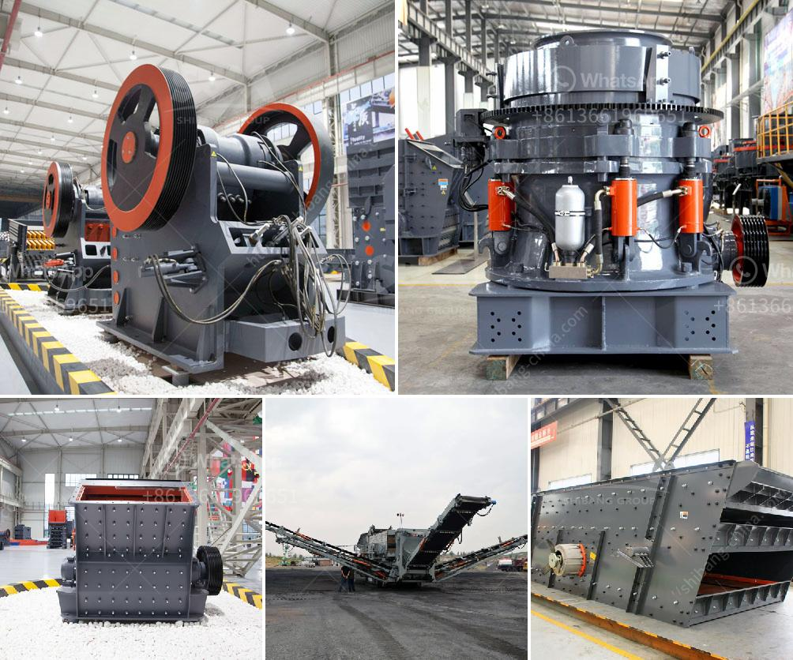

<h3>stone cracker machines</h3>
In today's fast-paced world, where time is of the essence, the construction industry constantly seeks ways to improve efficiency and productivity. One such innovation that has gained significant attention is the stone cracker machine. These machines, also known as stone splitters or hydraulic stone crackers, have revolutionized the way stone and concrete materials are processed, making the construction process faster, safer, and more economical.

Stone cracker machines are specifically designed to split stone and concrete blocks into desired sizes and shapes. They use hydraulic power to exert pressure on a specially designed splitting wedge, effectively breaking the material along its natural fissures or predetermined breaking points. This process is not only efficient but also eliminates the need for manual labor and expensive equipment like saws or hammers.

The key advantage of using stone cracker machines lies in their ability to split large blocks of stone or concrete into smaller, more manageable sizes. This allows for better handling and transportation, reducing the risk of damage or accidents during construction. Additionally, it enhances flexibility by enabling precise shaping or resizing of materials to suit specific project requirements.

Another significant benefit of stone cracker machines is their efficiency. These machines can complete the splitting process in a matter of seconds, improving work efficiency and reducing labor costs. With the ability to split stone and concrete blocks of different hardness and thickness, they can handle a wide range of construction projects, from road paving to building foundations. Stone splitters are also highly durable and require minimal maintenance, making them a cost-effective choice for construction companies.

Safety is paramount in the construction industry, and stone cracker machines address this concern wonderfully. By reducing the need for manual labor and replacing potentially dangerous tools like hammers or saws, they minimize the risk of worker injuries. Moreover, stone cracker machines operate in a controlled and contained environment, ensuring utmost safety during the splitting process.

Not only do stone cracker machines enhance safety and efficiency, but they also have a positive environmental impact. Their hydraulic power system significantly reduces noise pollution compared to traditional methods. Additionally, they minimize waste by accurately splitting materials, reducing the need for additional cutting or resizing, thereby reducing construction waste generated.

Stone cracker machines are also portable and can be easily transported to construction sites. This portability allows the use of stone splitters in remote or hard-to-reach locations, enabling construction projects in diverse terrains or environments.

Overall, stone cracker machines have transformed the construction industry. Their ability to split stone and concrete materials quickly, efficiently, and safely has made them an invaluable asset for construction companies worldwide. With their numerous advantages, including cost-effectiveness, time efficiency, enhanced safety, and environmental responsibility, these machines have become an indispensable tool in modern construction practices.

As the construction industry continues to strive for efficiency and sustainability, stone cracker machines will likely play an even more vital role. Their technological advancements and continuous improvements are paving the way for a brighter and more progressive future for the construction industry.
<h3>Contact us</h3><ul><li><strong>Whatsapp:&nbsp;<a href="https://wa.me/8613661969651">+8613661969651</a></strong></li><li><a href="https://swt.shibang-china.com/?git&amp;zhl&amp;stone cracker machines"><strong>Online Service(chat now)</strong></a></li></ul><h3>Related</h3><ul><li><a href='gypsum ball mill manufacturing machine.md'>gypsum ball mill manufacturing machine</a></li><li><a href='roller mill pictures.md'>roller mill pictures</a></li><li><a href='jaw crusher pe 150x250.md'>jaw crusher pe 150x250</a></li><li><a href='companies crushing plant.md'>companies crushing plant</a></li><li><a href='crusher sale philippines.md'>crusher sale philippines</a></li></ul>