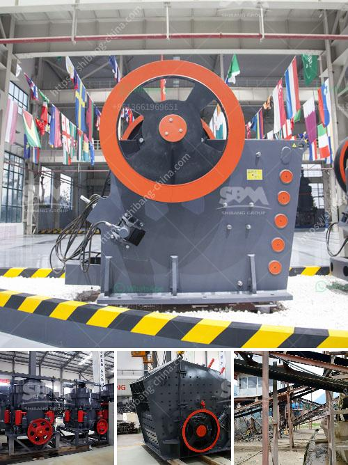

<h3>stone crasher busness plan pdf</h3>
Stone crushing businesses make up a large industry within the construction sector. They provide essential aggregates, such as sand, gravel, and crushed rock used in construction projects, civil engineering works, and road building. Attractive market opportunities exist in the equipment leasing and sales, equipment maintenance, and repair, and transportation sectors of the stone crushing industry. However, starting a stone crushing business involves a comprehensive business plan, and ensuring that key aspects of the business are considered.

A stone crasher business plan must include market analysis, machinery, and equipment, product line marketing strategy, financial planning, and analysis. The foundation of your business is, of course, a concrete and well-thought-out business plan that provides a roadmap for success.

Market Analysis: Before starting a stone crushing business, it is crucial to understand the market potential and competition landscape. Identify target customers, market trends, the profile of existing competitors, and future growth prospects. This analysis will help you understand your target market, enabling you to better position your business in the competitive landscape.

Machinery and Equipment: The core aspect of a stone crushing business is the machinery and equipment used to crush stones. Ensure that the machinery and equipment are periodically inspected and serviced to maintain their optimal performance. Invest in high-quality crushers, conveyors, and screening equipment to ensure efficient and effective stone crushing operations.

Product Line and Marketing Strategy: Determine the type and quality of products you plan to offer, and develop a marketing strategy to promote your stone crushing business. Identify your unique selling proposition (USP) and create a brand identity that resonates with your target market. Consider implementing online marketing techniques, such as search engine optimization (SEO) and social media marketing, to reach a wider audience and generate leads.

Financial Planning and Analysis: Develop a financial plan that includes projected revenue, expenses, and profit margins. Consider factors such as operating costs, salaries, marketing expenses, and maintenance costs. Identify potential funding sources, such as loans or investors, to ensure the smooth operation and growth of your stone crushing business.

Government Regulations and Permits: Compliance with government regulations is crucial for operating a stone crushing business. Obtain all necessary permits and licenses required by local and national authorities. Familiarize yourself with environmental regulations and ensure that your operations meet the necessary standards to minimize the impact on the environment.

Risk Analysis and Management: Conduct a risk analysis to identify potential risks and develop strategies to mitigate them. Consider risks such as equipment breakdowns, supply chain disruptions, and regulatory changes. Implement risk management strategies, such as contingency plans, insurance coverage, and backup equipment, to protect your business.

Conclusion: Starting a stone crushing business requires careful planning, market analysis, investment in machinery and equipment, and a comprehensive understanding of the industry. A well-developed business plan will help you navigate the challenges and maximize the opportunities within the stone crushing industry. By considering factors such as market analysis, machinery and equipment, product line marketing strategy, financial planning, and compliance with government regulations, you can establish a successful stone crushing business. Remember, meticulous planning is the key to long-term success in the stone crushing industry.
<h3>Contact us</h3><ul><li><strong>Whatsapp:&nbsp;<a href="https://wa.me/8613661969651">+8613661969651</a></strong></li><li><a href="https://swt.shibang-china.com/?git&amp;zhl&amp;stone crasher busness plan pdf"><strong>Online Service(chat now)</strong></a></li></ul><h3>Related</h3><ul><li><a href='iron ore processing equipment.md'>iron ore processing equipment</a></li><li><a href='gold washing machine for small miners.md'>gold washing machine for small miners</a></li><li><a href='stone crushing production process.md'>stone crushing production process</a></li><li><a href='manufacture of a cone crusher.md'>manufacture of a cone crusher</a></li><li><a href='used portable crusher for sale in germany.md'>used portable crusher for sale in germany</a></li></ul>