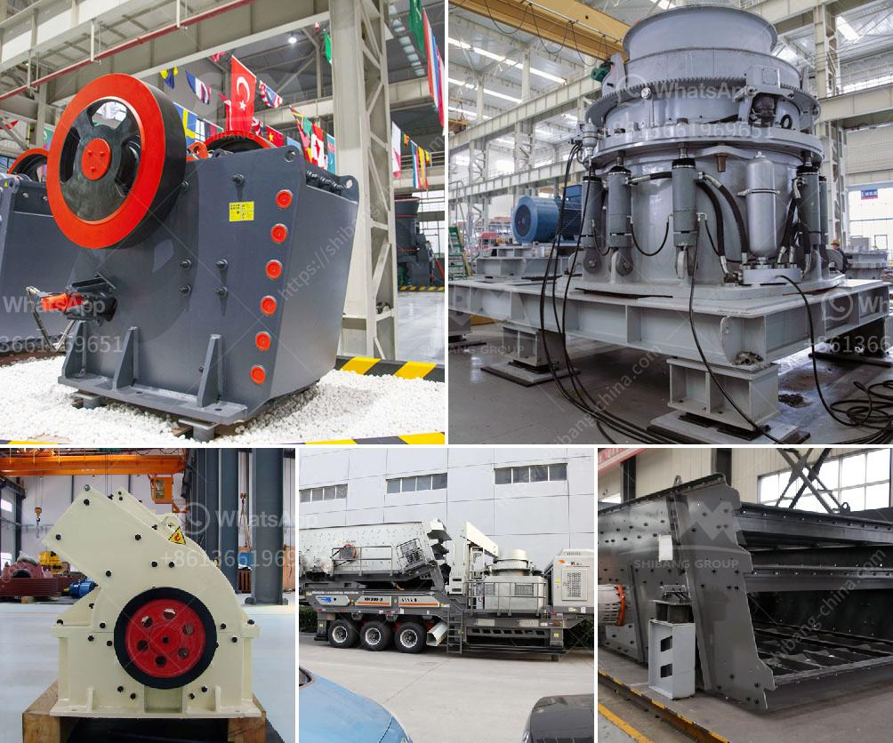

<h3>stone crush machine price in pakistan</h3>
Stone crushing industry is an important industrial sector in the country and it plays an important role in the development of Pakistan economic. The choice of stone crusher machine is crucial for the efficiency and productivity of the quarrying plant. The crushing machine, chosen will depend on several factors including the type of raw materials, size, hardness, and maximum feed size.

In summary, the stone crusher machine has been widely used in many industries, such as mining, metallurgy, building materials, highway, railway, water conservancy, chemistry and so on. The price of stone crusher is affected by several factors：

First: steel prices. Steel is the main raw material for making stone crushers, so the price fluctuation of steel prices has a very large impact on the price of equipment. The rise in steel prices will increase the production cost of the crusher manufacturers, so the price of the crusher will increase accordingly.

Second: crusher manufacturers have different prices because their models, regions, materials and so on will be different. When the selling price of the equipment is low, it will cause customers to doubt the quality of the equipment. It will not only increase the equipment’s price, but also lead to the failure of the equipment after purchase.

Third: the needs of users. In general, users will need more than one type of crusher machine in different production stages and different configurations. In order to obtain a better crushing effect, some users require that the fineness of the finished product is high, the yield is low, and the crusher equipment of these users will be ex-factory price.

Fourth: miscellaneous factors. For example, the price of steel in the market will affect the price of crushing equipment; the price of processed materials and the price of lifting equipment will also affect the price of the overall equipment.

As the leading manufacturer and exporter in China, we will provide maximum preferential factory price and discount for you. Our stone crusher has been exported to South Africa, Kenya, Nigeria, Ethiopia, Zambia, Namibia, Somalia, Nepal, Pakistan, Philippines, Malaysia, Saudi Arabic and over 90 countries around the world.

4. We provide lifelong service for the machine to ensure your machine runs consistently and smoothly.

5. We have a wide range of after-sales services including online technical support, on-site installation, and commissioning.

In conclusion, the stone crush machines are essential equipment in mining and stone quarrying operations. For solving the problems of crushing equipment, we need to know the crushing conditions, such as hardness of the material, the requirement of production capacity, and input and output size. We need to choose different stone crusher machine according to the materials’ characteristics.
<h3>Contact us</h3><ul><li><strong>Whatsapp:&nbsp;<a href="https://wa.me/8613661969651">+8613661969651</a></strong></li><li><a href="https://swt.shibang-china.com/?git&amp;zhl&amp;stone crush machine price in pakistan"><strong>Online Service(chat now)</strong></a></li></ul><h3>Related</h3><ul><li><a href='small scale gold mining professional equipment.md'>small scale gold mining professional equipment</a></li><li><a href='price and 900 stone crusher.md'>price and 900 stone crusher</a></li><li><a href='set up stone crusher plant.md'>set up stone crusher plant</a></li><li><a href='basalt crusher machine.md'>basalt crusher machine</a></li><li><a href='gypsum ball mill manufacturing machine.md'>gypsum ball mill manufacturing machine</a></li></ul>