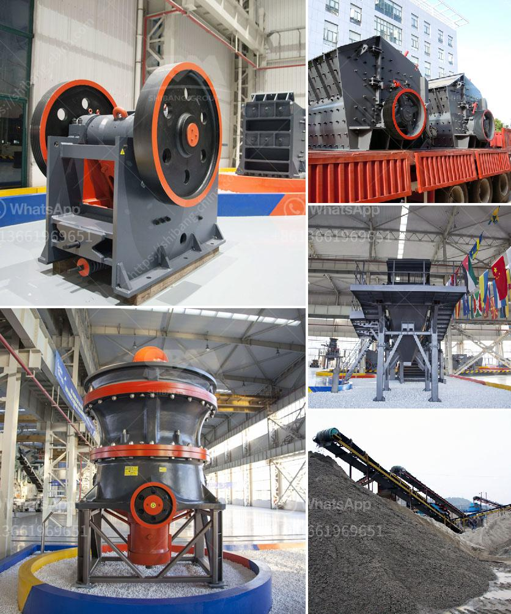

<h3>stone crusher 200 ton per</h3>
A stone crusher is a machine designed to reduce large rocks into smaller rocks, gravel, or rock dust. Crushers may be used to reduce the size, or change the form, of waste materials so they can be more easily disposed of or recycled, or to reduce the size of a solid mix of raw materials (as in rock ore), so that pieces of different composition can be differentiated. Crushing is the process of transferring a force amplified by mechanical advantage through a material made of molecules that bond together more strongly, and resist deformation more, than those in the material being crushed do.

In the mining industry, there are various types of crushers available for crushing different types of rocks or stones into smaller, more manageable sizes. One such machine is the stone crusher 200 ton per hour capacity of which is derived from a hopper, constructioncrushers.tpub.com. The primary crusher crushes the raw material into coarse gravel, which is then transported to the secondary crushing unit by a belt conveyor. A vibrating screen separates the material into different sizes, and the oversized material is sent back to the primary crusher for further crushing.

Stone crushers are widely used in construction works, mining operations, and other industrial applications. Their main purpose is to crush rocks or stones into smaller, more manageable sizes for various uses. These machines are powered by diesel engines or electricity and are capable of processing large quantities of material in a relatively short period.

The stone crusher with a capacity of 200 tons per hour is a popular choice for large-scale operators due to its robust design, high production capacity, and consistent performance. With low energy consumption and fuel consumption rates, the machine ensures a cost-effective crushing process.

Overall, the stone crusher 200 ton per hour is an efficient, reliable, and durable machine that perfectly suits various requirements in the construction and mining industries. With a straightforward operation capacity, easy maintenance, and convenient spare parts replacement, it delivers consistent outputs with excellent quality. Whether used for primary crushing, secondary crushing, or tertiary crushing, this machine is a reliable option for any crushing application.
<h3>Contact us</h3><ul><li><strong>Whatsapp:&nbsp;<a href="https://wa.me/8613661969651">+8613661969651</a></strong></li><li><a href="https://swt.shibang-china.com/?git&amp;zhl&amp;stone crusher 200 ton per"><strong>Online Service(chat now)</strong></a></li></ul><h3>Related</h3><ul><li><a href='overhaul jaw crusher.md'>overhaul jaw crusher</a></li><li><a href='vibrating screen troubleshooting.md'>vibrating screen troubleshooting</a></li><li><a href='slag crushing machine.md'>slag crushing machine</a></li><li><a href='stone crushers for sale kenya.md'>stone crushers for sale kenya</a></li><li><a href='cement grinding mills.md'>cement grinding mills</a></li></ul>