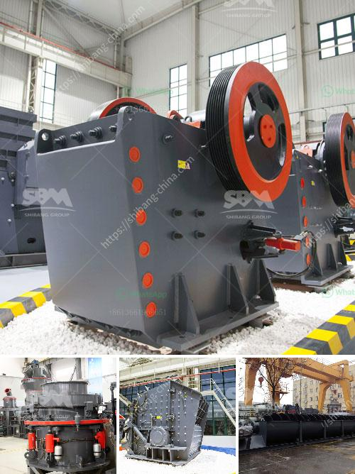

<h3>stone crusher 80 tons of jam</h3>
Stone crusher 80 ton jam can be used in the stone crushing process in various fields, such as highway construction, construction, chemical industry, and so on. The stone materials that can be processed by this machine include limestone, granite, dolomite, marble, quartz, and various other minerals. In recent years, with the rapid development of the construction industry, the demand for stone materials has been increasing, which has led to the popularity of stone crushers.

The stone crusher 80 ton jam machine produced by Liming Heavy Industry is a large-scale symmetrical crushing and screening equipment. In the crushing industry, it can be used to crush limestone, granite, dolomite, marble, quartz, and other materials. The crushed materials can be used as building aggregates, concrete aggregates, and valuable raw materials for infrastructure construction.

The stone crusher 80 ton jam machine is often used in the production of various stone materials, including various ores, cement, refractory materials, aluminum soil clinker, corundum, glass raw materials, mechanism sand, stone, and various metallurgical slag. It is especially suitable for the production of high-hardness and excellent grain size artificial sand, and is widely used in the construction of various highways, high-speed railways, bridges, municipal engineering, hydropower dams, and port terminals.

The stone crusher 80 ton jam machine has the advantages of large crushing ratio, high output, uniform product size, simple structure, reliable operation, and easy maintenance. It is widely used in mining, smelting, building materials, highways, railways, water conservancy, and chemical industries and many other sectors.

The stone crusher 80 ton jam machine uses the principle of "stone-to-stone". The material is crushed mainly by the extrusion and impact of the two counter-rotating rollers. The crushing method of the equipment is more flexible and diverse. The stone crusher can realize the one-time crushing of materials without the need for secondary crushing, and it can also carry out the shaping process, which simplifies the crushing process and saves production costs.

With the continuous improvement of the stone crusher 80 ton jam machine technology, the performance of the equipment is constantly improving. The new stone crusher has the advantages of high production efficiency, large crushing ratio, uniform product size, simple structure, reliable operation, and easy maintenance. It is welcomed by users in various fields.

In summary, the stone crusher 80 ton jam machine has many advantages in the stone crushing process. It can not only crush various stone materials, but also shape the materials. With the continuous development of technology, the performance and function of the equipment have been continuously improved, making it more suitable for the needs of various production fields.
<h3>Contact us</h3><ul><li><strong>Whatsapp:&nbsp;<a href="https://wa.me/8613661969651">+8613661969651</a></strong></li><li><a href="https://swt.shibang-china.com/?git&amp;zhl&amp;stone crusher 80 tons of jam"><strong>Online Service(chat now)</strong></a></li></ul><h3>Related</h3><ul><li><a href='stone crusher machine price in uganda.md'>stone crusher machine price in uganda</a></li><li><a href='x36 double roller crusher used.md'>x36 double roller crusher used</a></li><li><a href='quarry machines repairing centre in chennai.md'>quarry machines repairing centre in chennai</a></li><li><a href='hammer mill sale in malaysia.md'>hammer mill sale in malaysia</a></li><li><a href='conveyor belts for mining.md'>conveyor belts for mining</a></li></ul>