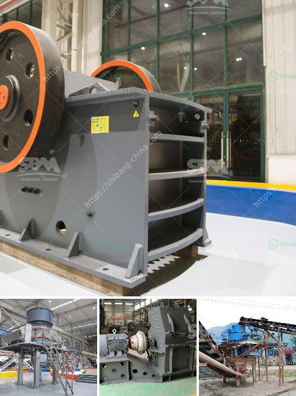

<h3>stone crusher business plan</h3>
Stone crusher business plan is a comprehensive document that outlines the financing, marketing, and operations of such a business, while listing the potential profits and risks associated with the venture. It serves as a roadmap to success, outlining the necessary steps and responsibilities for the establishment and operation of the business.

- Executive summary: Brief introduction and overview of the business, highlighting the main activities, goals, and objectives.

- Company description: Description of the company's mission, vision, and values, as well as the organizational structure and ownership.

- Products and services: Detailed description of the stone crushing products and services offered by the company, including the different sizes and grades available for various construction projects.

- Market analysis: In-depth analysis of the target market, including the demand and supply dynamics, competition, and customer demographics.

- Marketing strategy: Plans to effectively reach the target market, including promotional activities, advertising, and pricing strategies.

- Operations plan: Description of the production process, including the machinery and equipment required, as well as the staffing needs and operating procedures.

- Financial projections: Projections of income, expenses, and cash flow for the first few years of operation, including break-even analysis and return on investment calculations.

- Financing: Examination of the funding requirements for the business, including start-up costs, working capital, and potential sources of financing.

With a well-developed stone crusher business plan, you can reduce your risks, increase your profits, and create a sustainable business model. It allows you to make informed decisions and take the necessary steps to achieve your goals. Whether you are a newbie or an experienced entrepreneur, a solid business plan is crucial for your success in the stone crushing industry.
<h3>Contact us</h3><ul><li><strong>Whatsapp:&nbsp;<a href="https://wa.me/8613661969651">+8613661969651</a></strong></li><li><a href="https://swt.shibang-china.com/?git&amp;zhl&amp;stone crusher business plan"><strong>Online Service(chat now)</strong></a></li></ul><h3>Related</h3><ul><li><a href='mills for limestone in bolivia.md'>mills for limestone in bolivia</a></li><li><a href='coal powder making machine.md'>coal powder making machine</a></li><li><a href='manufacturers of coal mill in india.md'>manufacturers of coal mill in india</a></li><li><a href='calcite powder grinding mill sale.md'>calcite powder grinding mill sale</a></li><li><a href='cement clinker grinding equipmenttpd.md'>cement clinker grinding equipmenttpd</a></li></ul>