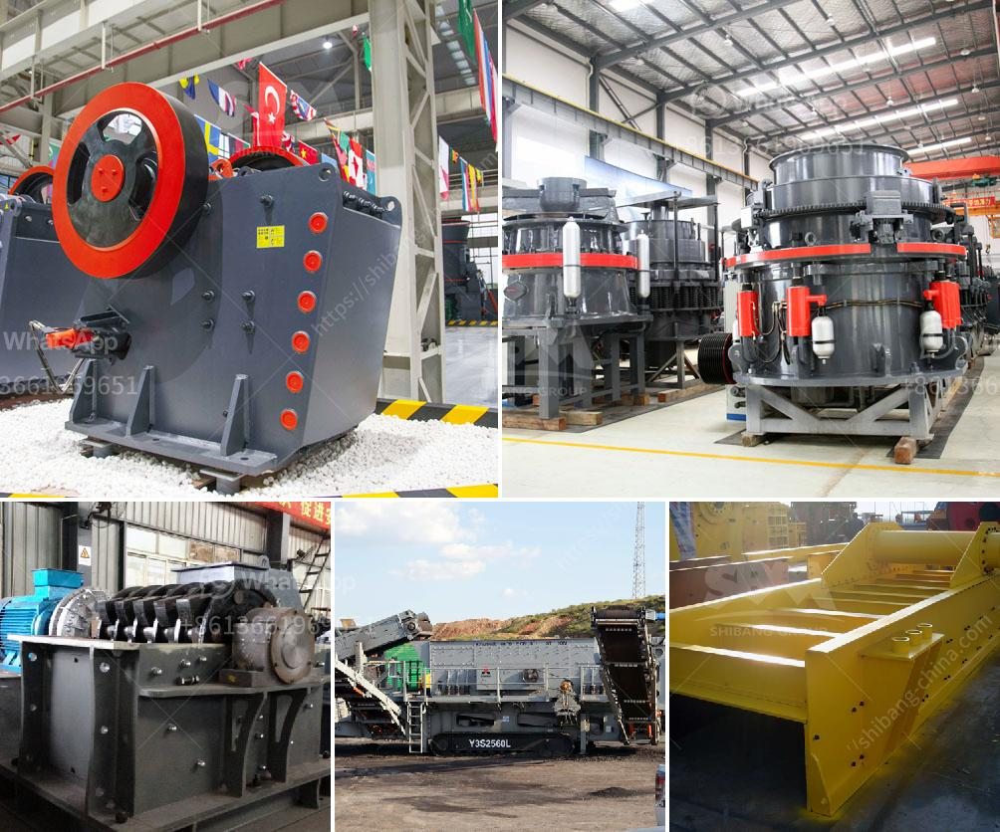

<h3>stone crusher cameroon</h3>
Cameroon is a country located in West Africa known for its rich natural resources such as oil, gas, and minerals. Recently, there has been an increase in the extraction and processing of these resources, leading to a high demand for stone crushers in the region. Stone crushers are essential equipment in mining and stone quarrying activities.

A stone crusher is designed to crush large stones into smaller pieces for construction purposes. In the mineral industry, crushers are used to process ores into valuable minerals. Stone crushers are commonly used in mines, recycling plants, construction sites, and quarries.

In Cameroon, there is a growing demand for stone crushers as the population continues to expand and more infrastructure projects are being implemented. Stone crushing is a crucial part of construction projects as it ensures the proper distribution of materials, resulting in strong and durable structures.

Stone crushers in Cameroon come in various types and models to fit a wide range of applications. Jaw crushers are commonly used in primary crushing stages, while cone crushers are more suitable for secondary and tertiary crushing. Impact crushers are also popular in the mining industry as they can be used to reduce the size of rocks and ores before further processing.

Investing in a stone crusher in Cameroon can be a lucrative venture. The country has rich reserves of granite, limestone, and other construction materials, making it an ideal location for quarrying activities. Additionally, the growing demand for infrastructure development, such as roads, bridges, and buildings, ensures a constant need for crushed stones.

Furthermore, the availability of skilled labor and affordable labor costs in Cameroon makes it cost-effective to operate stone crusher plants. The government of Cameroon is also supportive of mining and quarrying activities, providing a favorable business environment for investors.

However, like any investment, there are risks associated with investing in stone crushers in Cameroon. Market fluctuations and competition from other stone crushing businesses can impact profitability. It is important for investors to conduct a thorough market analysis and develop a solid business plan before committing to such an investment.

Proper maintenance and regular servicing of stone crushers are also crucial to ensure their longevity and efficiency. Investing in reliable and durable crushers from reputable manufacturers can help minimize breakdowns and reduce maintenance costs. Additionally, ensuring compliance with environmental and safety regulations is vital to operate responsibly and sustainably.

In conclusion, investing in a stone crusher in Cameroon can be a profitable venture due to the high demand for construction materials and the favorable business environment. However, it is important to conduct a thorough market analysis and develop a solid business plan to minimize risks and maximize returns. By choosing reliable and durable crushers, and adhering to environmental and safety regulations, investors can contribute to the infrastructure development of Cameroon while ensuring long-term profitability.
<h3>Contact us</h3><ul><li><strong>Whatsapp:&nbsp;<a href="https://wa.me/8613661969651">+8613661969651</a></strong></li><li><a href="https://swt.shibang-china.com/?git&amp;zhl&amp;stone crusher cameroon"><strong>Online Service(chat now)</strong></a></li></ul><h3>Related</h3><ul><li><a href='mineral grinder navi mumbai.md'>mineral grinder navi mumbai</a></li><li><a href='used granite crusher machinery.md'>used granite crusher machinery</a></li><li><a href='italy mobile vibrating screen.md'>italy mobile vibrating screen</a></li><li><a href='gold mining equipment company in japan.md'>gold mining equipment company in japan</a></li><li><a href='mobile crushing plant for limestone.md'>mobile crushing plant for limestone</a></li></ul>