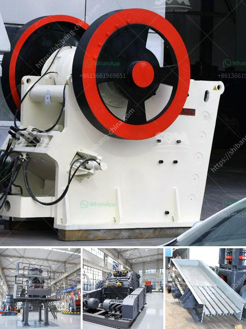

<h3>stone crusher company in dubai</h3>
Stone crushing industry is an important industrial sector in the country engaged in producing crushed stone of various sizes depending upon the requirement which acts as raw material for various construction activities such as construction of roads, highways, bridges, buildings, canals etc. It is estimated that there are over 12,000 stone crusher units in Dubai.

The stone crusher industry in Dubai is often seen as the thriving sector. The stone crushers are located along the periphery of the city. The population mainly in these areas consists of local Arabs, expatriates and immigrants. The major construction companies operate stone crushers, and the local Arabs, including construction workers from India, Pakistan, and Bangladesh, are the primary purchasers of the crushed stone.

Stone crushers are extensively used to crush bulk and heavy stones into different sizes efficiently and reliably, reducing the size of stones to facilitate further processing. Stone crusher units are mainly located in the bustling city of Dubai with nearly 40% of the Crusher Units operational in the city.

One Crusher Company in Dubai is a large-scale manufacturer of mining machinery and equipment. With scientific research, production and sales as one. The company engages in mining, crushing and screening equipment, sand making and washing equipment, urban construction, concrete mixing waste treatment and other equipment research, sales and service.

Stone Crushers in Dubai plays a crucial role in Dubai's infrastructure development as well as the country's economic growth. The Dubai Municipality and Ministry of Environment and Water have been working diligently to ensure that regulations and standards governing stone quarries and crusher operations are adhered to. Stringent measures are taken to minimize the impact on the environment and protect the health and safety of workers.

The stone crusher company in Dubai also stands out in the field due to its strong construction and transportation capabilities. It owns innovative stone crushers with advanced design principles to simplify operations and provide unique advantages. They are made to be durable, reliable, efficient, and safe to use, minimizing downtime and maximizing productivity.

Additionally, the stone crusher company in Dubai is equipped with a comprehensive set of equipment that ensures smooth production and consistent quality. The crushers and screening equipment are specially designed to cater to the various requirements of different customers, whether it is aggregates for concrete production or stones for road construction.

The stone crusher company not only sells its products locally but also exports them to other countries. The company's most important export markets include African countries, the Middle East, Southeast Asia, and Central Asia.

In conclusion, the stone crusher company in Dubai is a valuable contributor to the construction industry and has even helped strengthen the local economy. Dubai has a strong mix of cultures, economies, and geographic locations, making it an ideal place to showcase the importance of the stone crusher industry.
<h3>Contact us</h3><ul><li><strong>Whatsapp:&nbsp;<a href="https://wa.me/8613661969651">+8613661969651</a></strong></li><li><a href="https://swt.shibang-china.com/?git&amp;zhl&amp;stone crusher company in dubai"><strong>Online Service(chat now)</strong></a></li></ul><h3>Related</h3><ul><li><a href='deasel stone crushers and prices in gauteng.md'>deasel stone crushers and prices in gauteng</a></li><li><a href='ball grinding mill.md'>ball grinding mill</a></li><li><a href='crusher stone peru.md'>crusher stone peru</a></li><li><a href='alluvial gold washing plants.md'>alluvial gold washing plants</a></li><li><a href='chinese stone crusher machine.md'>chinese stone crusher machine</a></li></ul>