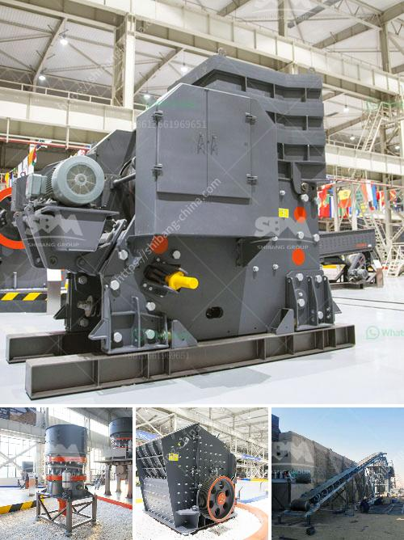

<h3>stone crusher company russia</h3>
Stone crusher company, Russia, has been serving the stone crushing industry for over half a century. Its innovative crushers have allowed the company to generate an impressive amount of orders from not only within Russia but from all over the world.

At Stone Crusher Company Russia, precision-engineered product range provides an almost infinite variety of models, engineered to meet customer requirements. The company's machinery operates at high efficiency levels, utilizing advanced technology to deliver outstanding performance in terms of power and speed.

One of the key features of Stone Crusher Company Russia's equipment is the ability to crush and process materials that are typically considered difficult to manage or recycle. Examples of such materials include stones, concrete, construction debris, and other hard-to-crush materials.

By specializing in the production of highly efficient crushing equipment, Stone Crusher Company Russia has emerged as a leader in the industry. The company has continually invested in research and development to improve the quality and efficiency of its crushers. As a result, their equipment ensures fast and efficient crushing with reduced power consumption and minimal operating costs.

The crushers offered by Stone Crusher Company Russia are versatile and capable of crushing a variety of materials. They have gained considerable popularity for their ability to handle a wide range of applications. Some of the notable advantages of Stone Crusher Company Russia crushers are:

1. Higher production output: The crushers are capable of delivering higher production rates compared to their counterparts in the market. This allows customers to crush more materials within a shorter time frame and increase their overall productivity.

2. Lower operational costs: Stone Crusher Company Russia's crushers are designed to minimize operational costs. They consume less power and require minimal maintenance, resulting in lower costs over time.

3. Greater durability: The crushers are built with high-quality components and materials, ensuring long-lasting performance. This durability reduces the need for frequent repairs or replacements, further contributing to cost savings.

4. Advanced safety features: Stone Crusher Company Russia designs its crushers with the operator's safety in mind. The machines are equipped with features such as hydraulic systems and advanced control systems to ensure safe and efficient operation.

Stone Crusher Company Russia's relentless commitment to quality and innovation has garnered global recognition. Their crushers are exported to various countries worldwide, expanding their reach and establishing a strong presence in the international market.

Stone Crusher Company Russia has become a significant player in the international stone crushing industry thanks to its high-performing equipment. With several decades of experience, the company continues to refine and improve its crushers to provide customers with enhanced productivity and profitability. As the brand expands globally, Stone Crusher Company Russia aims to maintain its position as a market leader while meeting the evolving needs of its customers.
<h3>Contact us</h3><ul><li><strong>Whatsapp:&nbsp;<a href="https://wa.me/8613661969651">+8613661969651</a></strong></li><li><a href="https://swt.shibang-china.com/?git&amp;zhl&amp;stone crusher company russia"><strong>Online Service(chat now)</strong></a></li></ul><h3>Related</h3><ul><li><a href='grinding rock into powder.md'>grinding rock into powder</a></li><li><a href='manufacturing process of mica crusher.md'>manufacturing process of mica crusher</a></li><li><a href='crusher plant price komatsu.md'>crusher plant price komatsu</a></li><li><a href='crushers and grinders mill.md'>crushers and grinders mill</a></li><li><a href='cost of cement manufacturing plant.md'>cost of cement manufacturing plant</a></li></ul>