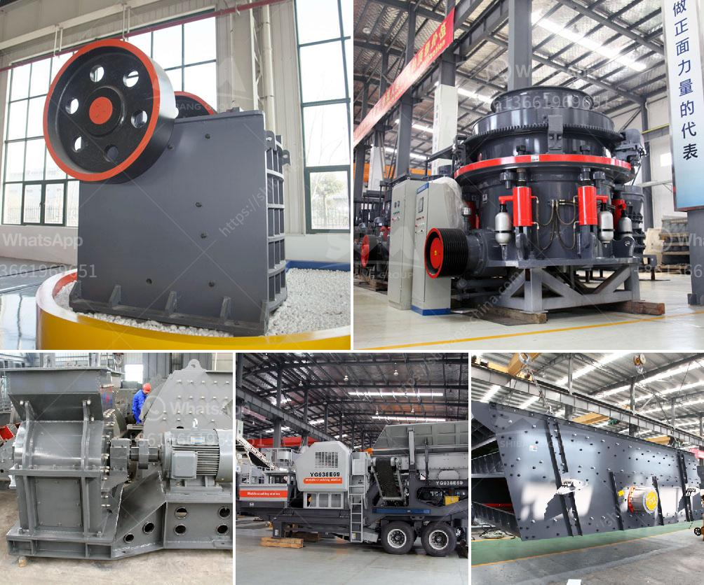

<h3>stone crusher conveyor belts</h3>
Stone crusher conveyor belts are being successfully used in various industries for decades now, and in a much better and efficient way. In the present scenario, with unprecedented growth in construction activities across the globe, the demand for conveyor belts for stone crusher has been surging rapidly.

These belts are made of high-quality materials and are durable enough to withstand extreme weather conditions. They work efficiently under harsh environments and have a prolonged service life. With their low maintenance and easy installation features, they are highly preferred by numerous industries.

The stone crushing industry relies heavily on conveyor belts to transport raw materials to the crushers for further processing. Surprisingly, this seemingly simple tool is quite essential for the smooth operation of any stone crusher unit. The primary reason that we can observe is the mobility factor. Since stone crushers are one of the crucial equipment used in the process of crushing stones, the need for conveline belts is highly essential.

These belts are used for automatic loading and unloading of materials between machines and can also be used for transporting raw materials such as coal, ore, and stones from one place to another within the industry premises. They can effortlessly move across various terrains, ensuring the smooth transportation of materials without any interruptions.

Conveyor belts play an important role in the production of stone crushing units. They are essential for handling large quantities of rocks and exposing them to a crushers’ high-speed rotating blades. For this reason, a lot of care should be taken while choosing the right conveyor belt for putting them through the crushers.

When it comes to stone crusher conveyor belts, only a few types of belts are suitable to convey such hard and abrasive materials. The conveyor belt must be of a material that can withstand the heavy load and run smoothly without any downtime. Range of conveyor belts used in mining industry is very high due to their cost-effective nature and numerous applications.

The downside of using conveyor belts in mining process is that they can become heavy and bulky due to the continuous wear and tear, and same must be replaced frequently. This ultimately increases downtime and adds to the overall operational cost of the sector. Hence, to save personnel from all such issues, a rubber or PVC conveyor belt is most commonly featured in stone crushers at mines. The one major advantage of such an adhering substance is that unlike other substances, it does not damage the surface. Also due to its strength, it can withstand temperature variation. Also over the year, engineers have come up with various versions of conveyor belts with different specifications in order to cater the need of the industry.

In conclusion, stone crusher conveyor belts are essential in delivering materials efficiently and effectively within the crushing industry. No matter the size of the project, or the nature of the industry, having a reliable and durable conveyor belt is crucial for success.
<h3>Contact us</h3><ul><li><strong>Whatsapp:&nbsp;<a href="https://wa.me/8613661969651">+8613661969651</a></strong></li><li><a href="https://swt.shibang-china.com/?git&amp;zhl&amp;stone crusher conveyor belts"><strong>Online Service(chat now)</strong></a></li></ul><h3>Related</h3><ul><li><a href='impact crusher company.md'>impact crusher company</a></li><li><a href='manufacturer of quartz powder mill.md'>manufacturer of quartz powder mill</a></li><li><a href='pulverizer machines manufacturers.md'>pulverizer machines manufacturers</a></li><li><a href='mining and quarrying crusher business in south africa.md'>mining and quarrying crusher business in south africa</a></li><li><a href='bentonite clay processing plant.md'>bentonite clay processing plant</a></li></ul>