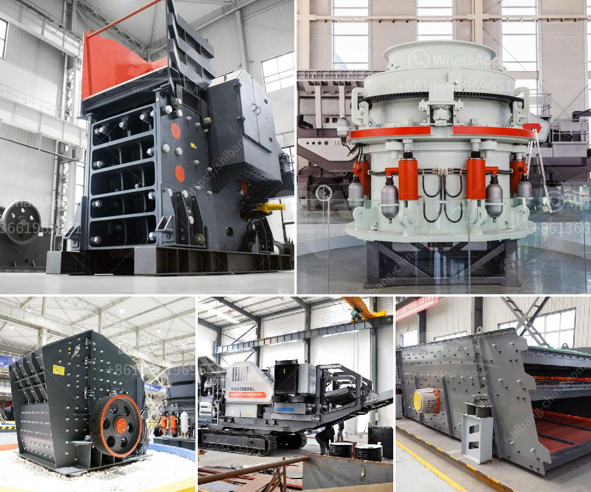

<h3>stone crusher dealers</h3>
Stone crusher dealers have a crucial role in the stone crushing industry. They facilitate the process of purchasing and selling of stone crushers. The dealers provide various services such as technical support and maintenance services for their customers. With the help of these dealers, the customers can select the best product for their needs and also get assistance in maintaining and operating the machines.

Stone crusher dealers offer a wide range of mobile and stationary stone crushers. These advanced machines are highly efficient and user-friendly. They are perfect for crushing different types of stones, including granite, limestone, marble, basalt, and more. Stone crushers are widely used in various industries like mining, construction, road, and railway building, and water conservancy. The crushing process is performed using high-quality equipment to ensure that the final product meets the required specifications.

The stone crusher dealers also offer customization options depending on the client's requirements. This enables the customers to choose the right size and capacity of the machine according to their specific needs. The dealers have a comprehensive understanding of the stone crushing industry and can provide expert advice to their customers.

Apart from selling stone crushers, the dealers also provide after-sales services like installation, commissioning, and regular maintenance. They have a team of experienced technicians who are well-trained in handling different types of stone crushers. These technicians ensure that the machines are installed correctly and are in perfect working condition. Regular maintenance and servicing are essential to keep the stone crushers running smoothly and avoid any breakdowns.

Stone crusher dealers play a crucial role in the stone crushing industry. They provide excellent quality machines, offer customization options, and ensure prompt after-sales services. This has made them essential partners for customers looking to purchase stone crushers. Whether it is for individual use or for a commercial project, consulting a reliable stone crusher dealer is vital to ensure a successful stone crushing operation.
<h3>Contact us</h3><ul><li><strong>Whatsapp:&nbsp;<a href="https://wa.me/8613661969651">+8613661969651</a></strong></li><li><a href="https://swt.shibang-china.com/?git&amp;zhl&amp;stone crusher dealers"><strong>Online Service(chat now)</strong></a></li></ul><h3>Related</h3><ul><li><a href='project report of a tph stone crusher.md'>project report of a tph stone crusher</a></li><li><a href='impact crusher 70 130tph.md'>impact crusher 70 130tph</a></li><li><a href='10 allis chalmers jaw crusher.md'>10 allis chalmers jaw crusher</a></li><li><a href='sample business plan for crushed stone.md'>sample business plan for crushed stone</a></li><li><a href='cost of crushed concrete.md'>cost of crushed concrete</a></li></ul>