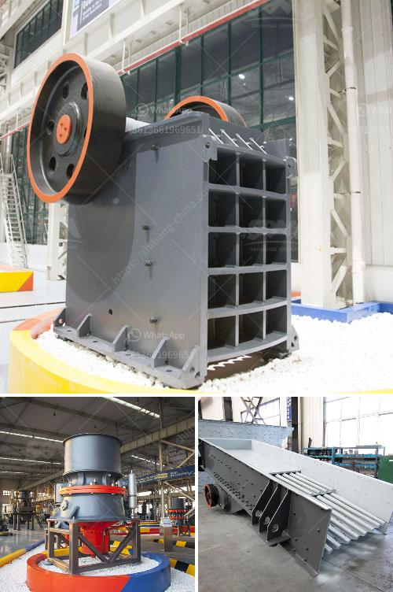

<h3>stone crusher equipment for sale</h3>
Stone crusher equipment is widely used in various industries such as mining, metallurgy, construction, highways, railways, infrastructure, etc. With the popularity of stone crushers, the market demand for these equipment is also growing, leading to a greater market share for manufacturers.

Nowadays, there are many types of stone crushers on the market, each with its own crushing principles and classifications. The most common ones are jaw crusher, cone crusher, and impact crusher. Jaw crusher breaks particles by compressing them. It generally consists of two jaws, one of which is fixed and the other is movable. Cone crusher works by crushing the ore through a wedging action between a cone and a mantle, while impact crusher uses impact force to break particles.

When buying a stone crusher equipment, there are many factors to consider, such as materials, production efficiency, equipment quality, and the service life of the equipment. Different stone crushers are suitable for different crushing needs, so it is important to find the equipment that meets your requirements.

Material selection is crucial because different materials have different hardness and abrasiveness. The hardness of the material affects the selection of the equipment. For example, if the material is too hard, it may cause excessive wear on the wearing parts of the equipment. In addition, the feed size of the material should also be considered. The larger the feed size, the larger the size of the equipment required.

Production efficiency is another important factor. The crushing efficiency of a stone crusher affects the overall efficiency of the entire production line. Generally, a higher crushing efficiency means higher productivity and lower energy consumption. Therefore, it is important to choose a stone crusher with high production efficiency.

The quality of the equipment also matters. High-quality equipment is more durable and has a longer service life. It can reduce downtime and maintenance costs, ultimately improving the overall efficiency of the production line. When purchasing stone crusher equipment, it is recommended to choose a well-known brand with a good reputation to ensure the quality of the equipment.

In conclusion, stone crusher equipment for sale is mainly used for the primary, secondary, and fine crushing of stones and ores. With the development of the mining industry, more and more manufacturers are launching new designs and models of stone crushers. They have become an indispensable equipment in various industries. The selection of equipment should be based on the materials to be crushed, production efficiency, equipment quality, and service life. By carefully considering all these factors, you can find the most suitable stone crusher equipment for your needs.
<h3>Contact us</h3><ul><li><strong>Whatsapp:&nbsp;<a href="https://wa.me/8613661969651">+8613661969651</a></strong></li><li><a href="https://swt.shibang-china.com/?git&amp;zhl&amp;stone crusher equipment for sale"><strong>Online Service(chat now)</strong></a></li></ul><h3>Related</h3><ul><li><a href='calcite grinding machine manufacturer in udaipur.md'>calcite grinding machine manufacturer in udaipur</a></li><li><a href='crusher plant layout.md'>crusher plant layout</a></li><li><a href='crushing plant philippines.md'>crushing plant philippines</a></li><li><a href='gyratory crusher price.md'>gyratory crusher price</a></li><li><a href='three roller raymond mill.md'>three roller raymond mill</a></li></ul>