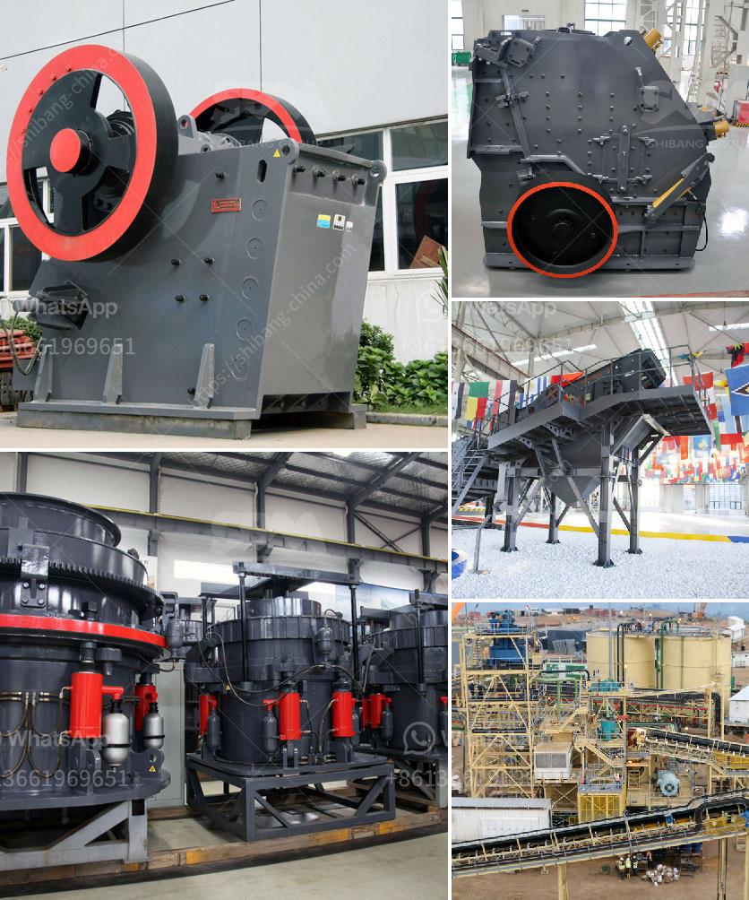

<h3>stone crusher for gravel</h3>
Stone crusher for gravel is commonly known as European jaw crusher, and is a new type of crusher developed by our company after the release of traditional jaw crusher. stone crusher machine price is a perfect combination of modern science and technology and the production practice, which can better satisfy the automatic production demands of vast customers.

The equipment mentioned above is more suitable for secondary crushing. If you need primary crushing equipment, see jaw crushers in our separate article.

As we all know, gravel is an important industrial raw material for building concrete, infrastructure and construction. From the viewpoint of environmental protection and sustainable development, resource utilization of gravel should be fully considered.

Since gravel is a relatively hard material, the stone crusher is also equipped with a specially designed anti-abrasion casing to prolong the service life of the gravel crusher plant. The cone crusher crushes again, forming a closed circuit cycle.

This crusher is used in pebble, limestone, dolomite, granite, rhyolite, diabase and other mineral jaw crushing plants. Impact crushing plants, cone crushing plants, and other crushing plants for quarries and gravel pits are also available for different stone or gravel sand making applications.

Durable wear parts and optimized cavity design enable higher capacity and uptime. Reliability and protection package have been optimized for higher production and added uptime.

The crushing volumes may vary depending on the feed material character and stone crusher machine configuration. The stone crusher machine capacity ranges from 500TPH to 800TPH. Therefore, the stone crusher machine is different from other stone crushers like concrete crushers, impact rock crushers, cone crusher machine, hammer crushers, sand making crushers, portable rock crushers, rock crushing machine.

Mobile crusher is a new type of stone crushing equipment, which expands the concept field of coarse crusher and fine crushering, it can suppy the customers the best crushing and screening solutions.

Considering from the customers’ standpoint, efficiently integrates the feeding equipment, crushing equipment, screening equipment, effectively solving the site constraints of the fixed crushing plants.

Certainly, it can be said that mobile gravel crushing equipment is suitable for reconstructing large-scale gravel production line. Partially integrated, modular or unitized design solutions are available for high-capacity gravel crushing applications.

In conclusion, a mobile rock crusher can contribute to road construction and improve the quality of dust for asphalt concrete. Compared to traditional sand making machine, a mobile rock crusher is not limited by environmental factors such as regional environment and time, and has a wide range of applications.

Overall, this stone crusher should be considered for processing of minerals, aggregates, gravel, sand and dimensions required for road projects. The Mobile Crushers and Screeners market demonstrates the overall overview, trends, opportunities and challenges for many years to come.
<h3>Contact us</h3><ul><li><strong>Whatsapp:&nbsp;<a href="https://wa.me/8613661969651">+8613661969651</a></strong></li><li><a href="https://swt.shibang-china.com/?git&amp;zhl&amp;stone crusher for gravel"><strong>Online Service(chat now)</strong></a></li></ul><h3>Related</h3><ul><li><a href='river sand and stone mining at sabah.md'>river sand and stone mining at sabah</a></li><li><a href='stone jaw crusher machine.md'>stone jaw crusher machine</a></li><li><a href='belt conveyor for coal design in india.md'>belt conveyor for coal design in india</a></li><li><a href='sale ghana grinding crusher.md'>sale ghana grinding crusher</a></li><li><a href='feldspar refining and processing equipment.md'>feldspar refining and processing equipment</a></li></ul>