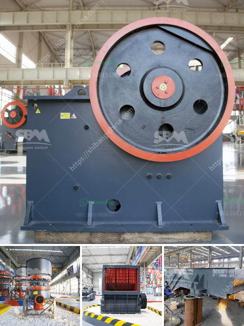

<h3>stone crusher for sale in south korea</h3>
With the increase in demand for ore resources in South Korea, the development of stone crusher equipment is booming. To meet the requirements of Korean customers, some manufacturers have focused on the improvement of stone-crushing technology.

Although some manufacturers are devoted to research and development of stone crushers, they also take into account the maintenance and usage costs of the equipment. To attract more customers, some manufacturers reduce the price of stone crushers, while also ensuring the quality and performance of the equipment.

In South Korea, the sales volume of stone crushers is growing rapidly. With more than 500 stone crushing units operating successfully in South Korea, the manufacturer is confident in expanding its sales network through online platforms, as well as leveraging its existing distribution networks.

In recent years, South Korea has witnessed a surge in infrastructure investment, leading to a greater demand for construction materials and building stones. This has further fueled the demand for stone crushers. To meet these requirements, the crushing equipment needs to be equipped with advanced technology and high-quality spare parts.

When choosing a stone crusher for sale, it is important to consider factors such as the type and size of the materials to be crushed, the desired output, the capacity of the machine, and environmental factors. The manufacturer should also take into consideration the maintenance and usage costs of the equipment.

In conclusion, stone crushers are a key equipment in the raw material preparation process in South Korea. Therefore, the future prospects of the industry are promising. The emergence of technology and increasingly diversified online sales channels have also opened up new opportunities for stone crushers in South Korea.
<h3>Contact us</h3><ul><li><strong>Whatsapp:&nbsp;<a href="https://wa.me/8613661969651">+8613661969651</a></strong></li><li><a href="https://swt.shibang-china.com/?git&amp;zhl&amp;stone crusher for sale in south korea"><strong>Online Service(chat now)</strong></a></li></ul><h3>Related</h3><ul><li><a href='clay grinding machine price list in andhra pradesh.md'>clay grinding machine price list in andhra pradesh</a></li><li><a href='grinding mills for sale philippines.md'>grinding mills for sale philippines</a></li><li><a href='sand screener and washer.md'>sand screener and washer</a></li><li><a href='crusher cost equipment crusher malaysia.md'>crusher cost equipment crusher malaysia</a></li><li><a href='scrap prices per ton in south africa.md'>scrap prices per ton in south africa</a></li></ul>