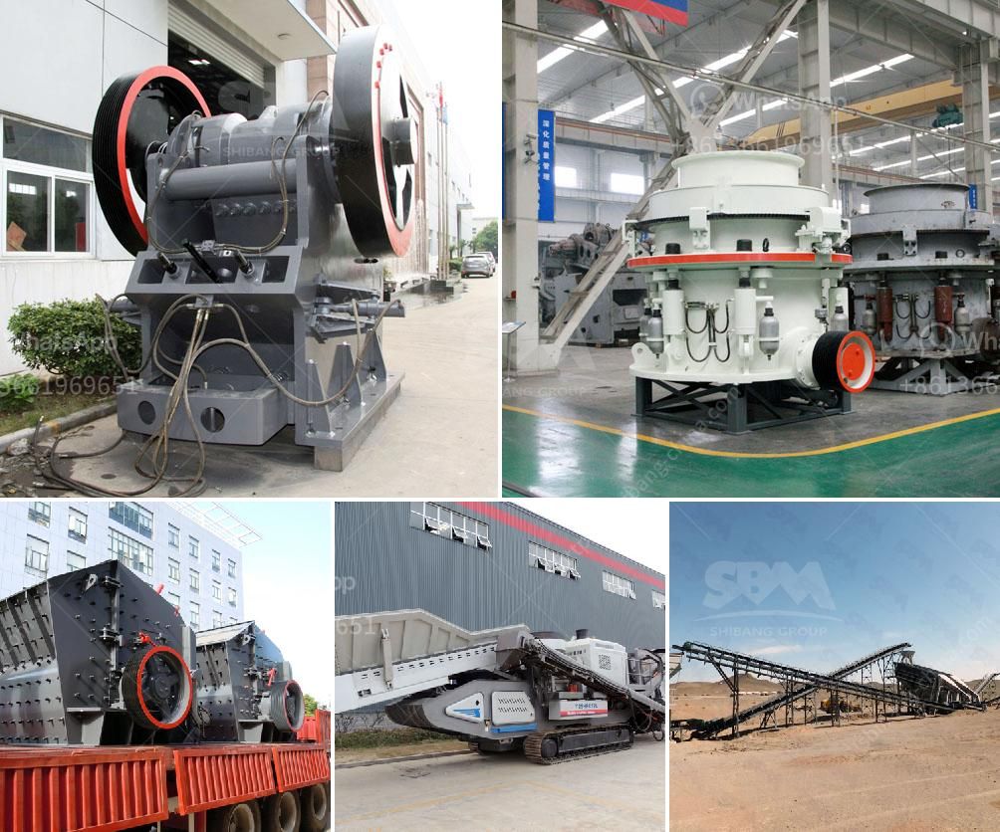

<h3>stone crusher hammer mill</h3>
A stone crusher is a machine used to convert large stones into smaller sizes that can be used in construction or other purposes. There are several types of stone crushing machines, which are differentiated based on the stone processing stages, namely primary crusher, secondary crusher and tertiary crusher.

Stone crusher hammer mill is a machine used to shred or crush materials into smaller pieces. The basic design and construction of this machine involve a rotating shaft or rotor on which the hammers are mounted. The hammers swing freely around the pivots, effectively shredding or crushing the materials placed inside. 

The main advantages of stone crusher hammer mill are its low energy consumption and high rotor speed. It can process materials with high moisture content without clogging the crushing chamber. Additionally, this machine produces a very fine output granule size, making it suitable for industries that require high-quality crushed materials, such as highway construction or brick manufacturing.

Stone crusher hammer mill can be used for various purposes within the agricultural sector. For instance, it can crush corn stalks, rice straw, hay, and other similar agricultural wastes into small pieces. These pieces can then be used as animal feed or as a raw material for producing compost, thus reducing waste and promoting sustainable farming practices.

The use of stone crusher hammer mill is also prevalent in the mining industry, where it is used to crush valuable ore to extract metals. In this application, the hammers rotate at high speeds and strike the material, causing it to break apart and release the desired mineral.

In conclusion, stone crusher hammer mill is an essential machine in the stone processing industry, and its versatility makes it suitable for a wide range of applications. It offers low energy consumption, high rotor speed, and produces high-quality crushed materials. Whether it is in construction, agriculture, or mining, this machine plays a vital role in processing various materials efficiently and effectively.
<h3>Contact us</h3><ul><li><strong>Whatsapp:&nbsp;<a href="https://wa.me/8613661969651">+8613661969651</a></strong></li><li><a href="https://swt.shibang-china.com/?git&amp;zhl&amp;stone crusher hammer mill"><strong>Online Service(chat now)</strong></a></li></ul><h3>Related</h3><ul><li><a href='graphite production line.md'>graphite production line</a></li><li><a href='small ballast making machine for sale kenya.md'>small ballast making machine for sale kenya</a></li><li><a href='jaw crusher plant price.md'>jaw crusher plant price</a></li><li><a href='cement grinding mills.md'>cement grinding mills</a></li><li><a href='sand washing screener florida.md'>sand washing screener florida</a></li></ul>