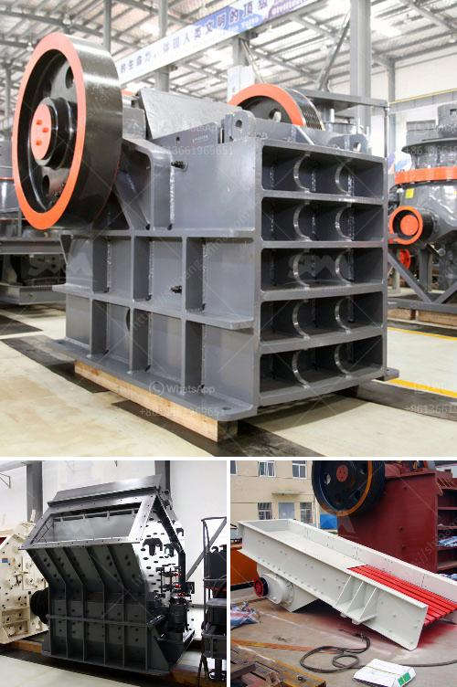

<h3>stone crusher in cebu</h3>
If you are looking for a stone crusher in Cebu for your construction project, you may need to consider investing in a reliable machine. Although there are a variety of brands and models available in the market, not all of them can provide the efficiency and reliability that you need. However, there is one machine that stands out among the rest - the stone crusher.

A stone crusher, also known as a rock crusher, is a machine designed to reduce large rocks into smaller rocks, gravel, or rock dust. Stone crushers may be used to reduce the size, or change the form, of waste materials so they can be more easily disposed of or recycled, or to reduce the size of a solid mix of raw materials, so that pieces of different composition can be differentiated.

For construction projects in Cebu, stone crushers are essential. They are responsible for crushing rocks into specific sizes providing concrete for buildings, roads, and other construction works. Stone crushers are also used for crushing stones into different sizes for agricultural purposes. Crushed stones are used to enrich the soil and improve its texture, making it suitable for planting crops.

When choosing a stone crusher in Cebu, it is important to consider several factors to ensure its efficient operation. First, look for a machine that has a strong and durable construction. This is crucial as it ensures that the machine can withstand the harsh working environment and the constant wear and tear of crushing rocks. A sturdy stone crusher will not only work efficiently but also have a longer lifespan, saving you money in the long run.

Secondly, consider the capacity of the stone crusher. The capacity should match the requirements of your project. If you are working on a small-scale project, a smaller capacity stone crusher may be sufficient. However, for larger construction projects, a stone crusher with a higher capacity is necessary to ensure efficient and timely completion of the project.

Additionally, check the power source of the stone crusher. Some machines run on electricity, while others are powered by diesel engines. The choice between the two depends on various factors such as availability of electricity and cost. Diesel-powered stone crushers are advantageous in areas where electricity is not readily available, making them a popular choice for remote locations or construction sites.

Furthermore, consider the accessibility and after-sales support of the stone crusher supplier. It is important to choose a supplier that is near your construction site to avoid delays and additional costs associated with transportation. Additionally, the supplier should provide excellent after-sales support, including maintenance and spare parts, to ensure that your stone crusher operates efficiently throughout its lifespan.

In conclusion, a stone crusher is a crucial machine for construction projects in Cebu. It plays a vital role in reducing the size of rocks into specific sizes for various applications, including concrete production and agricultural use. When choosing a stone crusher, consider factors such as durability, capacity, power source, and supplier support. By investing in a reliable stone crusher, you can ensure efficient and timely completion of your construction projects in Cebu.
<h3>Contact us</h3><ul><li><strong>Whatsapp:&nbsp;<a href="https://wa.me/8613661969651">+8613661969651</a></strong></li><li><a href="https://swt.shibang-china.com/?git&amp;zhl&amp;stone crusher in cebu"><strong>Online Service(chat now)</strong></a></li></ul><h3>Related</h3><ul><li><a href='equipment design of coal washing plant.md'>equipment design of coal washing plant</a></li><li><a href='sand making machine price.md'>sand making machine price</a></li><li><a href='start a quarry plant.md'>start a quarry plant</a></li><li><a href='diamond screening equipment for sale.md'>diamond screening equipment for sale</a></li><li><a href='low cost gold mining equipment.md'>low cost gold mining equipment</a></li></ul>