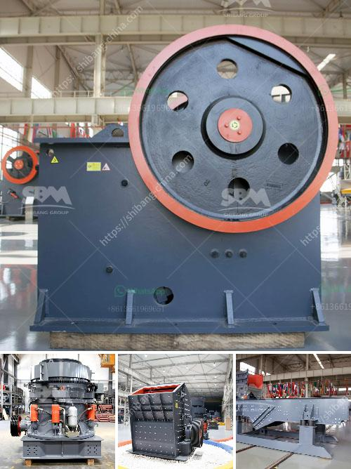

<h3>stone crusher in the philippines for sale</h3>
The Philippines is one of the fastest developing countries in Asia and there is a huge demand for construction and infrastructure projects. The country has been on an infrastructure development spree and the construction sector has been buzzing with activity. The government has initiated various projects to boost the economy, which has led to a rise in the demand for aggregates and stones for construction purposes. This has created a favorable market for stone crusher in the Philippines, which will boom over the years.

In the Philippines, crushers are the most common crushing equipment utilized by companies involved in stone quarries and mining. Those that are suitable for the job include the following:

These are different equipment, and each has unique characteristics that make them perfect for specific applications. The commonly used stone crusher plant includes Jaw crusher, Cone crusher, Impact crusher, Roll crusher, and diesel engine crusher for sale.

Different types of stone crusher plants involve in the stone crushing process such as jaw crusher, impact crusher, hammer crusher, cone crusher, mobile crusher etc. The newly designed stone crusher plant significantly improves the crushing capacity for different applications. In addition, the reasonable matching between crushing and screening equipment makes the whole production line occupies only a small area and can be applied in various construction sites.

With the advancement in stone crushing technologies, it’s now possible to manufacture aggregates with the help of stone crusher machines.  These machines not only break the larger stones into smaller ones but also help in converting the waste stones into aggregates.

All these machines work in different crushing or screening processing stages. As we have said, jaw crusher is coarsely crushing machine. Cone crusher, impact crusher machine and sand making machine are all used in finely crushing. And vibrating screen is screening equipment.

The layout of aggregate crusher plant is not fixed. All of the crushing and screening machines can be combined flexibly according to products’ requirements and customers’ demands. For instance, if you want big size materials, a jaw crusher and a screen can meet your needs. If you want smaller size of particles, you can use some finely crushing machine such as cone crusher and impact crusher besides jaw crusher. In addition, aggregate crusher plant design has two modes. The one is fixed crusher plant, the other one is mobile crusher plant.

Both the fixed crushers and the mobile crushers are finely arranged. They all have their own advantages and disadvantages, and what are the advantages and disadvantages of the crushing equipment for different purposes?

The jaw crusher can crush all kinds of soft and hard materials, the compressive strength is between 300-350Mpa, and the impact crusher is suitable for crushing medium hardness materials, if the material is tough, it will cause great damage to the consumables and shorten the service life. We know that the jaw crusher has a relatively high compressive strength, so when processing materials with high hardness, it is generally necessary to choose the greater crushing ratio. The jaw crusher can adjust the discharge port to control the material size.

Cone crusher is mainly used for crushing various high hardness materials, suitable for medium and fine crushing operations. Because the equipment adopts a laminated crushing principle, the broken product has a cubic structure, low needle-like content, no internal cracks, and high pressure resistance.

Impact crusher is mainly used for crushing of large, medium, and small materials with side length less than 500mm and compression strength no more than 350Mpa. Following will discuss about the technical advantages of HXJQ impact crusher.

Roller crusher is suitable for medium and fine crushing of materials with medium hardness, such as the lilimingne, slag, coke and coal, which are used in cement, chemical industry, electric power, metallurgy, building materials, refractories and other industrial departments.

Jaw crusher and cone crusher are usually used together in stone crushing production line, and there is no way to compare their advantages and disadvantages objectively. But they can be compared to their own different models, different series, different manufactures and other aspects. When choosing stone crusher plant, we should like to consider the following factors:

So while choosing stone crusher plant, make sure to match it appropriately so that you get the desired result.

The stone crusher plant concentrates on three aspects: product specification, equipment reliability, and maintenance convenience of the production line. stone crusher plant has the feature of high crushing efficiency, wide application and has become the mainstream equipment in rapid development of regional economy.

After entering the market, the stone crusher plant in Philippines has been suffering from a lack of non-metallic mines. But after survey the Philippines mining companies, the main rocks are granite, riverstone, and limestone.

The Philippines is the largest export country for ceramics and tiles in Asia. Limestone plays a big role in this industry. We can provide you with a complete set of stone crushing production line, sand making line, grinding plant and limestone calcination plant. It is featured with reliable performance, smooth operation and convenient maintenance. What's more, we can provide not only stone crusher plant, but also single-stage hammer crusher, DPC crusher, and other machines.

In order to save costs and high efficiency, our factory carries out "one-stop" stone production line service, which includes pre-sale consultation, design, manufacturing, installation, and after-sales service. If you have any questions, please contact our sales representatives, and we will do our best to provide you the best solutions.
<h3>Contact us</h3><ul><li><strong>Whatsapp:&nbsp;<a href="https://wa.me/8613661969651">+8613661969651</a></strong></li><li><a href="https://swt.shibang-china.com/?git&amp;zhl&amp;stone crusher in the philippines for sale"><strong>Online Service(chat now)</strong></a></li></ul><h3>Related</h3><ul><li><a href='barite rock mill.md'>barite rock mill</a></li><li><a href='brick stone crusher machine.md'>brick stone crusher machine</a></li><li><a href='manufacturer crusher machines contacts.md'>manufacturer crusher machines contacts</a></li><li><a href='how to make silica rock pebles in ball mill.md'>how to make silica rock pebles in ball mill</a></li><li><a href='rotary dryer machine photo.md'>rotary dryer machine photo</a></li></ul>