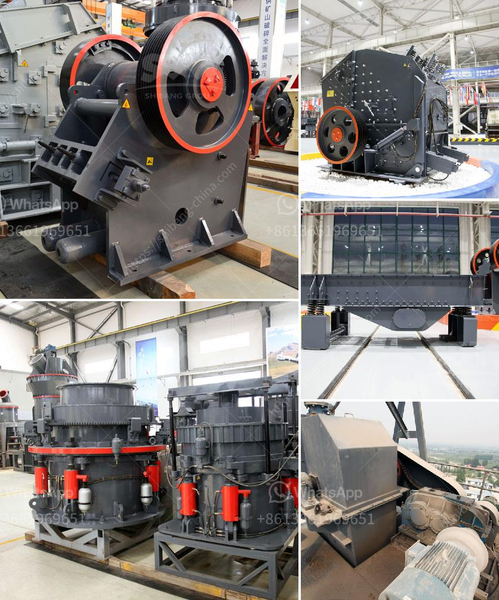

<h3>stone crusher jaw mini produksi indonesia</h3>
Stone crusher jaw mini produksi Indonesia is a machine designed to reduce large rocks into smaller rocks, gravel, or rock dust. This makes the stone crusher jaw mini produksi Indonesia ideal for crushing stones and rocks in outdoor areas such as mines, quarries, and construction sites. With the ability to crush materials with a compressive strength up to 320MPa, the stone crusher jaw mini produksi Indonesia is robust and durable.

Stone crusher jaw mini produksi Indonesia is also called rock crusher or jaw crusher as its name implies. The size of the discharge opening of the jaws is adjustable to control the size of the crushed material. This machine uses a motor as its power source. Through the motor's wheels, the eccentric shaft is driven by the triangle belt and slot wheel to make the moving jaw plate move by a regulated track. This machine is popular for its simplicity, reliability, and cost-effectiveness.

The stone crusher jaw mini produksi Indonesia is made of high-quality steel materials and is equipped with excellent components. This results in a longer service life, reliable performance, and lower maintenance costs. The stone crusher jaw mini produksi Indonesia is designed with a unique modular structure, which makes it easy to disassemble and transport.

The stone crusher jaw mini produksi Indonesia is widely used in crushing materials of various hardness, such as iron ore, copper ore, limestone, granite, basalt, and other minerals and rocks. This machine is especially suitable for crushing hard stones for construction and road building purposes.

In summary, the stone crusher jaw mini produksi Indonesia is suitable for primary and secondary crushing of all kinds of minerals and rocks with compressive strength less than 320 MPa. The stone crusher jaw mini produksi Indonesia is widely used in the industries of mining, metallurgy, building materials, highway, railway, water conservancy and chemical.
<h3>Contact us</h3><ul><li><strong>Whatsapp:&nbsp;<a href="https://wa.me/8613661969651">+8613661969651</a></strong></li><li><a href="https://swt.shibang-china.com/?git&amp;zhl&amp;stone crusher jaw mini produksi indonesia"><strong>Online Service(chat now)</strong></a></li></ul><h3>Related</h3><ul><li><a href='small scale gold mining professional equipment.md'>small scale gold mining professional equipment</a></li><li><a href='granite crusher cost.md'>granite crusher cost</a></li><li><a href='iron ore processing equipment.md'>iron ore processing equipment</a></li><li><a href='specification of jaw crusher.md'>specification of jaw crusher</a></li><li><a href='primary jaw crusher saudi.md'>primary jaw crusher saudi</a></li></ul>