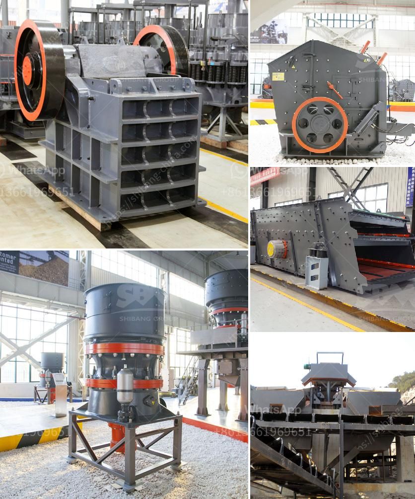

<h3>stone crusher machine germany</h3>
Stone crusher machines have been essential for numerous industries for over several decades now. The machine is primarily used in various industries such as mining, metallurgy, building materials, highways, railways, water conservancy, and chemical industries. The crushing machine has a simple structure, high crushing ratio, low energy consumption, high output, and convenient maintenance. It is an ideal crushing equipment for primary crushing.

In Germany, the stone crusher machine is widely used in various sectors such as mining, smelting, building materials, highways, railways, water conservancy, and chemical industries. Germany is a developed country with rich natural resources and a high population of machinery. Many stone crusher machines are developed and produced for this country. In the past few years, the mining industry has been developing rapidly, which drives the demand for the stone crushing machines.

There are many companies selling stone crusher machines in Germany. Some of the most popular ones are SBM, Terex, IROCK, and Kleemann. These companies are renowned for their high-quality products, durability, and reliability. Moreover, they offer a wide range of stone crushers, catering to different needs and requirements of customers.

The stone crusher machines made in Germany have low noise, even without harsh environmental standards. They adopt advanced technology and can process various materials, such as granite, limestone, stone, clay, coal, and more. These machines are equipped with dynamic handling devices that allow them to transport stones between different sites. They also have high-capacity crushers that can handle large quantities of materials efficiently.

In conclusion, stone crusher machines from Germany are ideal for mining, smelting, building materials, highways, railways, water conservancy, and chemical industries. They have a high crushing ratio, low energy consumption, and can process various materials, making them the preferred choice for crushing machines. With the development of the mining industry in Germany, the demand for these machines is expected to increase in the coming years.
<h3>Contact us</h3><ul><li><strong>Whatsapp:&nbsp;<a href="https://wa.me/8613661969651">+8613661969651</a></strong></li><li><a href="https://swt.shibang-china.com/?git&amp;zhl&amp;stone crusher machine germany"><strong>Online Service(chat now)</strong></a></li></ul><h3>Related</h3><ul><li><a href='harga impact crusher.md'>harga impact crusher</a></li><li><a href='calcite milling equipment for sale.md'>calcite milling equipment for sale</a></li><li><a href='coal wash and crusher machine.md'>coal wash and crusher machine</a></li><li><a href='second hand coal mining crushers in zimbabwe.md'>second hand coal mining crushers in zimbabwe</a></li><li><a href='diamond screening equipment for sale.md'>diamond screening equipment for sale</a></li></ul>