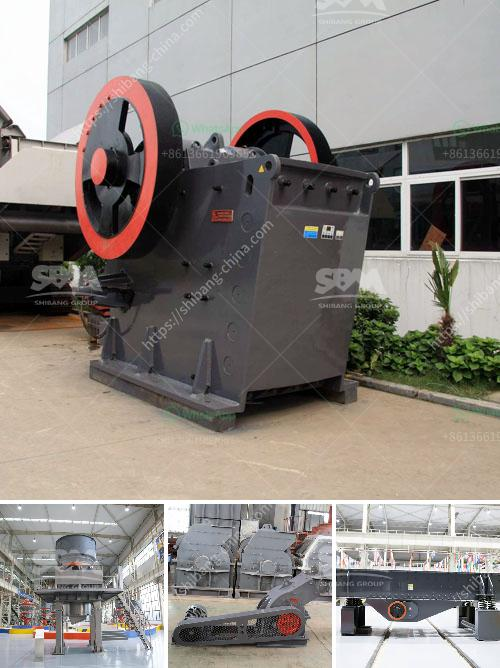

<h3>stone crusher machine in india</h3>
India is abundant with stone resources that include granite, marble, sandstone, limestone, slate, and quartzite, among others. Stone crushing industry has long history and plays important role in economy development in India.

Stone crusher machine is widely used in mining, metallurgy, construction, highways, railways, water conservancy, chemical and other industries. With the development of modern economy and society, the overall demand for stone crusher machine is increasing, and the prospects for this industry are promising.

Investment in stone crusher machine industry is also a major issue, and in order to improve the investment economic efficiency, the government must take measures to regulate the market economy. For example, to ensure the normal operation of the equipment and safety production, various parameters must be regulated strictly, including feeding, discharging, power, maintenance, etc.

Stone crusher machine manufacturer in India offer types of crusher for sale with best price used for stone crushing plant in India. Slang Crusher Machine in India - Heavy Slang Crusher Machine Profile: Slang crusher machine in the huge stones crushed into small stones, the first crusher is usually referred to as a "master" crusher.

As we all know, stone crusher includes jaw crusher, impact crusher, cone crusher and sand making machine. ect. Different model stone crusher has different usge and crushing method. Stone Crusher Usage

Stone Crusher Used in India for Sale with High Performance Cost Ratio Stone crusher is the main machine used in India mining production line. It can be divided into different types and SBM will provide the complete price list for local clients.
<h3>Contact us</h3><ul><li><strong>Whatsapp:&nbsp;<a href="https://wa.me/8613661969651">+8613661969651</a></strong></li><li><a href="https://swt.shibang-china.com/?git&amp;zhl&amp;stone crusher machine in india"><strong>Online Service(chat now)</strong></a></li></ul><h3>Related</h3><ul><li><a href='grinding plant in rajasthan.md'>grinding plant in rajasthan</a></li><li><a href='river sand and stone mining at sabah.md'>river sand and stone mining at sabah</a></li><li><a href='diamond stone crusher.md'>diamond stone crusher</a></li><li><a href='calcium bromide manufacturing process.md'>calcium bromide manufacturing process</a></li><li><a href='cost of mobile crusher in india.md'>cost of mobile crusher in india</a></li></ul>