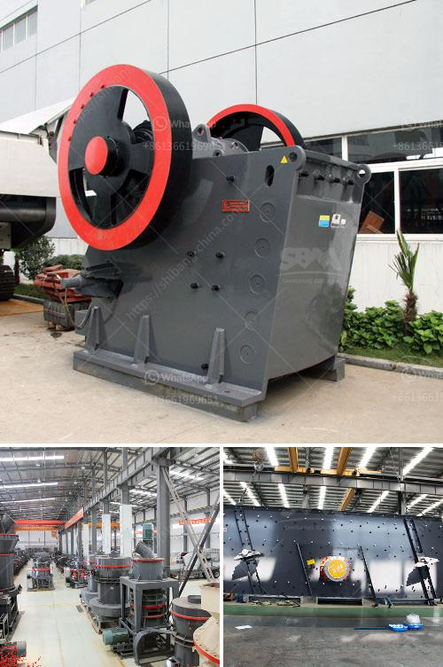

<h3>stone crusher machine in russia</h3>
Stone crusher machine is a powerful machine that turns stones into smaller pieces.  The machine has been used for centuries in various construction projects, especially in the construction of roads, bridges, buildings, and canals. It is now a staple in mining and construction projects.

The machine can quickly and efficiently reduce the size of stones into smaller, manageable pieces. This is particularly useful for projects that require stones of specific sizes and shapes. The machine comes in different sizes and models, depending on the requirements of the project.

In Russia, stone crusher machine is applied widely in rock crushing plant for crushing various rocks. Thus stunning in industry, stone crusher machine has played a significant role in Russia mining industry.

Stone crusher machine for sale is widely used in Russia mining industry. Though stone crusher machine includes stationary crusher and mobile crusher, it always needs a certain crushing machine for further crushing. The more important is the crushing equipment wear resistance and long service life. Moreover, the performance of crusher machine is closely related to the quality parameters etc. Our professional crusher machine engineers will suggest a suitable model for the customers according to their requirements.

Stone crusher machine in Russia is mainly used for mining and construction industry. The mining industry in Russia is expected to grow at a CAGR of over 5% over the forecast period. Due to the rapid economic growth as well as the growing construction industry in Russia, the demand for stone crusher machines is constantly increasing.

The other major factor behind the rise in demand for stone crushing equipment in Russia is the increasing prevalence of chronic diseases. This has resulted in a rise in the number of people suffering from various kidney-related problems, such as kidney stones, and more. This has created a booming stone crushing equipment market in Russia.

Furthermore, the government initiatives to support various construction and mining activities are also expected to propel the demand for stone crushing machines. The Russian government has invested significantly in development projects, such as the construction of new highways, bridges, and residential buildings.

In conclusion, the stone crusher machine in Russia is essential for a wide variety of construction projects. These machines can crush enormous amounts of rocks and stones into smaller pieces effortlessly and efficiently. The machine is very flexible in terms of adaptability and can be used for projects of different sizes and complexity. With the growing demand for stone crushing equipment in Russia, the machine is sure to have a bright future in the mining and construction industry.
<h3>Contact us</h3><ul><li><strong>Whatsapp:&nbsp;<a href="https://wa.me/8613661969651">+8613661969651</a></strong></li><li><a href="https://swt.shibang-china.com/?git&amp;zhl&amp;stone crusher machine in russia"><strong>Online Service(chat now)</strong></a></li></ul><h3>Related</h3><ul><li><a href='conveyor belt manufacturers in bangladesh.md'>conveyor belt manufacturers in bangladesh</a></li><li><a href='slag roller mill.md'>slag roller mill</a></li><li><a href='gold wash plant trummel revelstoke.md'>gold wash plant trummel revelstoke</a></li><li><a href='used triple horizontal vibrating screen for sale.md'>used triple horizontal vibrating screen for sale</a></li><li><a href='grinding machine parts and their functions.md'>grinding machine parts and their functions</a></li></ul>