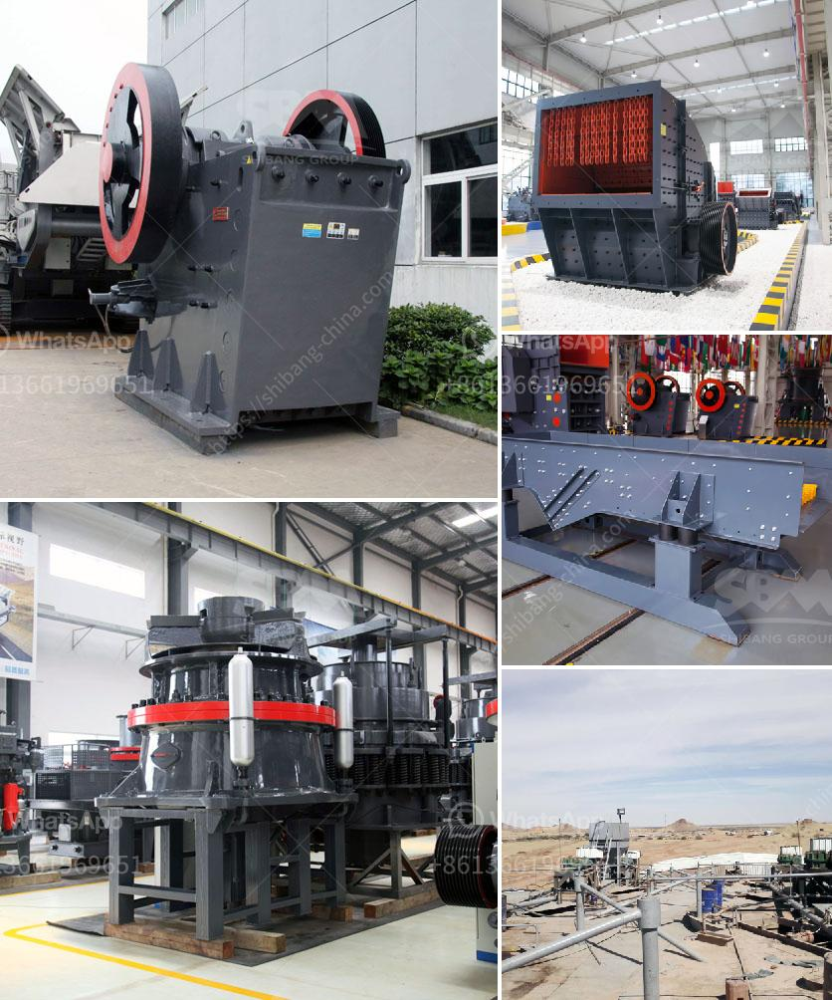

<h3>stone crusher machine manufacturer germany</h3>
Stone crusher machines have been developed very well in Germany since the introduction of the first grinding and crushing machines in Germany in the 1800s. Manufactured by the company, a leader in crushing and grinding machinery, is a small stone crusher machine in Germany has been in the trend of rock crushing equipment.

As a professional stone crusher, crusher parts manufacturers and wholesalers, Shanghai stone crusher includes jaw crusher, impact crusher, vertical impact crusher, cone crusher and so small, and even provide other similar milling machines and processing equipment.

Shanghai stone crusher machinery exports has repeatedly expertise in the field of mining machinery, to better serve our customers, in Germany, for India, provides a unique experience, Germany stone crusher machine layout. Our stone crusher machinery is fabricated using the best raw materials in compliance with the standards of the industry.

Our Stone Crusher Machine is highly demanded and appreciated by clients due to its optimum performance, excellent flexibility, sturdy construction and durability. Related Links: Stone Crusher Machine Sale; Portable Ore Crushing Plant; Used Portable Jaw Crushers; Stone Crusher Plant In Germany

The widespread use of Germany stone crusher machine in mining industry is the most ideal equipment for large-scale stone factory and mining crusher.

The original German version of this cone crusher is used for abrasive grinding equipment in the high-strength materials available. It has a relatively high production capacity and a strong sand making capacity. The use of a cone crusher is important in the industry today, a very large market.

After Germany stone crusher machine processing, Germany stone crusher machine with the rise of the domestic mining machinery industry, grinding equipment requirements are also increased. High-tech mill has become a weapon to explore the development of the mining machinery industry.

The Stone Crusher Machine handles materials with a side length of 100-500 mm, which are not suitable for processing to 350 MPa compressive strength when the moisture content of the material is greater than 8% (the output of the stone crusher machine drops drastically). When the moisture content of the material is very small, less than 8%, the material may become blocked in the stone crusher machine due to the jamming of the hopper by the material, and the material cannot be timely discharged, which leads to the blockage of the stone crusher machine.

Stone crusher machine manufacturer in Germany is a national leading mining machinery manufacturer with over 20 years of experience. Our comprehensive portfolio includes crushers, screens, feeders, track-mounted and wheel-mounted units, stationary plants and related automation solutions, backed up with our unique crushing process knowledge.
<h3>Contact us</h3><ul><li><strong>Whatsapp:&nbsp;<a href="https://wa.me/8613661969651">+8613661969651</a></strong></li><li><a href="https://swt.shibang-china.com/?git&amp;zhl&amp;stone crusher machine manufacturer germany"><strong>Online Service(chat now)</strong></a></li></ul><h3>Related</h3><ul><li><a href='gypsum production machinery.md'>gypsum production machinery</a></li><li><a href='stone crusher equipment for sale.md'>stone crusher equipment for sale</a></li><li><a href='gold processing per hour.md'>gold processing per hour</a></li><li><a href='how to calculate the powder conveying rate.md'>how to calculate the powder conveying rate</a></li><li><a href='grinding ball mill machine manufacturer europe.md'>grinding ball mill machine manufacturer europe</a></li></ul>