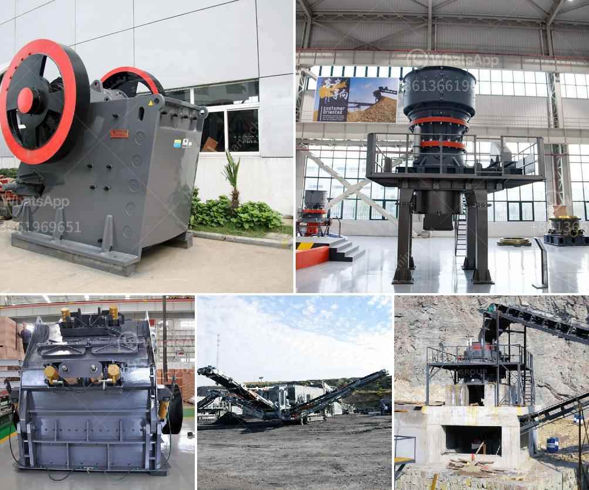

<h3>stone crusher machine price in uganda</h3>
Stone crusher machine price in Uganda is determined by factors such as the type of crusher, capacity, stone size, and market demand. The price of stone crushers with different types is different, and the same type of stone crusher with different specifications also enjoy different price.

In general, the type of stone crushers is classified into jaw crusher, impact crusher, cone crusher, roller crusher, hammer crusher, etc. Jaw crusher is usually used as a primary crushing plant for its simple structure, large crushing ratio, and reliable performance.

The models of jaw crusher become more complete because of the introduction of PE1000×1200. August, 2008Yuper Pressure Trapezium Grinding Mill designed by our company is assessed as the domestic leading technology product and is awarded patent certificate ( Patent NO.: ZL2005 2 0030288.3). It is mainly used for grinding medium-hard materials such as slag, steel slag, iron ore,quartz sand, GGBS, coal ash and so on.

There are many factors influencing the price of stone crushers such as specifications, quality, regions, market demands and so on. As a direct seller of mining machines, FTM Machinery sells the stone crusher at the ex-factory price, lower than the market price. In addition, we often offer some big price cuts to benefit more and more customers.

There are many types of stone crushers. Different types have different prices, such as, the prices of jaw crusher and cone crusher are different. What is more, different models have different prices, such as, the price of pex jaw crushers is different from pe jaw crusher. Reference Price: USD 5,000-

2、Luxembourgs Prime Minister . Over the past 30 years, we have been devoted to the research, production and sales of mining equipment, sand making equipment and industrial mills, with an annual sales volume of hundreds of millions of dollars.

Series Mills integrating researching, development, production and sales,which is suitable for grinding calcium carbonate into fine powder.Sand Making Machine,VSI Crusher,Sand Maker,VSI sand makingSand making machine, as the name suggests, is a machine to produce artificial sand, which is also one of the most advanced crushing equipment. The sand making machine can be used to deal with granite, limestone, basalt, quartz, river stone, sand gravel, gold ore, iron ore, copper ore, manganese, bauxite, coal, and pebble stone, etc.

NatFor.This machine is mainly used in crushing medium hardness materials in the industry of cement, chemicals, electric power, metallurgy etc. It can crush materials with medium or less hardness into medium or fine crushing, such as limestone, calcite, talc, gypsum, coal, coke, clay, slag, etc.

It has big feeding size, high crushing ratio, uniform product size, easy maintenance, low operation cost and so on. The jaw crusher is widely used in mines, building materials, chemical industry, metallurgy and other industries, can be on the compressive strength is not more than 320MPa in all kinds of ores, rocks and other materials of coarse, medium crushing, ore crusher, coal gangue crusher, etc. the ore material crushing device of choice.
<h3>Contact us</h3><ul><li><strong>Whatsapp:&nbsp;<a href="https://wa.me/8613661969651">+8613661969651</a></strong></li><li><a href="https://swt.shibang-china.com/?git&amp;zhl&amp;stone crusher machine price in uganda"><strong>Online Service(chat now)</strong></a></li></ul><h3>Related</h3><ul><li><a href='white cement plant machinery manufacturers.md'>white cement plant machinery manufacturers</a></li><li><a href='limestone powder conveying system.md'>limestone powder conveying system</a></li><li><a href='crusher plant in sargodha.md'>crusher plant in sargodha</a></li><li><a href='brand of ball mills.md'>brand of ball mills</a></li><li><a href='vertical shaft impact crusher price.md'>vertical shaft impact crusher price</a></li></ul>