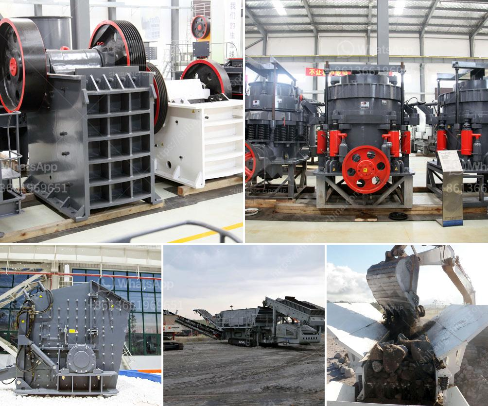

<h3>stone crusher machine tutorials</h3>
Stone crushing machine is widely used in the mining machinery industry and the current market demand is increasing significantly. The crushing equipment is used to break large pieces of rock into small pieces of material. The crushers used in this process are jaw crushers, impact crushers, cone crushers, etc. But the rock breaking machine also has different types and different uses.

Specifically, the jaw crusher is widely used in mining, smelting, building materials, highways, railways, water conservancy, chemical industry and various other industries. The impact crusher is used to crush coarse, medium and fine stones whose compressive strength is no more than 350MPa and Moh's hardness is lower than 9. In addition, it is widely used in quarrying, mining, construction waste recycling, and other industries. The cone crusher is suitable for crushing all kinds of ores and rocks with medium or higher hardness. It is mainly used in metallurgy, building materials, mining, chemical industry and other industries.

When using stone crusher machines, the cone crusher or jaw crusher needs to provide a certain amount of feed. For the technical performance parameters, please refer to the jaw crusher or cone crusher. Then, the materials on the screen are sent into the crusher chamber for preliminary crushing. Different types of crushing equipment have different characteristics and processing capabilities. For the specific capacity, please refer to the relevant equipment instructions.

Generally speaking, the crushing equipment used in the mining industry is generally a mobile crushing plant. Compared with the fixed crusher, the unique advantage of the mobile crusher is that it can be moved flexibly. It only takes less than an hour to drive from one mining site to another site, which greatly reduces transportation costs.

In addition, the mobile crusher has a good user experience and low maintenance costs. Compared with the traditional fixed crushing station, the mobile crushing station has been upgraded in terms of practicality, operation and fault intervention, which is more conducive to the construction and expansion of the mining site. It is an efficient, environmentally friendly and energy-saving crushing equipment.

In summary, the stone crushing machine showcased in this article can be used for crushing all kinds of materials, such as granite, limestone, basalt, pebble, metallurgical slag, etc. As a professional manufacturer of crushing equipment, we provide customers with a variety of mobile and stationary rock crushing solutions, such as the above-mentioned jaw crusher, impact crusher, cone crusher, and various other types. If you are interested in our products, please feel free to contact us.
<h3>Contact us</h3><ul><li><strong>Whatsapp:&nbsp;<a href="https://wa.me/8613661969651">+8613661969651</a></strong></li><li><a href="https://swt.shibang-china.com/?git&amp;zhl&amp;stone crusher machine tutorials"><strong>Online Service(chat now)</strong></a></li></ul><h3>Related</h3><ul><li><a href='cost of crushed concrete.md'>cost of crushed concrete</a></li><li><a href='crusher plant for coal for sale in south africa.md'>crusher plant for coal for sale in south africa</a></li><li><a href='sand screener and washer.md'>sand screener and washer</a></li><li><a href='slag drying and grinding technique india crusher.md'>slag drying and grinding technique india crusher</a></li><li><a href='ball mills for grinding zircon sand.md'>ball mills for grinding zircon sand</a></li></ul>