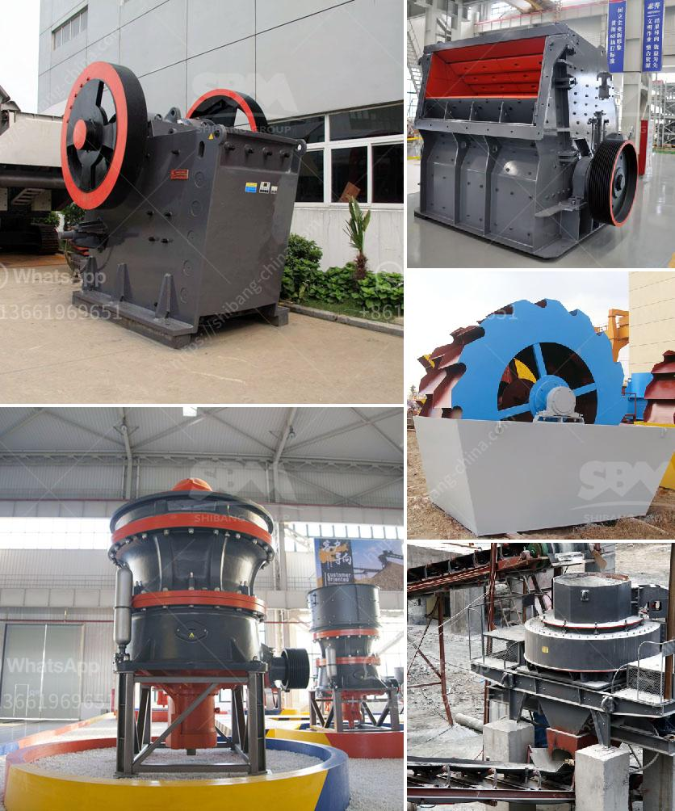

<h3>stone crusher plant in kenya</h3>
Stone crusher plant in Kenya is a lucrative business venture for contractors and builders. The demand for quality stone chips is increasing day by day as the development of infrastructure projects in Kenya, such as roads, highways, bridges, and buildings. There is a great demand for construction materials such as concrete, admixtures, and aggregates of all sizes. With the booming infrastructure industry, the stone crushing industry has also grown and matured in Kenya.

The stone crushing plant is a versatile machine that can be used for producing stone chips of various sizes. The stones can be used for projects involving the construction of roads, bridges, buildings, and canals. Stone crushing is also used to produce sand from limestone, granite, basalt, and river stone.

In Kenya, the mining sector is dominated by artisanal and small scale miners who rely on manual mining methods and crude processing technologies for their livelihood. As a result, various challenges arise, including occupational health and safety issues, inefficient and environmentally harmful mining practices, and limited access to finance and market opportunities.

However, with the establishment of stone crushing plants, the mineral-rich rocks can now be easily crushed into desired sizes and used for various construction purposes. Moreover, stone crushing is also expected to provide employment opportunities in rural areas.

The stone crusher plant has a high degree of automation, low operating costs, high crushing ratio, and high productivity. It is a good choice for a stone crushing production line. The stone crusher plant in Kenya is currently the most commonly used gravel crushing equipment.

It is mainly used in crushing medium-hardness materials and the number of finished particles produced is relatively large. The stone crusher plant in Kenya is the equipment commonly used for processing stone ores in Kenya. The stone crusher plant is reliable, convenient, and flexible in usage.

The equipment structure is simple, and the crushing operation is convenient. Due to the compact structure, beautiful appearance, advanced technology, and vast market prospects, the stone crusher plant won good reputation among users in the industry.
<h3>Contact us</h3><ul><li><strong>Whatsapp:&nbsp;<a href="https://wa.me/8613661969651">+8613661969651</a></strong></li><li><a href="https://swt.shibang-china.com/?git&amp;zhl&amp;stone crusher plant in kenya"><strong>Online Service(chat now)</strong></a></li></ul><h3>Related</h3><ul><li><a href='calcite grinding machine manufacturer in udaipur.md'>calcite grinding machine manufacturer in udaipur</a></li><li><a href='zeolite sand making machine manufacturer.md'>zeolite sand making machine manufacturer</a></li><li><a href='hydraulic jaw crusher 30 x 40.md'>hydraulic jaw crusher 30 x 40</a></li><li><a href='crusher plant for sale.md'>crusher plant for sale</a></li><li><a href='gold mining equipment company in japan.md'>gold mining equipment company in japan</a></li></ul>