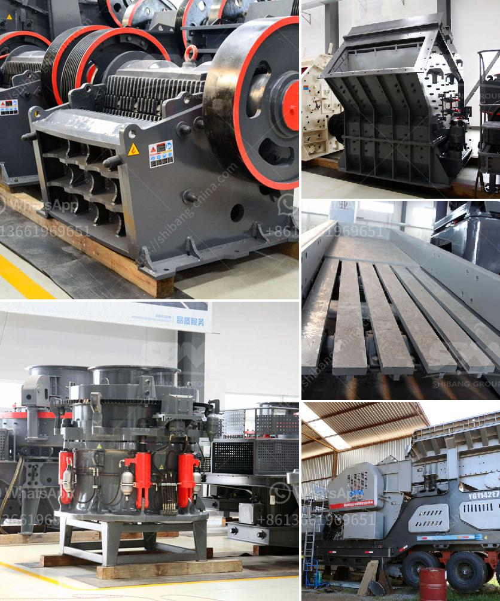

<h3>stone crusher plant in westbengal</h3>
Stone crushing plants operate differently. The crushing stage requires much greater attention, so the primary compression work gains assistance from an array of machinery that targets other forms of material breakdown expediency. Namely, the equipment that follows the primary crushing jaws opt for an impact-heavy mechanical profile. Impact hammers and impact plates are the important impact tools of impact crusher, which are not only easy to replace but also possess the strong wear resistance. Consumption of spare parts is less, and this gives the stone crusher plant a longer lifespan.

Crushers are used in the mining, metallurgical, construction, chemistry, petrochemical, transportation, and energy industries, mainly to reduce various types of stones and lump materials into medium-grained gravel. The machinery we have at our plant includes:

1. Jaw crushers - This machine is used for crushing stones and rocks of high pressure. The movable jaw is driven by the vibrating motor and the motion of transferring the eccentric shaft is completed through the belt pulley and the cone gear.

2. Impact crushers - These machines are designed with two rotors, which rotate in the same direction. They have a high feeding capacity and take advantage of the impact effect of the rotor in terms of reducing the size of rocks.

3. Cone crushers - These machines provide consistent performance and have a high reliability factor. Every model of crushers has its unique applications, so each one can provide you with better results than the others.

These machines work together to break down various types of rocks, ensuring that the final product is high-quality gravel, and the plant is equipped with different crushing equipment on presentation days.

The stone crusher plant can provide coarse aggregate for infrastructure construction industries such as expressways, high-speed railways, ports, airports, nuclear power, commercial and residential buildings, so it has a prosperous future.

Return on investment budgeting is a realistic approach to attain the above-mentioned goals. According to Rao, we should compare operating costs of the crushers, the productivity (tpd) and the sufficient screening capacity, among others, of plant operations, and later we can choose the preferred investment route. On the basis of the above analysis, the return on investment mechanism for the Stone Crusher Plant has been discussed.

Stone crushers in West Bengal have started receiving a fresh lease of life after the state government announced a 50% subsidy. Part of the package, a restructured energy conservation program has trimmed electricity consumption in 110 mainly industrial buildings by 30%.

Also, a Pilot Project for Energy Conservation began in 1993, through a non-governmental organization. 500 village homes received biogas plants, with each family pledging to surrender one acre of land for the biomass crops needed to operate the bio-digesters.

The West Bengal government has asked the State Electricity Distribution Company to ensure that the hours of electricity supply in West Bengal are extended to the contractual obligation of 300 days in a year. A relaxation has been issued for farmers, allowing them to install 100 HP (horsepower) motor pumps.

Since industries such as stone crushing plants, mining, construction, infrastructure, polytechnic, and engineering education have recently been hit by the economic downturn, subsidies and other interventions by the government have made a huge difference in generating employment for the unemployed.

Moreover, West Bengal has also been granted a production-linked subsidy. As of now, the manufacturing unit is providing direct employment to more than 30,000 people, with indirect employment reaching over 300,000 individuals.

In conclusion, the stone crusher plant will remain a lucrative venture for any entrepreneur. The business needs minimal investment for its operation and can promise high returns in the long run.
<h3>Contact us</h3><ul><li><strong>Whatsapp:&nbsp;<a href="https://wa.me/8613661969651">+8613661969651</a></strong></li><li><a href="https://swt.shibang-china.com/?git&amp;zhl&amp;stone crusher plant in westbengal"><strong>Online Service(chat now)</strong></a></li></ul><h3>Related</h3><ul><li><a href='sand making machine cost.md'>sand making machine cost</a></li><li><a href='conveyor belts for mining.md'>conveyor belts for mining</a></li><li><a href='gypsum recycling plant cost.md'>gypsum recycling plant cost</a></li><li><a href='vertical roller grinding mill for sale.md'>vertical roller grinding mill for sale</a></li><li><a href='gypsum ball mill manufacturing machine.md'>gypsum ball mill manufacturing machine</a></li></ul>