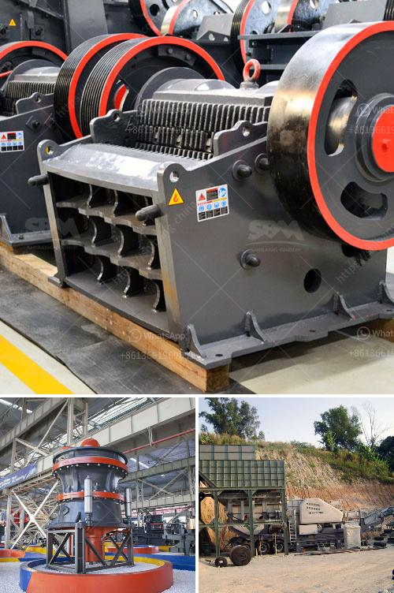

<h3>stone crusher plant management software</h3>
Stone crusher plant management software is a comprehensive software package designed to manage a stone crusher plant, including crushing operations, stockpiling, inventory management, and reporting. It includes various features such as real-time dashboards and reporting that help in having an overall view of the plant’s operations. 

This software enables the business owners to track the utilization of their equipment, manage their inventory, monitor the quality of raw materials and products, and keep track of employee activities. It also helps in keeping track of maintenance activities, scheduling repairs, and optimizing production schedules. 

With the increasing demand for stone products, the management of stone crushing plants has become more challenging. This software provides owners with an effective way to monitor and manage their plants, ensuring smooth operations and maximum profitability.

One of the key features of this software is the real-time monitoring and control of crushing operations. It allows the owners to monitor the status of each crushing unit in real time, including the availability of raw materials, the production rate, and the quality of finished products. This information is essential for making informed decisions about the plant’s operations and optimizing its performance.

Another important feature of this software is inventory management. It helps owners maintain an accurate record of their inventory, including raw materials, finished products, and spare parts. This enables them to monitor the stock levels, track the usage of materials, and plan for timely replenishment. Effective inventory management helps in reducing wastage, minimizing stockouts, and optimizing working capital.

Additionally, this software provides comprehensive reporting and analysis capabilities. It generates various reports such as production reports, inventory reports, maintenance reports, and quality reports. These reports provide valuable insights into the plant’s performance, help in identifying areas for improvement, and facilitate data-driven decision-making.

Moreover, this software streamlines the maintenance activities of a stone crusher plant. It helps in scheduling preventive maintenance tasks, tracks the maintenance history, and generates maintenance checklists. This ensures that the plant’s equipment is well-maintained, minimizing breakdowns and optimizing its lifespan.

In conclusion, stone crusher plant management software is a useful tool that helps in managing the daily operations of a stone crusher plant. It provides an overview of all the available, dispatched, and utilized resources, such as manpower, fleet, machines, and inventory. By effectively tracking the utilization and maintenance of these resources, owners can significantly enhance their plant’s productivity and profitability. Whether it is monitoring crushing operations, managing inventory, or planning preventive maintenance tasks, this software is an essential investment for any stone crusher plant owner.
<h3>Contact us</h3><ul><li><strong>Whatsapp:&nbsp;<a href="https://wa.me/8613661969651">+8613661969651</a></strong></li><li><a href="https://swt.shibang-china.com/?git&amp;zhl&amp;stone crusher plant management software"><strong>Online Service(chat now)</strong></a></li></ul><h3>Related</h3><ul><li><a href='prices of vibrating screens.md'>prices of vibrating screens</a></li><li><a href='jaw crusher single toggle.md'>jaw crusher single toggle</a></li><li><a href='rotary hammer mills with dispenser.md'>rotary hammer mills with dispenser</a></li><li><a href='jaw crusher pe 150x250.md'>jaw crusher pe 150x250</a></li><li><a href='mobile jaw crusher nigeria.md'>mobile jaw crusher nigeria</a></li></ul>