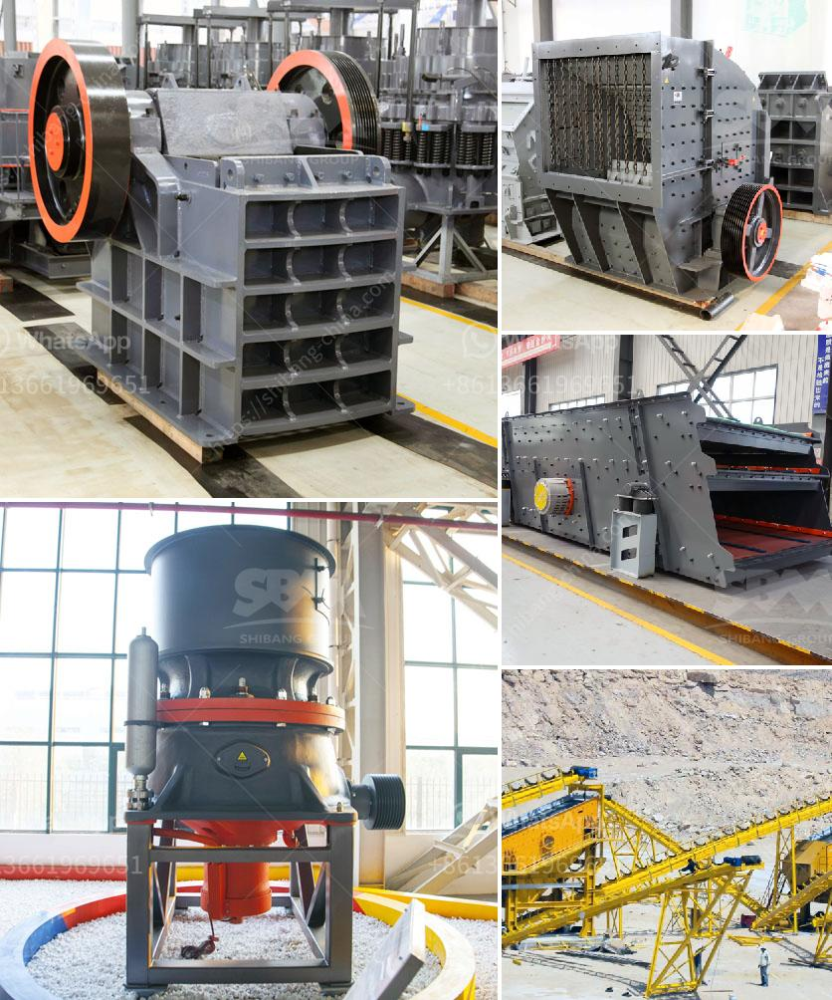

<h3>stone crusher plant set up procedure</h3>
Stone crushing plant is an important industrial sector in the country engaged in producing crushed stone of various sizes depending upon the requirement which acts as raw material for various construction activities such as construction of roads, highways, bridges, buildings, canals etc. It is estimated that there are over 15,000 stone crusher units in India.

The number is expected to grow further keeping in view the future plans for development of infrastructure of roads, canals and buildings that are required for overall development of the country. In India, the Stone Crushing Industry sector is estimated to have an annual turnover of Rs. 5000 crore and is therefore an economically important sector.

2. Application for consent to establish and consent to operate both to be obtained from the State Pollution Control Board

3. Stone crusher plant set up procedure in India are procedures and guidelines which are laid down by the pollution control board or environmental department for setting up a stone crusher plant. The process involved is to feed the stone in to the hammer crushers to make it further smaller in size as required by the customers in the hammer crusher, the stone is crushed. The crushed stone is screened by passing it through a vibrating screen to obtain different sized aggregates. The stone aggregates are then conveyed to the various construction sites. These aggregates are called as primary aggregates and they are obtained from hard rocks (granite, river gravels, igneous rock etc). The general procedure is to have an application submitted to the department along with copies of some of the required documents and the consent fee based on the size of the industry. Mostly the stone crushing units do not pay any prescribed compensation to the employees who get injured while on work. The subsidiary works as a marriage arrangement company which assist assembled single males as nicely as females fulfill in individual, the objective becoming marriage.

4. The conveyor system within the plant, as well as the support beams on the batching plants, should be taken into consideration to ensure proper and even distribution of the crushed stone material.

5. Following the installation, it is important to regularly inspect and maintain the plant to ensure its smooth operation and prevent any potential breakdowns.

6. Additionally, the plant should comply with all relevant safety regulations and provide necessary protective measures and equipment to prevent accidents and ensure worker safety.

Setting up a stone crusher plant involves a number of environmental and operational considerations. It requires careful planning and adherence to guidelines and regulations to ensure the plant operates efficiently and effectively, while minimizing the impact on surrounding communities and the environment. By following the correct set-up procedures, the plant operators can ensure that the plant is set up in a way that is conducive to efficient production, worker safety, and environmental sustainability.
<h3>Contact us</h3><ul><li><strong>Whatsapp:&nbsp;<a href="https://wa.me/8613661969651">+8613661969651</a></strong></li><li><a href="https://swt.shibang-china.com/?git&amp;zhl&amp;stone crusher plant set up procedure"><strong>Online Service(chat now)</strong></a></li></ul><h3>Related</h3><ul><li><a href='recycled glass countertops south africa.md'>recycled glass countertops south africa</a></li><li><a href='coal mining equipment for sale in germany.md'>coal mining equipment for sale in germany</a></li><li><a href='small ball mill prices in kenya.md'>small ball mill prices in kenya</a></li><li><a href='mobile rock crusher granulator jaw type ballitoville.md'>mobile rock crusher granulator jaw type ballitoville</a></li><li><a href='ball mills for grinding zircon sand.md'>ball mills for grinding zircon sand</a></li></ul>