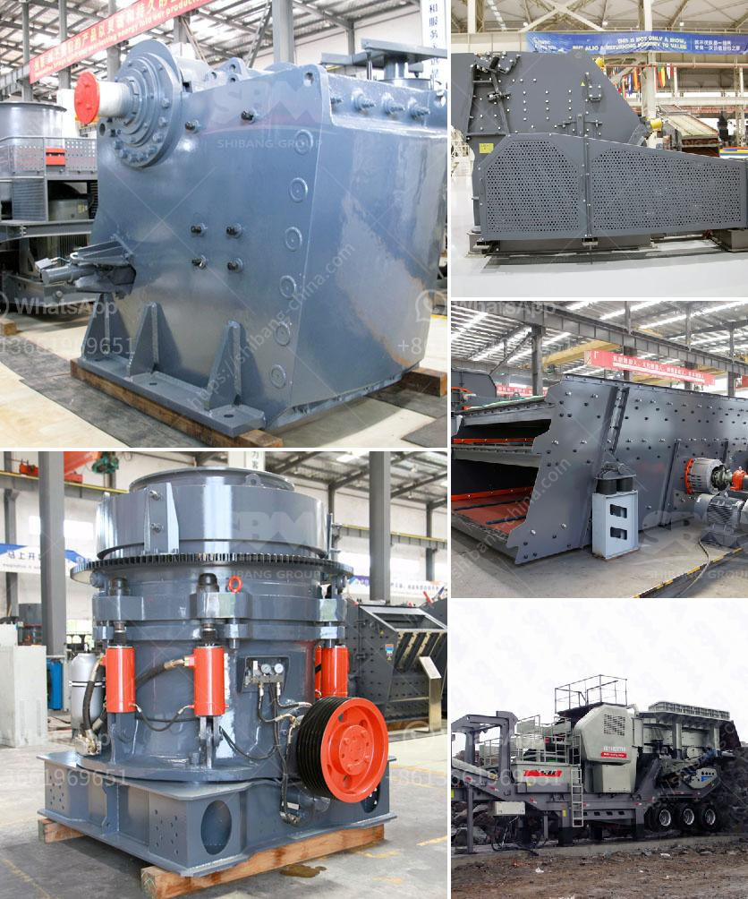

<h3>stone crusher plant sweden</h3>
Stone Crusher Plant Sweden - A stone crusher plant is a machine designed to reduce the size of large rocks from the ores extracted from the ground. These rocks are crushed into small, manageable sizes, which are then used to produce a variety of products. Stone crusher plants consist of various components that work together to crush rocks into required sizes.

Sweden is renowned for its granite deposits. Large quantities of high-quality granite are extracted and processed into various grades of crushed stone. Crushing plants are used to turn the extracted granite into aggregates, which are then used as raw materials in building, road construction, and other similar projects.

The stone crusher plant in Sweden includes various crushing machines, such as jaw crusher, impact crusher, cone crusher, mobile crusher, and screener. These machines are used for crushing granite, quartz, basalt, limestone, and other rocks on a large scale to produce aggregates for projects such as highways, bridges, airports, and industrial plants.

The jaw crusher is commonly used as the primary crusher in a stone crushing plant, providing an initial processing capacity of up to 800 tons per hour. It features a sturdy and durable design, ensuring high efficiency and long service life. The impact crusher, on the other hand, is used to crush smaller sizes of stones, producing aggregates of various sizes. It has a high crushing ratio, allowing it to produce high-quality and uniform aggregates.

The cone crusher is used for secondary or tertiary crushing. It has a large crushing force and can handle various types of materials, making it suitable for various applications. The mobile crusher and screener, on the other hand, are used for on-site crushing and screening. They can be transported easily from one location to another, enabling efficient and cost-effective operations.

Stone crusher plants in Sweden are equipped with advanced equipment, ensuring higher productivity, smoother operation, and more efficient use of energy. The innovative design of the machines allows reducing carbon emissions and environmental impact.

In conclusion, stone crusher plants in Sweden are innovative solutions that provide superior productivity, excellent particle size distribution, and reduced environmental impact. They have a wide range of applications across various industries, including mining, construction, and recycling. The use of advanced technologies and high-quality components ensures that the plants are durable, reliable, and efficient. With the growing demand for raw materials, stone crusher plants are essential for fulfilling our infrastructure needs and contributing to economic growth.
<h3>Contact us</h3><ul><li><strong>Whatsapp:&nbsp;<a href="https://wa.me/8613661969651">+8613661969651</a></strong></li><li><a href="https://swt.shibang-china.com/?git&amp;zhl&amp;stone crusher plant sweden"><strong>Online Service(chat now)</strong></a></li></ul><h3>Related</h3><ul><li><a href='raymond mill price list.md'>raymond mill price list</a></li><li><a href='stone crusher used equipment germany.md'>stone crusher used equipment germany</a></li><li><a href='stone crushers in cali.md'>stone crushers in cali</a></li><li><a href='buy stone crusher machine in saudi arabia.md'>buy stone crusher machine in saudi arabia</a></li><li><a href='cone crushers made in italy.md'>cone crushers made in italy</a></li></ul>