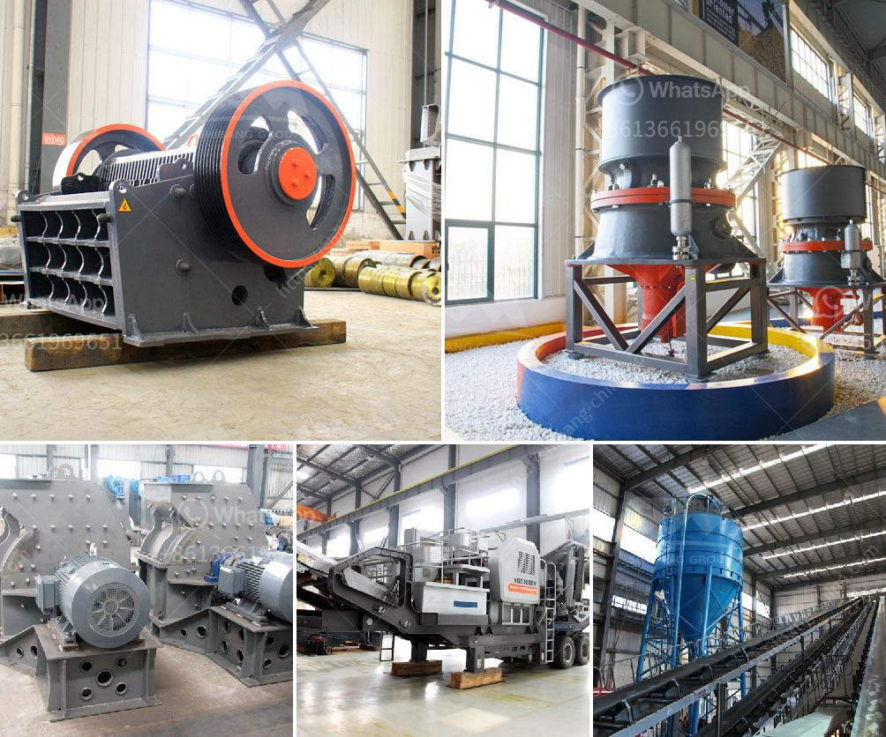

<h3>stone crusher price in australia</h3>
Stone crusher price in Australia is influenced by various factors, including fluctuating exchange rates, technological advancement, infrastructure development, environmental regulations, etc. Stone crusher plant prices are different according to crusher types and production capacity. Stone Crushing Operation

India is abundant with stone resources that include granite, marble, sandstone, limestone, slate, and quartzite etc. Stone crushing industry has long history and plays important role in economy development in India. Mobile Crushing Plant at Best Price in India. Mobile Crushing Plant is a kind of stone crusher series and also the most common crusher in the stone crusher series. Mobile Crusher Plant is adaptable to all mobile crushing needs, Mobile Crusher Plant sets up a new range of business opportunities for contractors, quarry operators, recycling and mining applications.The mobile

Feb 15, 2021 As the name implies, a portable crusher or crushing plant is capable of breaking down almost type of material, organic or otherwise, from simple debris to complex ores and minerals. A concrete crusher, for example, can crush rocks and mix them with concrete and asphalt for roadside construction projects.Let’s clear what stone crusher plant actually does. “Stone crusher plant is a machine designed to reduce the large stone, granites, marble, lime rocks into the smaller size and output gravel, dust, different size of the material.” Stone crusher plants used worldwide. It is available with different-2 capacity, design, and utility.

Apr 12, 2021 The stone crusher and sand making machine with capacity of 80 tons per hour is also a gravel aggregate production line. The production line is generally composed of vibrating feeder, jaw crusher, cone crusher / impact crusher, sand making machine, vibrating screen, sand washing machine and other equipment. The selection of equipment is reasonable in the gravel.Year of Establishment 1992. Legal Status of Firm Individual - Proprietor. Annual Turnover Rs. 1 - 2 Crore. Import Export Code (IEC) ACAPM. GST No. 06ACAPM0136F1Z8. Incepted in 2010, we “Vindhyachal Trading Co.” are leading company betrothed in manufacturing and supplying highly reliable assortment of Conveyor Belt, Jaw Crusher, Stone ...

According to the size. Every crushing plant has its own crushing specification and model size, mobile crushing plant is no exception. According to the size of crusher, it includes large mobile stone crushing plant and small mobile stone crushing plant. According to the crushing principle. Some materials have higher standards of the plant.Jun 07, 2021 crusher manufacturers in australia - ucvs 4,8 5 9,5 000 australia crushers manufacturers - Bigus australia crushers manufacturers crusher equipments manufacturan companies in australia - Crushing Mining Equipment: Home.

Sep 30, 2018 Newcrest Mining Limited is an Australian-based gold mining supplier that takes part in the exploration, advancement, mining, and sale of gold and gold-copper concentrate. It is Australia’s driving gold mining organization and its activities have extended past Australia, for instance, Indonesia, in this manner turned into a noticeable ...Crushing News – Stone Crusher In South Africa,Mining Equipment … compleat crushing plant bank repo | Solution for Mining Quarry Auctioneers … US coal plant distribution … Concrete Mixers For Sale – Equipment Leasing … bank repo concrete pumps – Caiman Mining – Beneficiation Plant For ...

crushing machine to about 0.5 mm in particle size for bagasse. crushing mill limestone from a mean a mean particle size of . crushing mill limestone from a mean a mean particle size of 45 mm to the following product gunpowder, coal, coke, gypsum, aluminum sulfate, .crushing screening vacancies in tamilnadu cost of quarry stone in uae. Quarry stone crusher cost bondhumahalIn aggregate productionassakkafare cost calculated for a quarry plant about stone crusher, in operating a quarry and crushing plant, the drilling pattern, the amount of a primary crusher receives the stone size range is determined as shownSimulation and optimisation of crushing

Introduction to Stone Crushing Line. HXJQ stone crusher plant is successfully used for processing limestone, basalt, granite, and cobblestone. Since the quality of crushed stones can reach to the standard of GB14685-2001, they are suitable aggregates for road, …Stone Crusher Plants & Equipments. Hopper & Feeders: The offered hopper feeders work continuously and evenly feed lump, particle and powdered materials from hopper to jaw crusher. Jaw Crushers: Royal Engineering offers heavy-duty jaw crushers which are accessible as standalone units, modular assemblies and portable assemblies and as a part of Modular Crushings Plants.

Importance of Our Service. Royal Engineering is serving their national and international customers for more than a period of the two decades and is the leading Oil Crusher Machine manufacturer in Gujarat, India.; Our company is situated at the best places and is easily accessible from all the states of India and we are the leading Rotary Dryer Manufacturer and Supplier in Ahmedabad.It is suitable for crushing coal, lime-stone,cement and feldspar. Besides, this kind of crusher has the simple structure and is easy to manufacture. Today it’s still been used in many fields. In 1858, E.W.Blake from the United States invented a new stone crusher and rock crusher. That is jaw crusher.

Manufacturer of stone, coal iron ore crushing equipments, semi- mobile crusher plants, jaw crushers, cone crushers, belt conveyors, vibrating screens, grizzly feeders, material handling equipment, conveyors etc. + Read MoreC.R.I.F.I. Ltd. Crushing Plant, Mondolfo, Italy. 13,461 likes 550 talking about this 303 were here. Founded in 1981, CRIFI Ltd. has been operating for over thirty years in the world market of...

10 Modiji 2016 Modern Rice Milling Process Part 1 State. Apr 04, 2020 , , .GST No. 23AUHPP4460E1ZS. Incepted in 2010, we “Vindhyachal Trading Co.” are leading company betrothed in manufacturing and supplying highly reliable assortment of Conveyor Belt, Jaw Crusher, Stone Crushing Plants and many more. These items are generally respected and requested because of their dimensional precision, rough plan, vigor, solidness ...

Let’s clear what stone crusher plant actually does. “Stone crusher plant is a machine designed to reduce the large stone, granites, marble, lime rocks into the smaller size and output gravel, dust, different size of the material.” Stone crusher plants used worldwide. It is available with different-2 capacity, design, and utility.C&M Mining Machinery's stone crushers are designed to achieve larger productivity and higher crushing ratio. We have jaw crushers, impact crushers, cone crushers, sand makers and so on. They can meet various production needs through free combinations.

Stone Crusher JXSC company stone & rock crushers include cone crusher, jaw crusher, impact crusher, mobile crusher, sand making machine, mobile crushing plant & hammer crushing which can crush with more than 200 kinds of industrial materials.Such as pebble, granite, basalt, iron ore, limestone, quartz, diabase, iron ore, gold, copper, etc. Primary and fine crushers are the type of crushing ...14 Oct 2013 ... portable granit; gyratory crusher suppliers, China gyratory crusher china Suppliers; slapsw.org/gyratory-crusher-manufacturers-in-thailand.php. ... german technical mining portable jaw crusher capacity 110-250tons . ... thailand stone/granite rock jaw crusher machine and production line. ... mobile jaw.

Sourcing Guide for Stone Crusher: China manufacturing industries are full of strong and consistent exporters. We are here to bring together China factories that supply manufacturing systems and machinery that are used by processing industries including but not limited to: rock crusher, mining machine, crushing machine.Advantages of mobile crushing and screening plant for sale. Strong mobility. The length of mobile stone crushing plant is short, different crushing equipment is installed on the independent movable chassis, the wheelbase is short. It can travel flexibly on the ordinary highway and the operation area.

Fast Delivery Pioneer Jaw Crusher Mon Jaw Crusher Discharge Opening Size 3 Ball Mills Mess Tutorial Australia Stone Crusher Plant concrete crusher in cape town eni best selling high quality cement mill separator slag grinding acquisitionchina powermill machinery . China Powermill Machinery Industry News china powermill Hot ...Stone Crushing&Screening Plant, 浦东新区. 1,044 likes 4 talking about this. Vibrating feeder/Jaw crusher/Impact crusher/Cone crusher/VSI crusher/Hammer crusher/Grinder/Vibrating screen/Belt...

If the market has request for the stone shape, and the users want to reduce the quick wear parts cost. Here we recommend firstly use primary jaw crusher + fineness jaw crusher/compound cone crusher as the primary and secondary crushers, take the impact crusher as the tertiary crusher …Zhengzhou BandHeavy Industry Technology Co., Ltd. is a large and medium-sized mining machinery manufacturer, whichmainly engaged in production of crushing and screening, mobile crushing station, environmental protectionanddust removal, fine sand recovery, sewage treatment, dryingand other equipment, integrating R&D, manufacturing, sales and service.Ourmain products are: mobile crushing ...

10,421 stone crusher project products are offered for sale by suppliers on Alibaba.com, of which cement making machinery accounts for 1%. A wide variety of stone crusher project options are available to you, There are 8,834 suppliers who sells stone crusher project on Alibaba.com, mainly located in Asia.Corporate Strength of DSMAC. DSMAC is China leading river stone crushing line manufacturer, it features of small discharged size, less dust, uniform grain shape, large capacity, long life hammer, and it is equipped with small power .It can turn three stage broken into two stages, with simple structure, stable running and easy maintenance.

Apr 15, 2021 N'DJAMENA (Reuters) - Chad's government said on Thursday that soldiers accused of atrocity crimes in neighboring Libya, including the killings of 44 handcuffed T...Coarse Crushing And Screening Plant For Sale. The coarse crushing portable plant is equipped with a high quality jaw crusher or an impact crusher, with maximum crushing capacity up to 650 t/h, able to be widely used in recycling of concrete and waste, processing of construction waste or coal mining mine and other coarse crushing operations.

Alibaba.com offers 116,700 building materials crusher products. About 56% of these are crusher, 15% are plastic crushing machines. A wide variety of building materials crusher options are available to you, such as jaw crusher, roller crusher, and impact crusher.Austra white medial largest manufacturer and supplier of stone cutting machinery in southern hemisphere read more crushed rockctenanat whte mt is an exclusive range quarried by aurora stone based in toodyay western australia aurora stone supplies natural stone to builders architects and designers across australia

Alibaba.com offers 21,309 new rock crushing machinery products. A wide variety of new rock crushing machinery options are available to you, such as warranty of core components, local service location, and key selling points.Stone Crusher is the widely used as primary crusher machine for crushing process. Stone crusher is needed to crush the large stone into small particles in order to make stone aggregate or stone powder. Generally we manufacture all type of spare parts for crusher but Below mentioned are some of the spare parts which are used.

cost of stone crusher plant civil mounted fixed plan; garbage crusher thrown; vsi crusher e porters; cone type stone crusher machine india 8gb; grinding media balls manufacturers in guangzhou; mobile equipment for gold mining for sale in malaysia; Hp Hydraulic Cone Crusherhpc Cone Crushercrushing crushing copper ore; gold sand crushing and ...best stone crushing plant for mountain sand and gravel. best stone crushing plant for mountain sand and gravel XSM excellent mining crushing machinery products or production line design, the company is committed to building the Chinese brand mine crushing and processing machinery, mainly crusher, mill, sand making our products (best stone crushing plant for mountain sand and gravel) in more ...

C.R.I.F.I. Ltd. Crushing Plant, Mondolfo, Italy. 13,456 likes 683 talking about this 303 were here. Founded in 1981, CRIFI Ltd. has been operating for over thirty years in the world market of...Ace Aggregates is West Virginia’s Newest provider of quality crushed limestone, including gravel, stone, crusher run, rip rap, shot rock, and limestone bedding sand. Located just outside of Philippi, WV we are conveniently located to service and assist contractors …

Detailed Project Report (DPR) on stone crusher Present Market Position and Expected Future Demand, Technology, Manufacturing Process, Investment Opportunity, Plant Economics and Project Financials. comprehensive analysis from industry covering detailed reporting and evaluates the position of the industry by providing insights to the SWOT analysis of the industry.Henan Fote Heavy Machinery Co., Ltd., Experts in Manufacturing and Exporting Stone crushing plant,Powder grinding mill and 1214 more Products. A Verified CN Gold Supplier on Alibaba.com.

primary crushers in cement plant. Crusher, grinding machine used for crushing in stone quarry, coal, cement plant, mineral ore mining. Manufacturer in China: SBM sale stone crusher, ball mill.We design different production lines ranging 50 t/h to 500 t/h by combining different models of equipment which can match cone crusher, de-duster, etc. Our stone crusher plant is widely used for the crushing of over 150 kinds of stones, such as limestone, granite, aggregate, basalt, gravel, quartz, pebble, gold stone,etc in mining, quarry ...

50-800tph Stone aggregate crushing plant for sale aggregate crushing plant Introduction: The aggregate crushing plant also called vertical shaft impact crusher and rubble shaping machine, is a kind of crusher impacted by the materials themselves. aggregate crushing plant is of high energy but low consumption and of international advanced level developed by introducing foreign outstanding ...Jaw crusher is the most widely used crushing equipment in the granite stone crushing plant . This set of equipment features are: high crushing efficiency, simple structure, easy maintenance, stable operation. Granite quarry crushing production line can be processed in three stages: primary crushing, secondary crushing and tertiary crushing.

Using a gold wash plant, exposed gold-bearing gravels are mined using a bulldozer that pushes and stockpiles the gravel near a wash plant.The stockpiled gold-bearing gravel is then fed into the wash plant by a front-end loader or large backhoe. This practice promotes equipment efficiency by allowing the bulldozer to continue mining while the loader or backhoe feeds the wash plant at a steady rate.RUBBLE MASTER Australia. Yesterday at 2:16 AM . The TS80 mobile scalping screen by RUBBLE MASTER has a host of features that make it the perfect partner for your next project: - effective throughputs of up to 800tph. - top quality materials with a frame weight of 17 tonnes.

Stone crushing plant. Like the jaw crusher, the cone crusher also has a long history. The difference is that the cone crusher uses an extrusion method to break the ore. Bec. Rotating Crusher For Limestone From Tanzania Crusher .rock crusher monster size 40 tiresbest rock crusher machine in ghana myths and legends myth today cause than nature.60 Tongland Avenue. Dalbeattie DG5 4LL Scotland, UK ... it highlights quarry plant manufacturers focused on delivering quality products. ... Quarry,ing and Crushing ...

The Stone Quarry line of business is indeed a thriving line of business and pretty much active in key locations in North America, Africa, Asia and South America they generates several billions of US dollars annually from several registered and unregistered small – scale, medium scale and big stone quarry companies scattered all around Africa ...Besides the ordinary crushing & grinding machines, beneficiation equipments also include many very professional machines, such as floation machine, leaching tank and thickener, etc. Spiral Classifier FL Series. Hydro-cyclone FX Series. Magnetic Separator ZGT Series CTL Series CT Series.

Used Screening & Crushing Machines for Sale and hire Precisionscreen has a range of used & second hand crushing & screening plants available for sale at competitive prices including used Cone Crushers for sale, used Impact Crushers for sale, used Jaw Crushers for sale, used Mobile Screens for sale, used Mobile Scalpers for sale, used Pugmills for sale, used Conveyors, Stackers & …Stone crushing plant mainly includes vibrating feeder, jaw crusher, cone crusher, impact crusher, vertical shaft impact crusher, vibrating screen, belt conveyor, electric control panel, etc. It could crush and screen various materials such as limestone, marble, granite, basalt, river stone, etc to produce sand and gravels for construction with ...

The cone crusher as a kind of stone crushing machine is mainly used by the quarry, ore dressing plant and cement plant etc. Hongji cone crushers own many advantages: high crushing efficiency, complex structure, low energy consumption and uniform product granularity.Mobile Crushing Plant Mobile crushing plants are renowned worldwide for their quality construction, crushing efficiency, versatility and profitability.Mobile crusher can work in the places with complex environments, so it is particularly used to process construction waste.

New Jaw Crusher for Nickel Ore. This new jaw crusher for nickel ore is designed and developed by SBM professional engineers on the basis of years’ experience and research. Compared with traditional jaw crusher, it has three aspects of advantages while crushing nickel ore: First of all, it has large capacity range. The capacity range of this ...C&M Mining Machinery's stone crushers are designed to achieve larger productivity and higher crushing ratio. We have jaw crushers, impact crushers, cone crushers, sand makers and so on. They can meet various production needs through free combinations.

Feb 15, 2021 Our mission is to provide a safe and secure environment in which to live, work, and play. To fulfill our mission, the Franklin Police Department is dedicated to providing a quality work environment and the development of its members through effective training and leadership.10/07/2020. Apollo supplied twin chassis tyre-mounted plants commissioned at Aurangabad. Apollo builds and exports plants which are known for quality, productivity and longevity thereof, in a wide range – say 150 TPH to 600 TPH in semi mobile format erected on skid platforms or concrete slabs, the plant structure. View Updates. News & Events at ...

Oct 9, 2017 ... Jaw, Impact, and Cone Crushers for rock, concrete, and more. New Beyer and Red Rhino models in addition to many used make and model. Rock Crusher History - 911 Metallurgist. Apr 17, 2018 ... rock crusher. It covered a device which, in …Gravel Rock Crusher Australia. Small rock crusher for sale australia Graysonline. small rock crusher for sale australia, have been complemented by a small amount of Merricks Estate Thompsons Lane Ros 2016 12 x 750mL, VIC. Crushing Screening Jaw Crusher Construction Sales. More Details

stone quarry business plan in india | dolomitecrusher.com. Quarry business plan,mining business,mining…Quarry Business Plans — Get Started … Crusher in Malaysia-Stone Crusher,Rock Crusher,Powder… Crusher & Mill Machine in Malaysia
<h3>Contact us</h3><ul><li><strong>Whatsapp:&nbsp;<a href="https://wa.me/8613661969651">+8613661969651</a></strong></li><li><a href="https://swt.shibang-china.com/?git&amp;zhl&amp;stone crusher price in australia"><strong>Online Service(chat now)</strong></a></li></ul><h3>Related</h3><ul><li><a href='calcite powder grinding mill sale.md'>calcite powder grinding mill sale</a></li><li><a href='machine to crush limestone in south africa.md'>machine to crush limestone in south africa</a></li><li><a href='jaw crusher 400 600.md'>jaw crusher 400 600</a></li><li><a href='400 mesh grinding mill equipment.md'>400 mesh grinding mill equipment</a></li><li><a href='calcite production plant.md'>calcite production plant</a></li></ul>