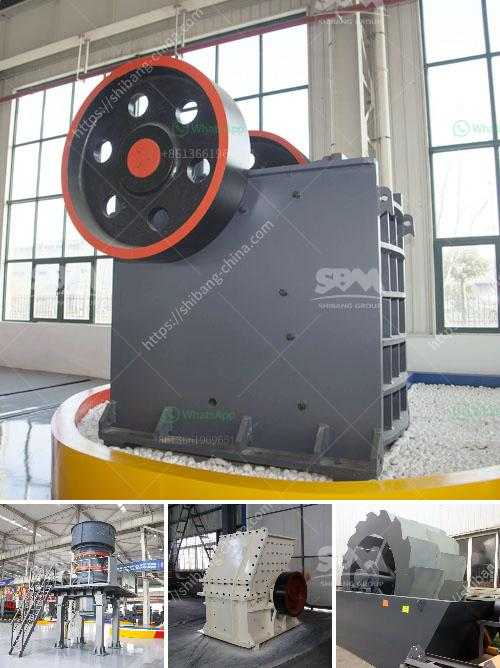

<h3>stone crusher prices german</h3>
The stone crusher industry in Germany is experiencing a considerable growth period due to increasing demand for aggregates used in numerous construction activities. This increase in demand has led to a surge in stone crusher prices German suppliers are responding to this demand by providing more innovative machines that offer greater productivity at reduced costs.

Germany is known for its highly advanced machinery and relentless pursuit of technological advancements. This is particularly true in the construction and mining sectors. German manufacturers have always excelled in producing high-quality and durable equipment. Stone crushers are no exception.

Stone crushers are primarily used to crush rubble and other construction materials into smaller sizes for further use in the construction industry. The importance of stone crushers cannot be overstated. They are essential for the construction of roads, bridges, buildings, and other infrastructure projects. Without stone crushers, it would be near impossible to accomplish large-scale construction projects efficiently and cost-effectively.

The prices of stone crushers in Germany vary depending on the specific model and capacity. However, one thing is certain - German suppliers offer competitive prices for their stone crushers. Whether you are a contractor or a construction company, you can find the best stone crusher prices German manufacturers have to offer by conducting thorough research and comparing various suppliers.

In recent years, German stone crusher manufacturers have invested significant amounts in research and development to improve the quality and efficiency of their machines. As a result, the latest generation of stone crushers offers enhanced productivity and reduced running costs. This makes them even more attractive to customers.

Moreover, German stone crusher manufacturers are increasingly focusing on eco-friendly technologies to meet the growing demand for sustainable construction practices. Many of the latest stone crushers are designed to operate with lower fuel consumption and produce fewer emissions, making them environmentally friendly choices for construction projects.

Additionally, German stone crusher manufacturers prioritize customer satisfaction by providing excellent after-sales service and support. As a customer, you can be confident that any issues or concerns you may have will be addressed promptly and effectively. This level of customer service is another reason why stone crusher prices German companies offer are worth considering.

In conclusion, the stone crusher industry in Germany is witnessing remarkable growth due to increasing demand for construction aggregates. German manufacturers have responded to this demand with innovative and efficient stone crushers, offering competitive prices. These crushers are not only high in quality but also environmentally friendly and backed by excellent customer service.

If you are in the construction industry and need a reliable and efficient stone crusher, exploring the stone crusher prices German companies are offering is a wise decision. By doing so, you can find the perfect machine that meets your requirements and ensures the success of your construction projects while maximizing productivity and minimizing costs.
<h3>Contact us</h3><ul><li><strong>Whatsapp:&nbsp;<a href="https://wa.me/8613661969651">+8613661969651</a></strong></li><li><a href="https://swt.shibang-china.com/?git&amp;zhl&amp;stone crusher prices german"><strong>Online Service(chat now)</strong></a></li></ul><h3>Related</h3><ul><li><a href='small ball mill prices in kenya.md'>small ball mill prices in kenya</a></li><li><a href='pulviriser machine in allahabad.md'>pulviriser machine in allahabad</a></li><li><a href='harga stone crusher 250 ton.md'>harga stone crusher 250 ton</a></li><li><a href='calcium carbonate proses by process.md'>calcium carbonate proses by process</a></li><li><a href='mineral industrial crushers.md'>mineral industrial crushers</a></li></ul>