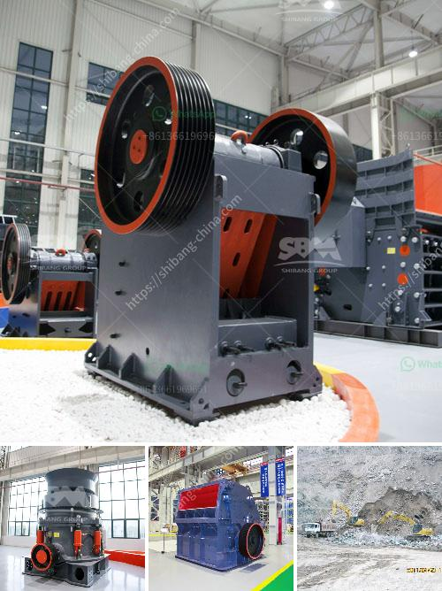

<h3>stone crusher small for quarry project</h3>
A small stone crusher machine is designed to reduce large rocks into smaller pieces, gravel, or rock dust. Crushers may be used to reduce the size, or change the form, of waste materials so they can be more easily disposed off or recycled, or to reduce the size of a solid mix of raw materials, so that pieces of different composition can be differentiated. Crushing is the process of transferring a force amplified by mechanical advantage through a material made of molecules that bond together more strongly, and resist deformation more, than those in the material being crushed.

The small size stone crusher is suitable for quarry project. When the customers have limited yards or working site, the small stone crusher machine is the best choice to expand the quarry project. From its small size, the output capacity ranges from 10-30tph. It is designed to meet the individual requirements of quarry customers. As a trusted supplier of mining equipment, SBM can ensure that all mining machine manufacturers are built to handle the harsh conditions associated with quarrying operations.

The small stone crusher machine for sale can crush stones into smaller size than gravel which is more suitable for road building. It is easy transportation, low transportation cost, and reliable performance. Also the small stone crusher machine can be used as construction aggregate or metal for sale. It is efficient in reducing the large amount of concrete, bricks, stones, and other materials into smaller pieces that are required for construction.

The small stone crusher is widely used in mining, building materials, chemical industry, metallurgy and so on. It is suitable for primary and secondary crushing of all kinds of minerals and rocks with compressive strength less than 320 MPa. In construction, road and railway building, and manufacturing industry, small stone crusher is widely used by most customers.

In conclusion, the small stone crusher is suitable for quarry project. With reasonable design, compact structure, and easy operation, it is widely applied for medium and fine crushing of various hard ores and rocks in the fields of metallurgy, mining, chemical, cement, and construction. Compared with large-scale stone crushing production line, small stone crusher has the advantages of small occupation area, high investment return, and reliable operation. Therefore, it is recommended to select suitable type and model according to the specific requirements and local conditions of the quarry project. With proper maintenance and regular inspection, the small stone crusher machine can have a long-lasting service life and provide high quality final products.
<h3>Contact us</h3><ul><li><strong>Whatsapp:&nbsp;<a href="https://wa.me/8613661969651">+8613661969651</a></strong></li><li><a href="https://swt.shibang-china.com/?git&amp;zhl&amp;stone crusher small for quarry project"><strong>Online Service(chat now)</strong></a></li></ul><h3>Related</h3><ul><li><a href='mobile crusher 100tph.md'>mobile crusher 100tph</a></li><li><a href='gold plant for sale south africa.md'>gold plant for sale south africa</a></li><li><a href='vibrating screen in south africa.md'>vibrating screen in south africa</a></li><li><a href='how to charge grinding media in ball mill.md'>how to charge grinding media in ball mill</a></li><li><a href='grinding a stone crusher.md'>grinding a stone crusher</a></li></ul>