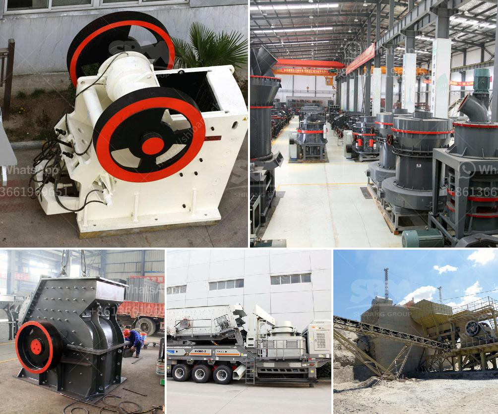

<h3>stone crusher suppliers in indore</h3>
When it comes to building, construction, or landscaping projects, finding the right suppliers for your needs is essential. One such supplier that plays a significant role in the construction industry is stone crusher suppliers in Indore.

Indore, situated in central India, is one of the fastest-growing cities in the country. With its vibrant economy and booming construction sector, it is no surprise that stone crusher suppliers in Indore are in high demand.

These suppliers provide various types of stones, such as limestone, granite, marble, and more, that are used in different stages of construction projects. Whether you need stones for the foundation or for decorative purposes, stone crusher suppliers in Indore cater to all your requirements.

What sets these suppliers apart is their commitment to quality and timely delivery. They understand the importance of using high-quality stones that are durable and can withstand the test of time. Their stones are sourced from trusted quarries and undergo rigorous quality checks to ensure consistency and reliability.

In addition to supplying stones, these suppliers also offer value-added services such as stone cutting, polishing, and shaping. This allows you to customize the stones according to your specific needs, giving your project a unique touch.

Another advantage of sourcing stones from these suppliers is their extensive knowledge and expertise in the industry. Whether you are a builder, contractor, or homeowner, they can provide valuable guidance and suggestions on stone selection, usage, and maintenance.

Moreover, stone crusher suppliers in Indore prioritize customer satisfaction above everything else. They provide excellent customer service, ensuring that all your queries and concerns are addressed promptly. Whether you need assistance in choosing the right stones or have any post-purchase issues, they are just a call away.

In conclusion, stone crusher suppliers in Indore are an integral part of the construction industry. They offer a wide range of high-quality stones that cater to various construction needs. With their commitment to quality, timely delivery, and exceptional customer service, they are undoubtedly the go-to suppliers for all your stone requirements.
<h3>Contact us</h3><ul><li><strong>Whatsapp:&nbsp;<a href="https://wa.me/8613661969651">+8613661969651</a></strong></li><li><a href="https://swt.shibang-china.com/?git&amp;zhl&amp;stone crusher suppliers in indore"><strong>Online Service(chat now)</strong></a></li></ul><h3>Related</h3><ul><li><a href='quartz plass grinder price.md'>quartz plass grinder price</a></li><li><a href='rubble recycle concrete crusher hire.md'>rubble recycle concrete crusher hire</a></li><li><a href='crushing plant for sale philippines.md'>crushing plant for sale philippines</a></li><li><a href='mica powder mill malaysia.md'>mica powder mill malaysia</a></li><li><a href='gypsum mining crusher in kenya manufacturer.md'>gypsum mining crusher in kenya manufacturer</a></li></ul>