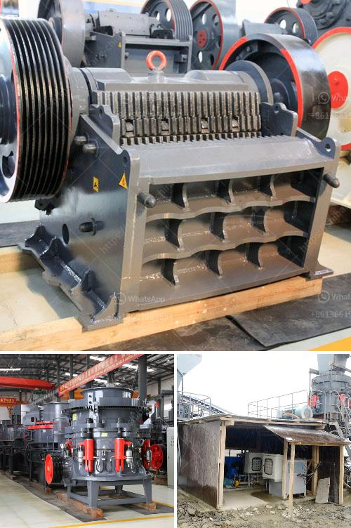

<h3>stone crusher uk</h3>
Stone crusher machines are used to break down large stones into smaller pieces in a variety of applications. The crushing process is accomplished by the use of a specially designed machine that uses impact and compression forces to reduce the size of the material. These machines have been in use for many years in the mining and construction industries, and are now also being utilized in the recycling industry. In the UK, stone crushers are widely used in various sectors such as mining, construction, and demolition. 

One may wonder why stone crushers are so important in the UK. The answer lies in the fact that the UK relies heavily on the extraction and utilization of natural resources. Stone is a primary material used in various sectors such as construction, road building, and landscaping. With the increasing demand for these materials, it has become necessary to use stone crushers to efficiently and effectively extract and process the required materials.

The stone crusher industry in the UK is well-established, with a long history of manufacturing and production. This has led to a range of stone crushers that are designed to cater to the diverse needs and requirements of the UK market. These crushers come in various sizes and capacities, allowing businesses to choose the right machine for their specific needs.

In the UK, stone crushers are widely used in the mining sector to break down large rocks into smaller, more manageable pieces. This enables the extraction of valuable minerals and ores that are present in these rocks. Stone crushers are also extensively used in the construction industry to prepare aggregate materials for various construction projects. Whether it is for road construction, building construction, or laying the foundation for a new development, stone crushers play a critical role in ensuring the availability of the required materials.

In addition to their use in mining and construction, stone crushers are now increasingly being used in the recycling industry. With the growing focus on sustainability and environmental preservation, the recycling of materials has become crucial. Stone crushers are used to crush and process various recyclable materials such as concrete, asphalt, bricks, and more. By breaking down these materials, stone crushers enable the recycling industry to reclaim and reuse these valuable resources, reducing the need for new materials and minimizing waste.

The stone crusher industry in the UK is highly competitive, with numerous manufacturers and suppliers vying for business. This competition has led to the development of advanced and innovative stone crushers that boast enhanced efficiency, productivity, and versatility. These machines are designed to provide a reliable and long-lasting solution for all crushing needs.

To conclude, stone crushers are an integral part of the UK's mining, construction, and recycling industries. Their ability to break down large stones into smaller pieces makes them indispensable in the extraction and processing of minerals and ores, preparation of aggregate materials for construction projects, and recycling of valuable materials. With the continuous advancements in technology and growing demand for stone crushers, the industry in the UK is set to thrive and continue providing a crucial service for various sectors of the economy.
<h3>Contact us</h3><ul><li><strong>Whatsapp:&nbsp;<a href="https://wa.me/8613661969651">+8613661969651</a></strong></li><li><a href="https://swt.shibang-china.com/?git&amp;zhl&amp;stone crusher uk"><strong>Online Service(chat now)</strong></a></li></ul><h3>Related</h3><ul><li><a href='cement plants for sale.md'>cement plants for sale</a></li><li><a href='rock crusher distributors in phillipinwes.md'>rock crusher distributors in phillipinwes</a></li><li><a href='grinding mill gold ore.md'>grinding mill gold ore</a></li><li><a href='coal wash and crusher machine.md'>coal wash and crusher machine</a></li><li><a href='hammer mill machines in indonesia.md'>hammer mill machines in indonesia</a></li></ul>