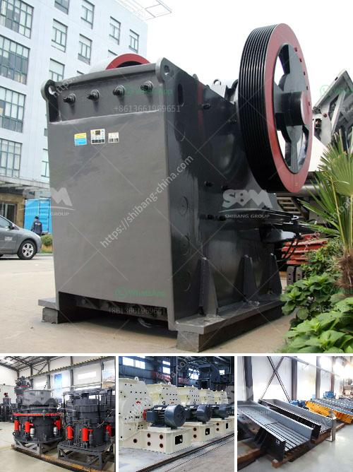

<h3>stone crusher used equipment germany</h3>
Stone crushing equipment is used to reduce or change the size of the stone into smaller pieces, gravel or rock dust in order to use it for various end-user application. The crushing surface of these equipment's are capable enough to compress materials like stones, iron, coke, quartzite and many other.

Germany is Europe's largest producer of aggregates with an annual demand of 500 million tons of gravel, sand, silica, quartz and natural stone. To address the needs of their customers, many German stone crushing plants feature advanced technologies and superior equipment. Energy efficiency and conservation measures have also been taken into account. When compared to other stone crushing equipment, stone crusher used equipment Germany has a higher crushing ratio and production efficiency.

Various stone crushing equipment used in stone crushing plants includes jaw crusher, impact crusher, cone crusher, fine crusher, roll crusher, hammer crusher and mobile crushing station, etc. Mining and construction industry is highly prosperous in Germany, evident by the increase in the number of construction equipment manufacturers and suppliers. This has led to a rise in the demand for crushers that can be used in various construction projects.

Stone crushing equipment is used for breaking down larger rocks into smaller pieces, which can then be used as gravel for construction purposes. These equipment's are also highly beneficial in iron ore, limestone, quartz, granite, sandstone and other raw materials processing. Crushers like jaw crushers and cone crushers are popularly used in primary crushing stages, while impact crushers and hammer crushers are used in secondary crushing applications.

The stone crusher used equipment in Germany can effectively process various types of stones such as limestone, granite, limestone, aluminum, copper and many other non-ferrous metals. In the process of crushing these different types of stones and ores, users will benefit from the availability of advanced technology and excellent performance of stone crushing equipment. Additionally, Germany stone crushing equipment has low energy consumption, which saves production cost and reduces environmental pollution.

Moreover, Germany stone crushers have abundant crushing capacity and can process various stones into desired size by adjusting the crushing cavity. Besides, Germany stone crusher equipment has more advanced technology and higher dust protection device. Thus, German stone crusher equipment is more popular among various stone crushing plants in Germany.

In conclusion, stone crusher used equipment Germany is designed to achieve maximum productivity and high reduction ratio. From large primary jaw crusher and impact crusher to cone crusher and VSI series for secondary or tertiary stone crushing, Germany stone crusher equipment is equipped with advanced technology and high-quality materials. It ensures that the stone crusher used equipment in Germany is reliable and durable, and can bring considerable economic benefits to customers in the stone crushing industry. With the continuous advancement of technical level, Germany stone crushing equipment is well received and widely used in the market.
<h3>Contact us</h3><ul><li><strong>Whatsapp:&nbsp;<a href="https://wa.me/8613661969651">+8613661969651</a></strong></li><li><a href="https://swt.shibang-china.com/?git&amp;zhl&amp;stone crusher used equipment germany"><strong>Online Service(chat now)</strong></a></li></ul><h3>Related</h3><ul><li><a href='dolomite crusher turkey 200 ton price.md'>dolomite crusher turkey 200 ton price</a></li><li><a href='coal specifications for power plant.md'>coal specifications for power plant</a></li><li><a href='lime stone pulverizer machine manufacturers.md'>lime stone pulverizer machine manufacturers</a></li><li><a href='german crusher manufacturers.md'>german crusher manufacturers</a></li><li><a href='copper mining and crusher processing in zambia.md'>copper mining and crusher processing in zambia</a></li></ul>