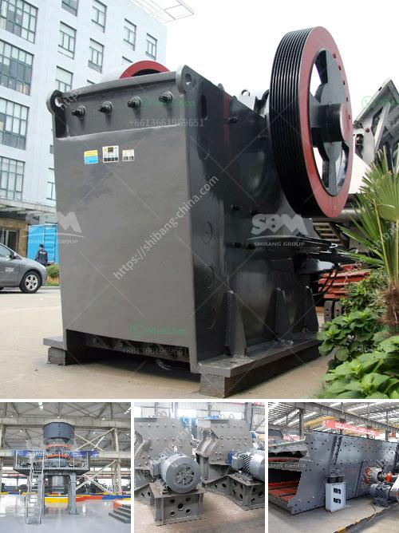

<h3>stone crusher zenith</h3>
Stone Crusher Zenith is a leading supplier of stone crusher machines in the world. Zenith is a famous brand in the field of crushing and grinding machines and has a long history in the industry. The company is known for its advanced technology and excellent quality of products, including stone crushers.

The stone crusher machines produced by Zenith have many advantages, such as high crushing ratio, reasonable structure, stable operation, easy maintenance and low operation cost. It can be widely used in various industries, such as mining, construction, road construction, chemical industry, etc. With the increasing demand for stone materials in infrastructure construction, the stone crusher machines provided by Zenith are widely welcomed by customers.

The stone crusher machines provided by Zenith can be divided into several types according to different crushing principles and different product sizes. Among them, jaw crusher, cone crusher and impact crusher are the mainstream crushing equipment in mining industry. Each type of crusher has its own unique advantages.

The jaw crusher is the most widely used crushing equipment. It has the advantages of large crushing ratio, uniform product size, simple structure and easy maintenance. The jaw crusher is suitable for crushing various materials with compressive strength less than 320 MPa.

The cone crusher is mainly used for secondary and tertiary crushing. It has the advantages of high crushing efficiency, large processing capacity, low energy consumption and uniform product size. The cone crusher is suitable for crushing various ores and rocks with medium and high hardness.

The impact crusher is mainly used for crushing and shaping of materials with low hardness and brittle materials. It has the advantages of high crushing efficiency, large processing capacity, cubic shape of finished products and selective crushing of materials. The impact crusher is suitable for crushing various materials with compressive strength less than 350 MPa.

In addition to the above three types, Zenith also provides mobile crusher and portable crusher, which can be used in different working conditions and can meet the requirements of different customers.

Stone Crusher Zenith has always been committed to technological innovation and product improvement. The company has a strong research and development team, equipped with advanced testing equipment, and has established close cooperation with many universities and research institutions. Through continuous technological innovation, the company's stone crusher machines have reached the international advanced level.

In conclusion, Stone Crusher Zenith is a leading supplier of stone crusher machines in the world. The machines provided by Zenith have been trusted and praised by customers. With excellent product quality, advanced technology and comprehensive service, Zenith has become a reliable partner for many customers in the mining industry.
<h3>Contact us</h3><ul><li><strong>Whatsapp:&nbsp;<a href="https://wa.me/8613661969651">+8613661969651</a></strong></li><li><a href="https://swt.shibang-china.com/?git&amp;zhl&amp;stone crusher zenith"><strong>Online Service(chat now)</strong></a></li></ul><h3>Related</h3><ul><li><a href='used granite crusher machinery.md'>used granite crusher machinery</a></li><li><a href='crushing plant working.md'>crushing plant working</a></li><li><a href='apolo grinding mill price in india.md'>apolo grinding mill price in india</a></li><li><a href='feldspar refining and processing equipment.md'>feldspar refining and processing equipment</a></li><li><a href='price of gold mining equipment.md'>price of gold mining equipment</a></li></ul>