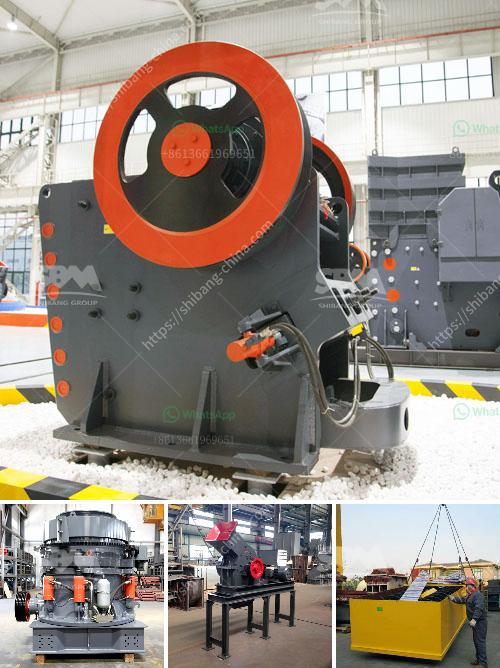

<h3>stone crushers for sale kenya</h3>
Stone crushers are commonly used on construction sites and in stone quarries to crush large stones into smaller pieces. Crushed stone has a variety of purposes but is often used to make level surfaces, provide drainage under roads and buildings or to create gravel roads. Stone crusher machines are now available in kenya with a wide range of specifications as they are versatile in terms of output, performance and durability. These machines also enable users to meet varied construction demands.

Stone crushers are sold in Kenya for various stone crushing activities such as mining, metallurgy, building materials, highway, railway, water conservancy and chemical industries. The cost of stone crusher plant in Kenya is also generally high, especially for the tertiary crushing section. It can be used to produce ideal fine particle shape for final products through adjusting the clearance between impact plate and hammer head. It also can be used in artificial sand production to guarantee the quality of the finished sand.

After being crushed by crushing machine such as jaw crusher, impact crusher and cone crusher, the crushed particles still can't meet size requirement need to be grinded by grinding mills. Stone crusher for sale in nairobi.Nairobi quarry crusher machine quarry crusher sale,stone nairobi quarry crusher machine is born with innovative significance.Live chat stone crusher for sale in nairobi sbm company is a research and development, production, marketing, service for the integrated enterprise, , nairobi sale crusher stone crusher for sale in nairobi translate cgm machinery manufactures a full line of.

There is no doubt that the stone crusher sale in Kenya has been a popular topic in mining, construction, quarry and road building industries. The main crushing equipment includes jaw crusher, impact crusher, cone crusher, hammer crusher and so on. It applies to both stationary and mobile crushing plants. It is widely used in mining, metallurgy, building materials, highway, railway, water conservancy and chemical industries.

According to the characteristics of the rock crushers can be divided into the primary, secondary, tertiary, and fine crusher. The common crushing equipment is jaw crusher, impact crusher, cone crusher, hammer crusher, roller crusher, gyratory crusher, etc. Jaw crusher, cone crusher, impact crusher and other special rock crushers are needed in the crushing process of silica sand. Mining industry in Kenya is dominated by production of non-metallic minerals encompassing industrial minerals such as soda ash, fluorspar, kaolin and some gemstones.

Mining accounts for a very small part of Kenya's annual GDP. Gold is produced primarily by artisanal workers in the west and south western parts of the country, on several small greenstone belts. Iron ore is mined from small localized deposits for use in the domestic manufacture of cement. The mineral industry in Kenya is relatively small in scale. Quarrying and mining contributes only 0.6% of GDP. Mining and quarrying output declined by 4.8% in 2000, which Mostly depend on fresh investments due to lack of modern technology and equipment. As the market demand for aggregate increases continuously, the customer hoped that SKD can customize an efficient, intelligent and environmental crushing production line to produce high-quality sand.

In conclusion, the stone crusher machines are essential equipment in mining, construction, railway, bridge and other industries. Depending on the type and scale of the stone crushing project, the machine can be purchased or leased. A stone crusher machine is built to reduce large rocks into smaller rocks, rock dust, or gravel. Stone crusher machine is widely known as Crushers, and they are used to reduce the size, change the form of waste minerals so they can easily be recycled or disposed of properly. Crusher is one of the primary machines to be used in the mining industry.
<h3>Contact us</h3><ul><li><strong>Whatsapp:&nbsp;<a href="https://wa.me/8613661969651">+8613661969651</a></strong></li><li><a href="https://swt.shibang-china.com/?git&amp;zhl&amp;stone crushers for sale kenya"><strong>Online Service(chat now)</strong></a></li></ul><h3>Related</h3><ul><li><a href='x36 double roller crusher used.md'>x36 double roller crusher used</a></li><li><a href='concrete crusher plant uae.md'>concrete crusher plant uae</a></li><li><a href='grinding machine manufacturers from europe.md'>grinding machine manufacturers from europe</a></li><li><a href='rubble recycle concrete crusher hire.md'>rubble recycle concrete crusher hire</a></li><li><a href='recycled concrete crusher.md'>recycled concrete crusher</a></li></ul>