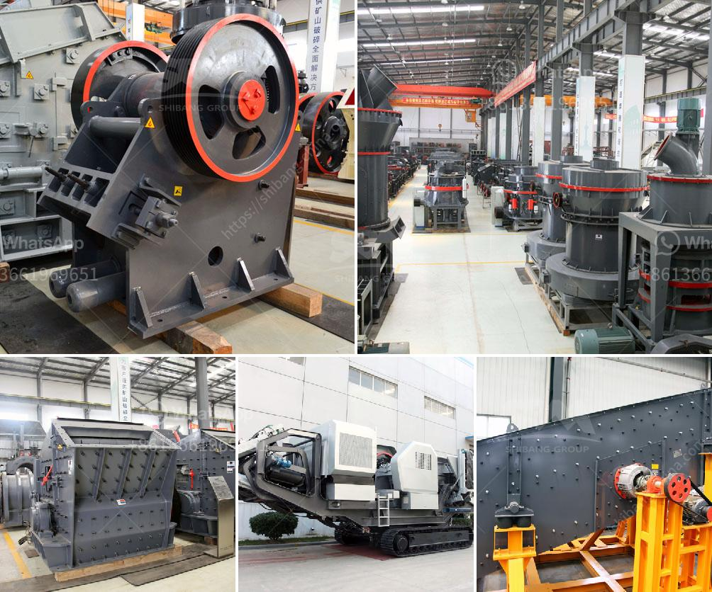

<h3>stone crushers fron china</h3>
Stone crushing industry is an important industrial sector in the country engaged in producing crushed stone of various sizes depending upon the requirement, which acts as raw material for various construction activities such as construction of roads, highways, bridges, buildings, canals etc. It is estimated that there are over 12,000 stone crusher units in China. The number is expected to grow further keeping in view the future plans for development of infrastructure and construction activities.

Stone crushers play a crucial role in providing the raw material for infrastructure development. They are highly efficient machines with low operating costs. The primary goal of stone crusher machines is to reduce large rocks into smaller rocks, gravel, or rock dust. They can efficiently break down materials such as granite, limestone, river stone, and other hard materials.

China has a vast market for stone crushers and is well known for its pioneering stone crusher technology. Stone crusher manufacturers in China have also developed a production line of high-performing stone crushers. Their technological advancements have resulted in the development of a variety of stone crushers, such as jaw crushers, cone crushers, impact crushers, and mobile crushers.

Jaw crushers are widely used in the mining and construction industry due to their ability to crush hard and abrasive materials. Cone crushers are commonly used for secondary or tertiary crushing stages and can be used in stationary or mobile applications. Impact crushers are versatile crushers that can be used in both primary and secondary crushing stages. They are commonly used to produce crushed materials for road construction, railway ballast, and concrete aggregate.

One of the most prominent stone crusher manufacturers in China is Shibang Machinery. Shibang has been producing jaw crushers, cone crushers, impact crushers, and other stone crushing equipment for several decades. They have the expertise and experience to offer reliable crushing machinery that meets the specific requirements of their customers. Their stone crushers are designed to be easy to operate, low maintenance, and highly efficient.

In recent years, China's stone crushers have been exported to various countries, such as Malaysia, Ethiopia, Tanzania, Zambia, and more, greatly expanding their market share. This is a testament to the quality and reliability of Chinese stone crushers. In addition to their high performance, these crushers also come with excellent after-sales service and technical support, ensuring that customers have access to professional help whenever needed.

China's stone crushers have revolutionized the stone crushing industry with their advanced technology and efficient performance. They have become an essential part of various construction projects, providing the required raw materials with high efficiency. Their wide range of applications and versatility make them an ideal choice for contractors and infrastructure developers.

In conclusion, stone crushers from China have proven to be a reliable solution for the stone industry. With their effective crushing capabilities, advanced technology, and exceptional after-sales service, they have become a preferred choice for many. Whether it is for road construction, building projects, or any other infrastructure development, Chinese stone crushers ensure smooth operations and high-quality end products.
<h3>Contact us</h3><ul><li><strong>Whatsapp:&nbsp;<a href="https://wa.me/8613661969651">+8613661969651</a></strong></li><li><a href="https://swt.shibang-china.com/?git&amp;zhl&amp;stone crushers fron china"><strong>Online Service(chat now)</strong></a></li></ul><h3>Related</h3><ul><li><a href='manufacturer of cement packing plant machinery.md'>manufacturer of cement packing plant machinery</a></li><li><a href='second hand coal mining crushers in zimbabwe.md'>second hand coal mining crushers in zimbabwe</a></li><li><a href='modular conveyor belt supplier china.md'>modular conveyor belt supplier china</a></li><li><a href='three quarter stone machine.md'>three quarter stone machine</a></li><li><a href='three roll milling italy.md'>three roll milling italy</a></li></ul>