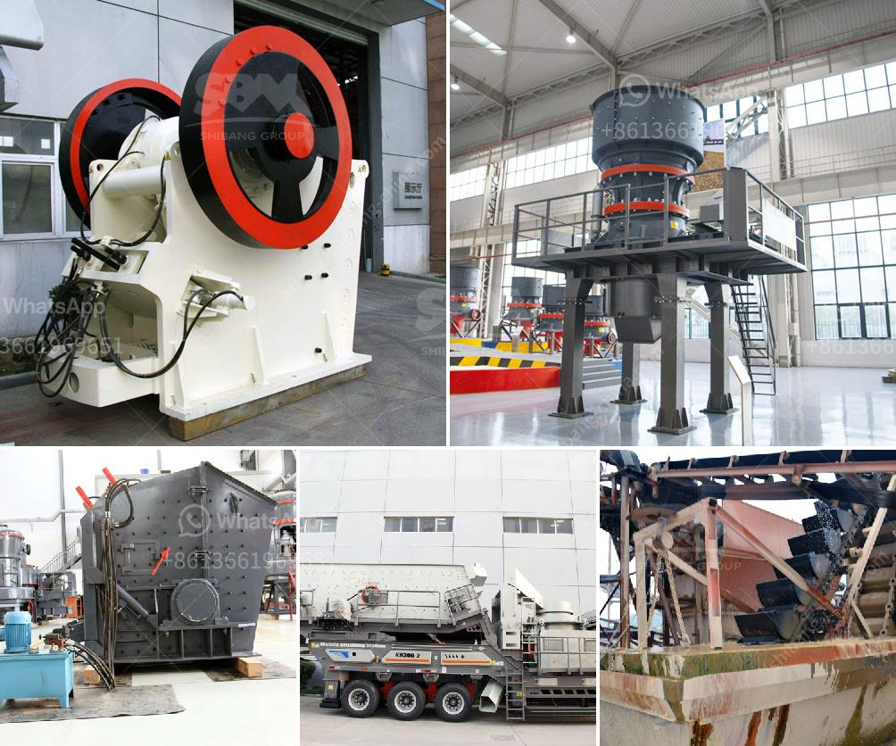

<h3>stone crushers hire scotland</h3>
In the construction industry, one of the most critical tasks is to break down larger rocks and stones into smaller pieces that can be used in various applications. This is where stone crushers come into play, as they efficiently reduce the size of these materials, making them ideal for use in building roads, foundations, and other construction projects. In Scotland, stone crushers hire services have gained immense popularity due to their high effectiveness and efficiency.

Stone crushers are heavy-duty machines designed to crush stones and rocks into smaller sizes. They are commonly used in quarries, mines, and construction sites, making them an essential tool for any construction project. These machines work by applying force to the stone, breaking it down into smaller pieces. The crushed stones and rocks can then be used as aggregate for concrete and asphalt, making them an integral part of the construction process.

Stone crushers hire services in Scotland have gained popularity for many reasons. Firstly, it is a cost-effective solution for construction companies who need to crush a large quantity of stones and rocks. Instead of purchasing expensive equipment, hiring stone crushers allows these companies to access the latest machinery at a fraction of the cost.

Moreover, stone crushers hire services offer flexibility and convenience. Construction projects often have varying timelines, with different stages requiring different amounts of crushing. By hiring stone crushers, companies can adjust the number of machines and the duration of hire according to their specific needs. This eliminates the need for purchasing equipment that may not be used to its full potential, thereby saving on costs.

Stone crushers hire services also offer expertise and technical support. These machines require skilled operators who are trained in their operation and maintenance. By hiring stone crushers, construction companies can benefit from the expertise of experienced operators who can ensure the machines are operated safely and efficiently. Additionally, stone crusher hire companies provide technical support and troubleshooting services, ensuring any issues are addressed promptly to minimize downtime.

In Scotland, stone crushers hire services are widely available, catering to the diverse needs of construction projects. Whether it's a small-scale residential project or a large-scale infrastructure development, there is a range of stone crushers to suit every requirement. From jaw crushers to impact crushers, each machine offers unique features and advantages, allowing companies to select the most suitable equipment for their specific needs.

In conclusion, stone crushers hire services have become an integral part of the construction industry in Scotland. Offering cost-effective solutions, flexibility, and technical expertise, these services ensure that construction projects can efficiently crush stones and rocks as required. With a wide range of machines available, stone crushers hire services cater to the diverse needs of construction companies, providing them with the necessary tools to complete their projects successfully.
<h3>Contact us</h3><ul><li><strong>Whatsapp:&nbsp;<a href="https://wa.me/8613661969651">+8613661969651</a></strong></li><li><a href="https://swt.shibang-china.com/?git&amp;zhl&amp;stone crushers hire scotland"><strong>Online Service(chat now)</strong></a></li></ul><h3>Related</h3><ul><li><a href='low cost gold mining equipment gold mining equipment.md'>low cost gold mining equipment gold mining equipment</a></li><li><a href='rock crushing plant.md'>rock crushing plant</a></li><li><a href='prices of vibrating screens.md'>prices of vibrating screens</a></li><li><a href='mineral grinder navi mumbai.md'>mineral grinder navi mumbai</a></li><li><a href='sand washing machines turkey.md'>sand washing machines turkey</a></li></ul>