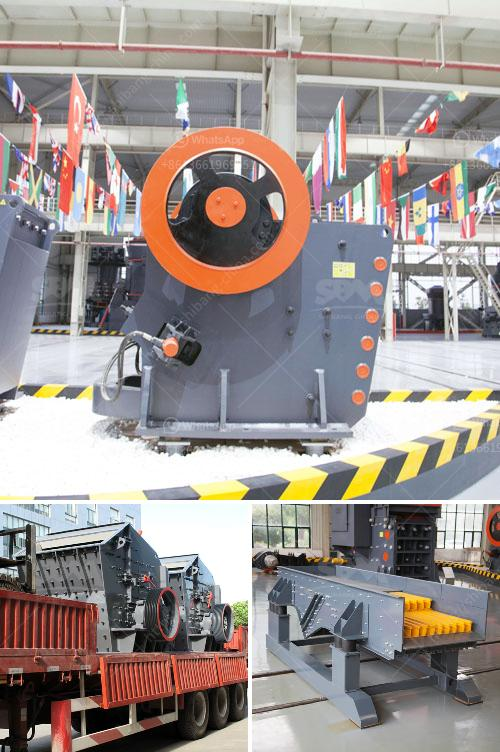

<h3>stone crushers in cali</h3>
In California, the infrastructure development and construction industry present a huge opportunity for the stone crusher market. The California Urban Infrastructure Construction Development Program Fund, along with the increase in population, rapid urbanization, and industrialization, is driving the growth of the construction industry. The demand for stone crushers is subsequently rising, contributing to the overall development of the sector.

Stone crushers are essential equipment in the mining and crushing industry. Stone crushing equipment is used to break large stones into smaller particles of desired size. These fragmented stones are used in road construction, railway tracks, and various construction activities. Crushing stones can transform waste into valuable aggregate that can be reused in various construction projects, thus offering a sustainable solution while minimizing the environmental impact.

However, the growth of stone crushers also brings its own set of environmental concerns. The primary environmental concern associated with stone crushers is air pollution. Dust emissions generated during the crushing process can have detrimental effects on air quality, polluting both urban and rural areas. Fine particulate matter (PM2.5) released from stone crushers can cause respiratory diseases and impact human health. Moreover, the fine particles settle on vegetation, reducing its ability to perform photosynthesis, affecting crop yield and overall environmental balance.

To address the environmental issues associated with stone crushers, stringent regulations have been implemented in California. The California Air Resources Board (CARB) has set strict standards for controlling the emissions from stone crushers. The regulations aim to limit the amount of PM2.5 and other pollutants emitted during the crushing process. Stone crushers are required to install advanced pollution control equipment like dust suppression systems and baghouse filters to minimize dust emissions.

Despite the regulations in place, monitoring compliance remains a challenge. California is a vast state with numerous stone crushers spread across different regions. Ensuring that all crushers adhere to the regulations requires strong enforcement and monitoring mechanisms. Regular inspections by regulatory authorities, periodic emissions testing, and hefty penalties for non-compliance can act as deterrents and lead to better compliance.

In addition to air pollution, stone crushers can also have negative impacts on water resources. Mining and crushing operations can generate high volumes of wastewater, contaminating nearby rivers and groundwater sources. This pollution can harm aquatic ecosystems and affect the availability of safe drinking water for communities.

To mitigate the water pollution caused by stone crushers, it is important to implement water management strategies. Crushers should install sedimentation ponds or water treatment systems to ensure that the wastewater generated during the crushing process is properly treated before being discharged. Regular monitoring and reporting of water quality parameters can further assist in tracking compliance and identifying areas for improvement.

In conclusion, stone crushers play a vital role in the construction industry, facilitating the development of infrastructure. However, their operation can lead to environmental challenges, particularly related to air and water pollution. California has taken significant steps to mitigate the environmental impact of stone crushers through strict regulations and enforcement measures. Continued efforts to improve monitoring, compliance, and the adoption of sustainable practices will be crucial in minimizing the environmental footprint of the stone crusher industry in California.
<h3>Contact us</h3><ul><li><strong>Whatsapp:&nbsp;<a href="https://wa.me/8613661969651">+8613661969651</a></strong></li><li><a href="https://swt.shibang-china.com/?git&amp;zhl&amp;stone crushers in cali"><strong>Online Service(chat now)</strong></a></li></ul><h3>Related</h3><ul><li><a href='crusher plant in sargodha.md'>crusher plant in sargodha</a></li><li><a href='gravel pebbles mining south africa.md'>gravel pebbles mining south africa</a></li><li><a href='stone crusher suppliers in indore.md'>stone crusher suppliers in indore</a></li><li><a href='gold washing machine for small miners.md'>gold washing machine for small miners</a></li><li><a href='stone crusher machine tutorials.md'>stone crusher machine tutorials</a></li></ul>