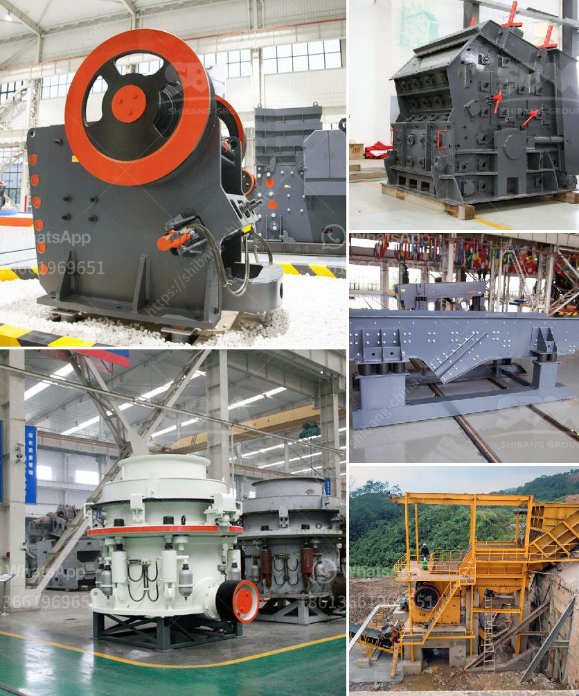

<h3>stone crushers in kenya</h3>
Stone crushers are machines designed to break large rocks into smaller pieces in order to achieve a manageable size. The stone crushers are capable of crushing rocks, coal, lime stone, iron ore, quartz, dolomite, manganese ore, gypsum, phosphate, limestone, bauxite, cement clinker, and many more materials. It turns out to be an essential capability for various construction and mining purposes.

In Kenya, stone crushers are regulated under the Mining Act, which outlines the manner in which mining activities should be conducted. Among the regulations, the Act requires quarry owners to submit an environmental impact assessment report to the relevant authorities before the start of any quarrying activities. This report ensures that the extraction and usage of stone will have minimal adverse effects on the environment.

Additionally, the Kenyan government has taken measures to streamline the licensing process for stone crushers. This includes introducing an e-registration portal where potential investors can apply for licenses and permits online. By digitalizing the process, the government aims to reduce bureaucracy, corruption, and ensure transparency in the licensing process.

The stone crushing industry plays a significant role in the economic development of Kenya. The establishment of commercial stone crushers in Kenyan cities contributes to reducing air pollution, providing jobs, and generating economic income for locals. Additionally, the government has initiated various poverty alleviation programs that aim to provide jobs for local communities through the stone crushing activities.

However, it is essential to note that stone crushers can also pose environmental challenges, especially if not well regulated. They can contribute to soil erosion, land degradation, and water pollution if the necessary precautions are not taken. Therefore, it becomes crucial for the government to enforce stringent regulations and conduct regular inspections to ensure environmental sustainability in stone crushing operations.

In conclusion, stone crushers play a vital role in Kenya's construction and mining industry. They are essential for the economic development of the country while also presenting environmental challenges. It is necessary for the government, quarry owners, and stakeholders to work together to create policies and regulations that promote environmentally-friendly stone crushing operations in Kenya.
<h3>Contact us</h3><ul><li><strong>Whatsapp:&nbsp;<a href="https://wa.me/8613661969651">+8613661969651</a></strong></li><li><a href="https://swt.shibang-china.com/?git&amp;zhl&amp;stone crushers in kenya"><strong>Online Service(chat now)</strong></a></li></ul><h3>Related</h3><ul><li><a href='how to start a stone crusher business.md'>how to start a stone crusher business</a></li><li><a href='gold processing plant dry.md'>gold processing plant dry</a></li><li><a href='stone crusher machine in russia.md'>stone crusher machine in russia</a></li><li><a href='tracked jaw crusher for sale.md'>tracked jaw crusher for sale</a></li><li><a href='small scale gold mining professional equipment.md'>small scale gold mining professional equipment</a></li></ul>