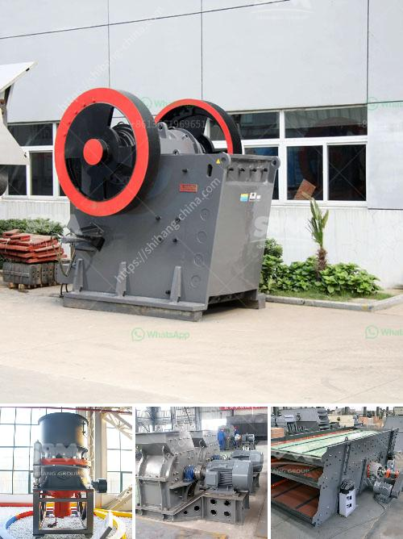

<h3>stone crushers in veracruz</h3>
The stone crusher industry plays an important role in the economy of Veracruz, a vibrant Mexican state located along the country's eastern coastline. Veracruz is not only known for its rich culture and history but also for its diverse natural resources, including vast deposits of minerals and stones. The local stone crushers are crucial for processing these resources and contributing to the region's economic development.

Veracruz is endowed with an abundance of rock formations and has long been recognized as a leading producer of aggregates used in construction, road building, and various other industrial applications. Stone crushers are specialized machines designed to reduce large rocks into smaller ones, gravel, or rock dust. By employing mechanical force, these crushers break down the stones into more manageable sizes, making them suitable for different uses.

One of the primary uses of crushed stones in Veracruz is for the construction industry. The region experiences continuous urbanization and infrastructure development, requiring a steady supply of aggregates. Stone crushers are pivotal in meeting this demand by providing a reliable and consistent source of high-quality materials. Ranging from asphalt and concrete production to the development of foundations and drainage systems, crushed stones from Veracruz's crushers are indispensable in building a robust and modern state.

Moreover, the stone crusher industry in Veracruz contributes to employment generation, providing livelihoods for many individuals and families. From machine operators and technicians to administrative staff, this sector offers a diverse range of job opportunities. By creating employment, the industry supports local communities and ensures economic stability, further strengthening the overall development of the state.

However, while stone crushers are crucial for economic development, there is also a need to ensure their operations align with environmental sustainability guidelines. Quarrying and crushing activities produce dust, noise, and vibrations, which can have adverse effects on the surrounding ecosystems and communities.

To combat these challenges, the stone crusher industry in Veracruz has taken proactive measures to minimize environmental impacts. Many crushers have adopted advanced technologies such as wet suppression systems, dust filters, and noise-canceling equipment. These measures not only improve the working environment for workers but also significantly reduce the pollution levels emitted during the crushing process.

Additionally, the industry promotes responsible mining practices to mitigate negative environmental effects. Quarry rehabilitation programs, erosion control techniques, and water management initiatives are implemented to ensure that the extraction and processing of stones are carried out sustainably. By adhering to these practices, stone crushers in Veracruz contribute to environmental conservation and minimize their ecological footprint.

In conclusion, the stone crusher industry in Veracruz occupies a central position in the state's economy. Its role in providing aggregates for construction, generating employment, and fostering environmental sustainability cannot be overstated. Efforts to continue improving operational practices and embracing sustainable technologies will further enhance the benefits derived from this industry. Veracruz's stone crushers are instrumental in shaping the state's future by fueling economic growth while preserving its natural resources.
<h3>Contact us</h3><ul><li><strong>Whatsapp:&nbsp;<a href="https://wa.me/8613661969651">+8613661969651</a></strong></li><li><a href="https://swt.shibang-china.com/?git&amp;zhl&amp;stone crushers in veracruz"><strong>Online Service(chat now)</strong></a></li></ul><h3>Related</h3><ul><li><a href='hammer mill pc800 x 600.md'>hammer mill pc800 x 600</a></li><li><a href='stone crushers in veracruz.md'>stone crushers in veracruz</a></li><li><a href='second hand equipment for sale in south africa.md'>second hand equipment for sale in south africa</a></li><li><a href='list of iron ore mining companies in china.md'>list of iron ore mining companies in china</a></li><li><a href='accessories for chia conveyor belts.md'>accessories for chia conveyor belts</a></li></ul>