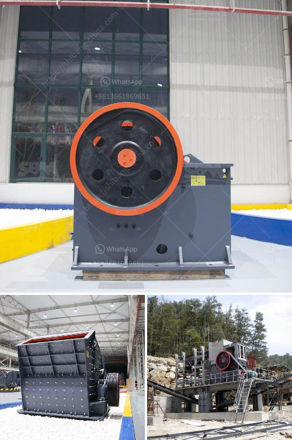

<h3>stone crushers machine price in nepal</h3>
The price of the stone crusher machine in Nepal has always been the hot issue that the customers are concerned about. It increases with the development of the infrastructure in Nepal and has been highly praised and widely used in the construction projects. Nowadays, more and more people are investing in stone crushing plants in Nepal to make a fortune and increase their wealth.

BD crusher machine has many types and specifications for your reference. Its capacity ranges from 20t/h to 500t/h, and the price is also different separately. Thousands of contractors, quarry operators, recycling and mining applications are thriving in Nepal due to the increasing demand for stone crushers.

For those starting their journey in a stone crushing business, the market entry strategy is relatively easy due to the increase in jobs and the exponential rise in the number of housing projects. However, to set up a stone crushing plant in Nepal, it requires permission from the authorities, which can be time-consuming and difficult to obtain.

The stone crushers machine price in Nepal clearly shows that the machinery is available in Nepal. These machines have different capacities and sizes. Some machines can crush stones into smaller sizes while others may crush rocks into sand-sized particles. Different types of stone crushers have different technical specifications, therefore, their prices are also different.

As an experienced crusher manufacturer and exporter, Aimix’s crushers have been exported to more than 60 countries over the past 30 years. We have various kinds of crushers for sale, such as: small concrete crusher for sale, mini crusher for sale, mobile concrete crusher for sale, etc. Besides, we can customize all types of crushers on the basis of customers’ requirements.

The crusher machine price in Nepal possesses a great worthy economic benefit for investors due to its excellent performance and low operation costs. A crusher has been widely used in the industries of mining, metallurgy, engineering, building materials, water conservancy, transportation, etc.

The demand for crushers is constantly increasing in Nepal, as many infrastructural projects are being developed. The development of roads, hydropower, dam construction, airports, railways, bridges, tunnels, and high-rise buildings are pushing the demand for aggregates and various types of stones such as gravel, pebbles, granite, basalt, limestone, etc.

The stone crushing industry in Nepal is considered polluted and unorganized. There are many stone crushers, but the high rate of pollution and illegal operation affects the environment and natural resources. Continuous monitoring of pollution and judicial measures are needed to control the pollution and regulate the industry.

In conclusion, the stone crusher machine price in Nepal is quite competitive and reasonable. So investing in a stone crusher plant not only meets local industrial policy but also avoids wastage of resources. Wastage of money is reduced by selecting the suitable equipment with high quality and competitive price.
<h3>Contact us</h3><ul><li><strong>Whatsapp:&nbsp;<a href="https://wa.me/8613661969651">+8613661969651</a></strong></li><li><a href="https://swt.shibang-china.com/?git&amp;zhl&amp;stone crushers machine price in nepal"><strong>Online Service(chat now)</strong></a></li></ul><h3>Related</h3><ul><li><a href='small rock crusher australia.md'>small rock crusher australia</a></li><li><a href='portable concrete crusher rental maryland.md'>portable concrete crusher rental maryland</a></li><li><a href='for crushing plant permit philippines.md'>for crushing plant permit philippines</a></li><li><a href='kaolin grinding plant manufacturer in india.md'>kaolin grinding plant manufacturer in india</a></li><li><a href='ball mills for grinding zircon sand.md'>ball mills for grinding zircon sand</a></li></ul>