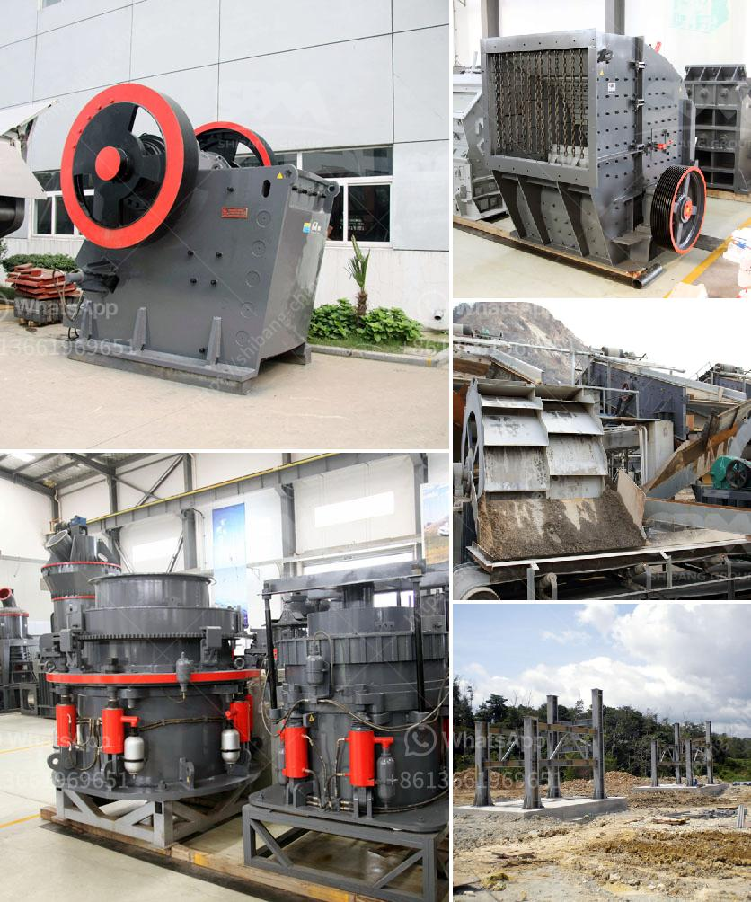

<h3>stone crushers plant prices</h3>
When it comes to owning a stone crushing plant, the project location, cost, and operational factors play a vital role. However, the prices of the machinery fluctuate depending on various factors, such as manufacturing cost, production capacity, and imported components. This article will discuss the stone crusher plant prices and how to choose the right one for your project.

A stone crusher plant is mainly used for the production of aggregates of various sizes, coarse aggregates, crusher run, rock sand, and other fine aggregates from basalt, granite, limestone, river stone, and other hard or abrasive materials. These different types of materials are used in different stages of the production process, such as a primary crusher, secondary crusher, and tertiary crusher.

The manufacturing and installation cost of a stone crushing plant depends largely on the chosen machinery and materials. Costs could be relatively higher if buying new machinery or if imported components are required. But for many individuals, the initial purchasing cost of equipment is only a small portion of the total expense. In most cases, labor costs, transportation costs, and operating expenses are even more significant.

The geographical location of the stone crusher plant can have a huge impact on the price. Different areas have different costs of living and levels of demand, which directly affect the prices of stone crushing machinery. When comparing prices between suppliers and manufacturers, it is advisable to ensure that the chosen machinery falls within the project budget.

Before selecting the machinery, it is essential to assess the nature of the project. Determine the specific materials to be processed, required output, and the desired final product size. This knowledge will help in selecting the ideal machinery that can efficiently handle the workload.

It is always recommended to reach out to different suppliers and manufacturers to get a clear idea of the market prices. Consider the reputation, customer reviews, and after-sales services offered by the suppliers before making a decision. Remember to also check if any spare parts or technical support are provided.

While the initial purchase price may be an essential factor, it is equally important to consider the long-term operational costs. Evaluate the machinery's energy consumption, maintenance requirements, and expected lifespan. A slightly higher initial investment in a more efficient and durable machine may save you a significant amount in the long run.

In conclusion, when purchasing a stone crusher plant, it is important to consider various factors to ensure that the machinery is suitable for your project, reliable, and within your budget. By thoroughly researching prices and understanding your project requirements, you can make an informed decision that will maximize your investment and productivity in the long term.
<h3>Contact us</h3><ul><li><strong>Whatsapp:&nbsp;<a href="https://wa.me/8613661969651">+8613661969651</a></strong></li><li><a href="https://swt.shibang-china.com/?git&amp;zhl&amp;stone crushers plant prices"><strong>Online Service(chat now)</strong></a></li></ul><h3>Related</h3><ul><li><a href='used copper process plants for sale.md'>used copper process plants for sale</a></li><li><a href='quarry crusher zimbabwe.md'>quarry crusher zimbabwe</a></li><li><a href='small ball mill prices in kenya.md'>small ball mill prices in kenya</a></li><li><a href='cement manufacturing plant.md'>cement manufacturing plant</a></li><li><a href='3 roller raymond mill delhi.md'>3 roller raymond mill delhi</a></li></ul>