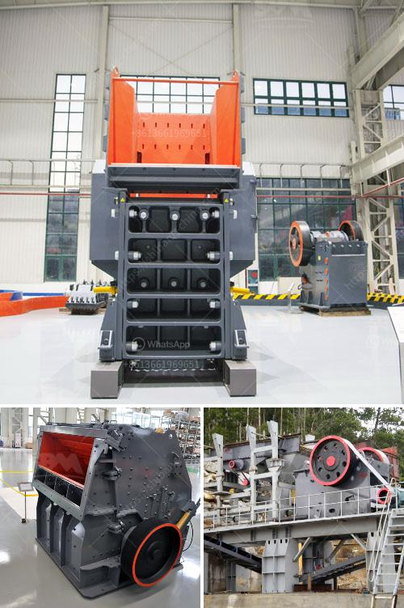

<h3>stone crushing industry</h3>
Stone crushing industry is an important industrial sector in the world. It produces crushed stone, a raw material for various construction activities that are essential for the economy. Stone crushing units are also being established in the vicinity of residential areas, which has resulted in serious health and environmental issues affecting the residents and workers.

Stone crushing industry is an important industrial sector in the country engaged in producing crushed stone of various sizes depending upon the requirement, which acts as raw material for various construction activities such as construction of roads, highways, bridges, buildings, canals, etc. It is estimated that there are over 12,000 stone crusher units in the country, employing over 500,000 workers.

The stone crushing industry is characterised by several issues that are detrimental to the environment, such as air pollution, dust pollution, noise pollution, deforestation, erosion, and excessive groundwater extraction. These issues have significant impacts on the health and well-being of the nearby residents and workers.

One of the major concerns associated with stone crushing activities is the emission of particulate matter into the atmosphere. These fine particles can cause respiratory problems, eye irritation, allergies, and even lung diseases. The fine dust generated during the crushing process can also settle on nearby crops, affecting the quality and yield. Moreover, these dust particles can also cause damage to buildings and infrastructure.

Noise pollution is another major environmental impact of stone crushing activities. The crushers generate excessive noise that can lead to hearing loss, annoyance, and sleep disturbances among the nearby residents. Moreover, the noise pollution can also affect wildlife by disrupting their natural patterns, leading to migration or even death.

Stone crushing activities also contribute to deforestation and erosion. The indiscriminate extraction of raw materials leads to the destruction of vegetation, soil erosion, and loss of biodiversity. These activities can have long-term consequences for the ecosystem.

Excessive groundwater extraction by stone crushing units has been a concern in many areas. The continuous pumping of groundwater for the washing of crushed stones not only affects the water table but also reduces the availability of water for agriculture and other uses. This can lead to water scarcity in the area, affecting the livelihoods of the local population and creating conflicts over water resources.

To address these environmental issues, it is necessary to have proper regulations and monitoring mechanisms in place. Stone crushing units should be located away from residential areas and important ecological zones. Proper dust control measures should be implemented to reduce the release of fine particles into the atmosphere. Crushers should also be equipped with noise control measures to reduce noise pollution. Additionally, strict regulations should be enforced to prevent the indiscriminate extraction of raw materials and excessive groundwater pumping.

In conclusion, the stone crushing industry plays a crucial role in the economy but has significant environmental impacts. It is important to balance the growth of this industry with the protection of the environment and the well-being of the nearby residents and workers. Efforts should be made to implement sustainable practices and technologies to mitigate these impacts and ensure a sustainable future for all.
<h3>Contact us</h3><ul><li><strong>Whatsapp:&nbsp;<a href="https://wa.me/8613661969651">+8613661969651</a></strong></li><li><a href="https://swt.shibang-china.com/?git&amp;zhl&amp;stone crushing industry"><strong>Online Service(chat now)</strong></a></li></ul><h3>Related</h3><ul><li><a href='gold conveyor belts south africa.md'>gold conveyor belts south africa</a></li><li><a href='stone crushing machine cost.md'>stone crushing machine cost</a></li><li><a href='coal transfer conveyor supplier in china.md'>coal transfer conveyor supplier in china</a></li><li><a href='vertical mill coal.md'>vertical mill coal</a></li><li><a href='rumus menghitung berat besi stanliss.md'>rumus menghitung berat besi stanliss</a></li></ul>