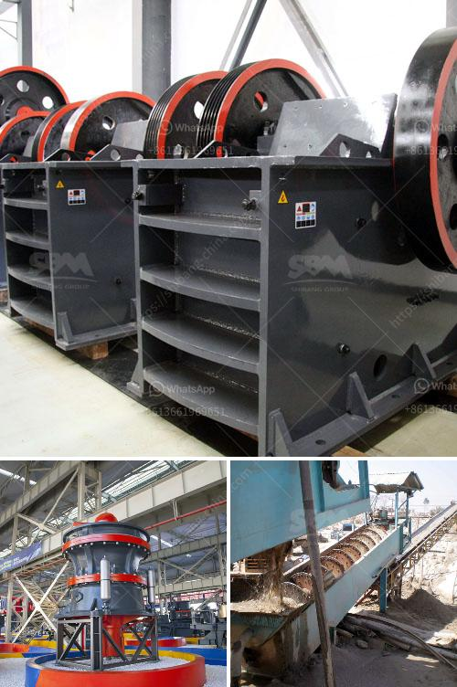

<h3>stone crushing machine cost</h3>
Stone crushing machine plays an important role in the mining industry these days. The rapid advancement of churning out stones has led to the better lives of individuals without constructing infrastructures would not be possible. People all around the world are striving to flourish in the building sector, thereby driving the demand for stone crushing machines to a great extent. Consequently, the market is booming, and suppliers are frequently introducing advancements to cater to the increasing customer needs.

The cost of stone crushing machines relies on various factors, like the type of machine, the capacity, the demand for the product, and geographical location. Also, the stone crushing machine manufacturers' aim is to ensure that the cost of the machine is minimized while maximizing production capacity. The largest possible capacity of a stone crushing machine in units of output per hour can be obtained by multiplying the width by the length of the receiving opening (i.e. the discharge gap) by the horizontal peripheral speed per minute.

In recent years, the industry has witnessed a significant revolution in terms of automation and energy efficiency. Technological advancements have led to the automation of various processes, reducing the labor and operating costs. Moreover, energy-efficient machines have made it possible to reduce power consumption, contributing to a reduction in operational expenses.

It is crucial for buyers to be aware of the stone crushing machine cost when purchasing machinery. The cost should include not only the purchase price but also operating expenses, maintenance costs, and any other related costs over time. After-sales service should also be considered when budgeting for the overall cost. Opting for a reliable and reputable supplier ensures good quality machinery, with reliable customer support and maintenance, enhancing the machine's lifespan.

Furthermore, it is advisable for buyers to compare prices and features among different suppliers. This will enable them to make an informed decision and ensure they are getting the best value for their investment. However, cost should not be the sole determining factor, as the quality and reliability of the stone crushing machine are of utmost importance in the long run.

In conclusion, the cost of stone crushing machines can vary widely depending on factors such as the type, capacity, demand, and geographical location. With the advancement in technology, stone crushing machines are now more efficient and energy-saving. It is crucial for buyers to consider the overall cost, including after-sales service and maintenance, when purchasing machinery. Comparing prices and features among different suppliers will ensure buyers make an informed decision and get the best value for their investment in stone crushing machines.
<h3>Contact us</h3><ul><li><strong>Whatsapp:&nbsp;<a href="https://wa.me/8613661969651">+8613661969651</a></strong></li><li><a href="https://swt.shibang-china.com/?git&amp;zhl&amp;stone crushing machine cost"><strong>Online Service(chat now)</strong></a></li></ul><h3>Related</h3><ul><li><a href='gypsum calcining equipment price.md'>gypsum calcining equipment price</a></li><li><a href='mobile crusher japan.md'>mobile crusher japan</a></li><li><a href='all about ball mills.md'>all about ball mills</a></li><li><a href='calcium carbonate proses by process.md'>calcium carbonate proses by process</a></li><li><a href='vibrating screen troubleshooting.md'>vibrating screen troubleshooting</a></li></ul>