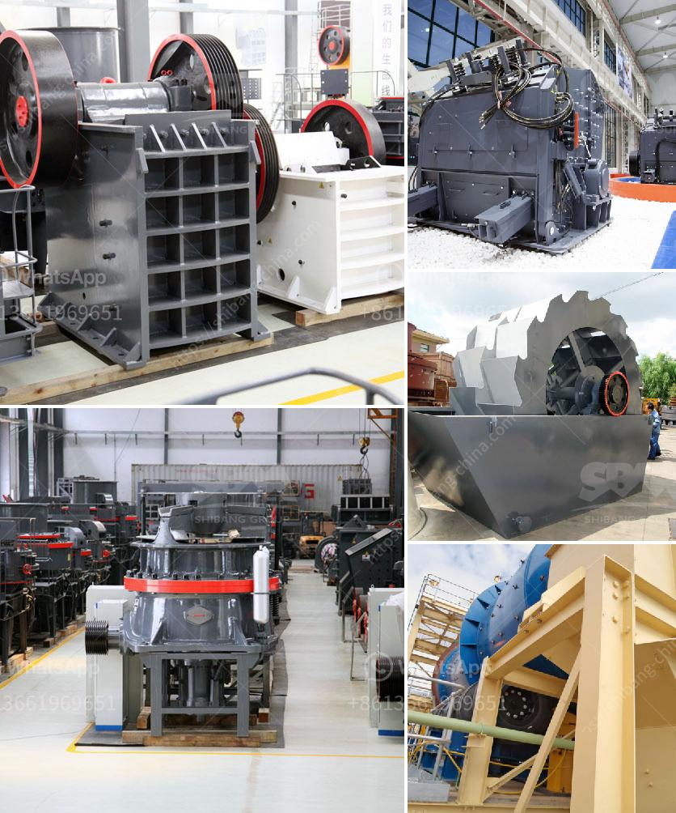

<h3>stone +crushing +machine +suppliers</h3>
Crushed stones are used as raw material for several construction activities such as building houses, constructing roads, and many more. In order to meet the high demand for stones, various suppliers across the globe provide different types of stone crushing machines. These machines can process various types of rocks, ores, and stones such as limestone, basalt, granite, pebble, iron ore, and more. However, not all suppliers provide reliable and high-quality crushing machines to their clients. Therefore, it is important to choose a supplier that can provide reliable and high-quality machines to ensure efficient and effective stone crushing processes.

When choosing a stone crushing machine supplier, it is important to check the reputation and reliability of the supplier. A good supplier will have a strong reputation in the market and will be known for providing high-quality machines that are built to last. They will have a track record of satisfied customers who can vouch for the quality and performance of their machines. Reliable suppliers will also have a strong customer support system in place, ensuring that their clients are well taken care of during the entire process of purchasing, installing, and operating the stone crushing machines.

High-quality stone crushing machines should be durable, reliable, and easy to maintain. The crushing machine’s construction should be sturdy enough to withstand continuous use. The machine’s housing and flywheel cover should be made from high-quality materials for it to withstand vibrations and the crushing process. With proper maintenance, these machines should provide years of trouble-free operation. A reliable supplier will also provide spare parts and professional technicians to ensure that any issues or breakdowns are quickly addressed and resolved.

In addition to the quality and durability of the machines, a good supplier should also provide a wide range of options to meet the specific needs of their clients. Different types of stone crushing machines are required for different applications. For example, cone crushers are best suited for medium to hard rocks and are commonly used for secondary and tertiary crushing stages. Jaw crushers are primarily used for primary crushing and are ideal for materials with compressive strength of less than 320MPa. Impact crushers and VSI crushers are used for secondary crushing and can produce cubical final products suitable for asphalt and concrete production.

Furthermore, a reliable stone crushing machine supplier should have an after-sales service department, which consists of professional technicians who can respond to any emergency situations promptly. They should provide regular maintenance services and be available for any troubleshooting or repair needs. This ensures that the stone crushing machines are always in proper working condition, maximizing productivity and efficiency.

In conclusion, choosing a reliable and high-quality stone crushing machine supplier is crucial for the success of any construction project. By considering factors such as reputation, quality, variety, and after-sales service, clients can find a reliable supplier that can provide them with durable, efficient, and high-performing crushing machines. These machines will ensure the efficient processing of rocks, ores, and stones for various construction purposes, ultimately contributing to the successful completion of any construction project.
<h3>Contact us</h3><ul><li><strong>Whatsapp:&nbsp;<a href="https://wa.me/8613661969651">+8613661969651</a></strong></li><li><a href="https://swt.shibang-china.com/?git&amp;zhl&amp;stone crushing machine suppliers"><strong>Online Service(chat now)</strong></a></li></ul><h3>Related</h3><ul><li><a href='vertical horizontal milling machine.md'>vertical horizontal milling machine</a></li><li><a href='price hammer crusher in nigeria.md'>price hammer crusher in nigeria</a></li><li><a href='china silica sand vibrating separator screen.md'>china silica sand vibrating separator screen</a></li><li><a href='gypsum board making machine price in pakistan.md'>gypsum board making machine price in pakistan</a></li><li><a href='coal crusher and screening plants for sale.md'>coal crusher and screening plants for sale</a></li></ul>