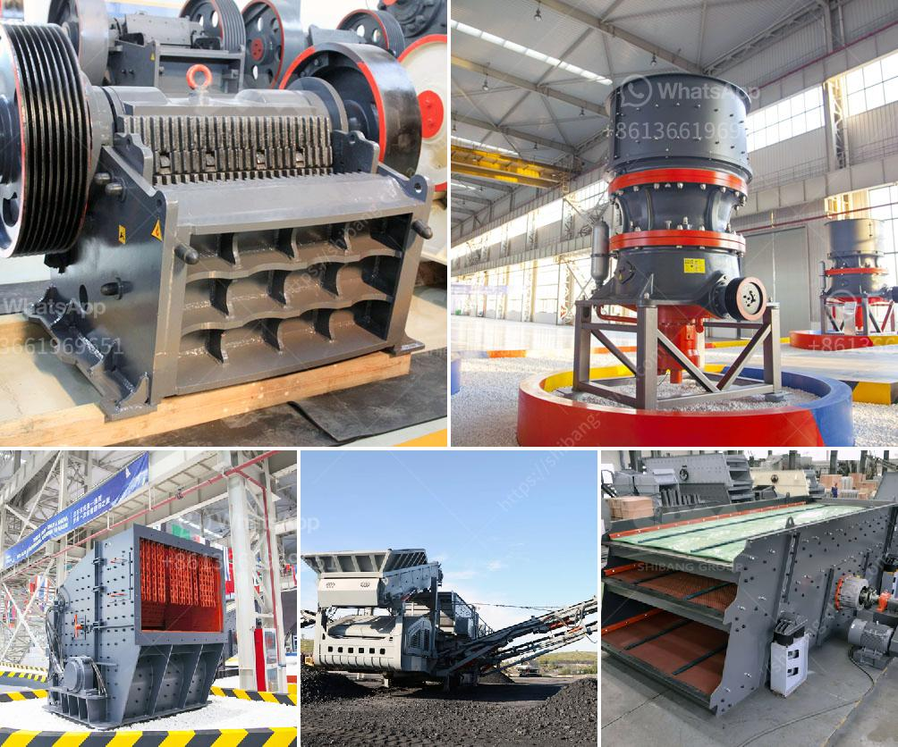

<h3>stone crushing machines in uk</h3>
Stone crushing machines are widely used in the mining and quarrying industry around the world. In the UK, the demand for these machines has been on the rise, especially with the increasing construction projects in the country. The stone crushing industry is affected by various factors, such as government regulations, demographics, and technological advancements. These factors directly or indirectly impact the growth of the stone crushing machines market in the UK.

Government regulations play a crucial role in shaping the stone crushing industry. As construction projects are becoming increasingly important for economic development, governments are introducing various policies and regulations to ensure the sustainable growth of the industry. These regulations primarily focus on environmental and safety standards. Stone crushing machines need to comply with these standards to operate legally in the UK. This includes proper dust control measures, noise reduction methods, and waste management practices. Companies manufacturing stone crushing machines are continuously innovating to meet these regulations and improve their machines' environmental performance.

Demographics also play a significant role in the demand for stone crushing machines. The UK has a growing population, and with it comes the need for more infrastructure development. Housing projects, road construction, and commercial buildings are just a few examples that require stone crushing machines. The increasing demand for these machines is expected to contribute to the growth of the stone crushing industry in the UK.

Technological advancements have revolutionized the stone crushing machines market. Traditional stone crushing machines were bulky, noisy, and inefficient. However, with advancements in technology, modern stone crushing machines have become more compact, efficient, and quiet. These machines are equipped with advanced features such as hydraulic systems, remote control operation, and precise crushing capabilities. Additionally, manufacturers are focusing on developing machines that are easy to maintain and repair, reducing downtime and increasing overall productivity.

One prominent company in the UK's stone crushing machines market is Terex Corporation. With a history dating back to the early 20th century, Terex has established itself as a leading manufacturer of innovative crushing equipment. The company's range of machines includes crushers, screens, and conveyors designed to meet the diverse needs of the construction industry. Terex's machines are known for their reliability, durability, and high-performance capabilities, making them a popular choice among contractors and quarry operators.

In conclusion, stone crushing machines play a crucial role in the construction industry in the UK. As the country experiences population growth and increasing infrastructure projects, the demand for these machines is expected to rise. Government regulations, demographics, and technological advancements are key factors influencing the growth of the stone crushing machines market. Manufacturers like Terex Corporation are continuously innovating to meet these demands and provide efficient and environmentally friendly machines. With the right balance of regulations and technological advancements, the stone crushing industry in the UK is poised for further growth and success.
<h3>Contact us</h3><ul><li><strong>Whatsapp:&nbsp;<a href="https://wa.me/8613661969651">+8613661969651</a></strong></li><li><a href="https://swt.shibang-china.com/?git&amp;zhl&amp;stone crushing machines in uk"><strong>Online Service(chat now)</strong></a></li></ul><h3>Related</h3><ul><li><a href='slag crusher machine india.md'>slag crusher machine india</a></li><li><a href='toggle jaw crusher.md'>toggle jaw crusher</a></li><li><a href='forno paragon para venda.md'>forno paragon para venda</a></li><li><a href='mobile crusher seller.md'>mobile crusher seller</a></li><li><a href='flsmidth cement plant in egypt.md'>flsmidth cement plant in egypt</a></li></ul>