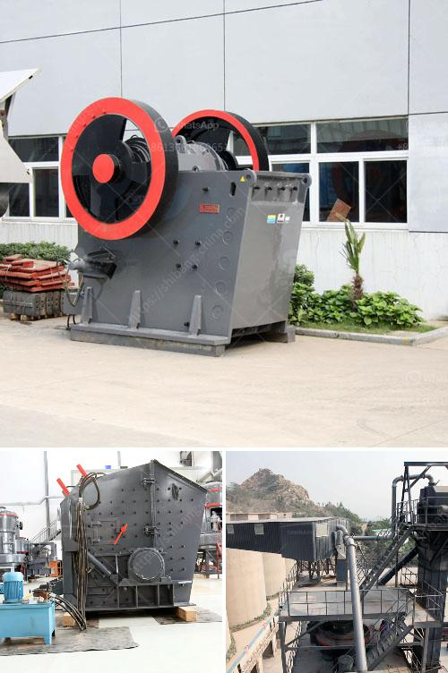

<h3>stone crushing plant cost in pakistan</h3>
Pakistan is a developing country and its economy is progressing day by day. The country has a huge potential for development in various sectors and for this purpose, the government is focused on all the necessary steps to support the growth of the industrial sector. Under the Vision 2025, the government is continuously working to promote the expansion of the industrial sector and improve the overall infrastructure.

The stone crushing plant is a great investment opportunity for new entrepreneurs. It offers tangible benefits to both the capital and workforce. The low-cost project is the ideal choice for small and medium-sized enterprises. It reduces the operation cost and maintenance cost effectively, and can break the stones into different sizes even if the output size of the same machine is different.

In Pakistan, there are many stone crushing plants. Of course, many different stone crusher machines are used in Pakistan. Many various types of mining machines can be used for stone crushing, such as crushing equipment, grinding mill equipment, flotation machines, separation machines as well as some other ancillary equipment. All these machines work together in the stone crushing plant to complete the whole production line.

Here, we will introduce some details about stone crushing plant cost in Pakistan. There are many factors that affect the crushing plant cost, such as the price of raw materials, labor cost, operating costs, cost of machinery, maintenance costs, spare parts costs, etc.

These factors should be taken into consideration when you are thinking about starting a new stone crushing plant. For all the stone crushing plant cost in Pakistan, the key machinery involved in the stone crushing industry is Hammer Crusher, Vibrating Feeder, Jaw Crusher, Cone Crusher, Impact Crusher, Vibrating Screen, and Belt Conveyor.

The general stone crushing plant production processes is: (bunker)—feeder—jaw crusher—impact crusher—vibrating screen—finished product. The machines can be connected by the belt conveyor.

In addition, we want to mention that the cost of stone crushing plant is also affected by some factors if the suppliers' machines are not good quality and bad service. I think no one want to buy a stone crushing plant that is bad quality.

So, when selecting a stone crusher machine manufacturer, it is vital to check the quality of the machines provided. There are different types of crushing machines available in the market that come with their own set of unique features and specifications.

Therefore, it is important to choose a machine that meets your requirements and fits well into your overall budget. It is always recommended to do some research and compare different machines and their prices in order to make an informed decision.

In conclusion, there are many factors affecting the stone crushing plant cost in Pakistan. If you want to reduce the investment cost, then you can choose a good quality used machine. It is the best way to reduce costs and increase the productivity of your mining operations.

By choosing the right type of crushing machines, you can save a lot of money. But, if you are not familiar with the crushing plant design and foundation, you should firstly consult to professional engineers. Nowadays, there are many professional engineers in Pakistan. Some professional engineers will design the specific crushing production line according to your mining site and specific requirements.

The stone crushing plant produced by Hongxing Machine always adopts the advanced technology and good materials that can ensure the long service life and less wear and tear. During the running process, the stone crusher machine no need to be maintained or repaired within 1-3 years time.
<h3>Contact us</h3><ul><li><strong>Whatsapp:&nbsp;<a href="https://wa.me/8613661969651">+8613661969651</a></strong></li><li><a href="https://swt.shibang-china.com/?git&amp;zhl&amp;stone crushing plant cost in pakistan"><strong>Online Service(chat now)</strong></a></li></ul><h3>Related</h3><ul><li><a href='roll mill machine manufacturers.md'>roll mill machine manufacturers</a></li><li><a href='mica processing plant in jharkhand.md'>mica processing plant in jharkhand</a></li><li><a href='copper processing plants in usa for sale.md'>copper processing plants in usa for sale</a></li><li><a href='gravel belt conveyor rental toronto.md'>gravel belt conveyor rental toronto</a></li><li><a href='equipment for a mini quarry plant.md'>equipment for a mini quarry plant</a></li></ul>