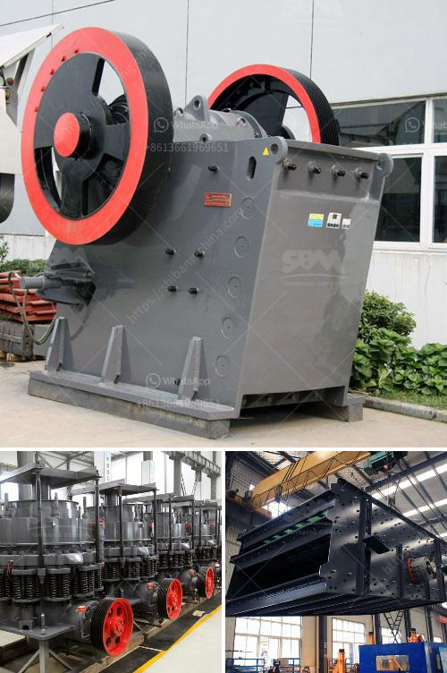

<h3>stone crushing production process</h3>
Stone crushing production line, also called rock crushing plant, involves the production process of a variety of rock particles, ranging from the tiny pebble to the complex ores, such as quartz, granite, basalt, limestone, etc. 

In the mining industry, the stone crushing plant is commonly used for crushing rocks into desired size. It serves the purpose of efficiently separating various sizes of aggregate material in order to supply the desired products. These aggregate materials are then used in construction projects, such as roads, bridges, buildings, and so on. 

The stone crushing production line mainly consists of vibrating feeder, jaw crusher, impact crusher, vibrating screen, belt conveyor, and centralized electronic control system. The designed output is generally 50-800t/h. To meet different processing needs of customers, it can be equipped with cone crusher, dust removal equipment, etc. 

The stone crushing production line has a three-stage crushing system consisting of primary jaw crusher, secondary impact crusher and tertiary cone crusher. The raw materials are uniformly sent to the jaw crusher by the vibrating feeder for coarse crushing. After that, the coarse materials are fed into the impact crusher for secondary crushing. Then, the tertiary cone crusher reduces the size of the crushed stones. During this process, the stones themselves are broken into smaller sizes, while the dust and unwanted materials are removed. 

After the crushing process, the stones with desired sizes are conveyed to the vibrating screen for separation. Different sizes of stones are separated and sent to different piles. The oversized material will be sent back to the impact crusher for re-crushing until the size is suitable for the final product. The final product, which meets the required size, will be transported to the finished product area by the belt conveyor. 

Throughout the entire stone crushing production process, the vibrating feeder, jaw crusher, impact crusher, vibrating screen, and belt conveyor work together to complete the process. For dispersing other unwanted materials and improving the quality of the final products, dust removal equipment can also be installed. 

Overall, stone crushing production lines are quite complex, requiring a combination of equipment and various support processes. The successful completion of each production stage ensures the quality of the final product. Therefore, it is essential to carefully plan and design the production process, select appropriate equipment, and ensure smooth operation at every stage. 

In conclusion, the stone crushing production line is a complex process, and it involves a variety of equipment. To ensure the final product's quality, it is necessary to have a well-designed production line. Starting from the raw material input to the final product output, the entire process needs to be carefully managed to avoid any potential issues or delays. With the right combination of equipment and processes, a stone crushing plant can effectively meet the requirements of different customers in the mining industry.
<h3>Contact us</h3><ul><li><strong>Whatsapp:&nbsp;<a href="https://wa.me/8613661969651">+8613661969651</a></strong></li><li><a href="https://swt.shibang-china.com/?git&amp;zhl&amp;stone crushing production process"><strong>Online Service(chat now)</strong></a></li></ul><h3>Related</h3><ul><li><a href='dry process of cement manufacturing.md'>dry process of cement manufacturing</a></li><li><a href='format of the business plan for stone crusher.md'>format of the business plan for stone crusher</a></li><li><a href='cone crusher specifications.md'>cone crusher specifications</a></li><li><a href='aggregate production line.md'>aggregate production line</a></li><li><a href='sand making machine suppliers in south africa.md'>sand making machine suppliers in south africa</a></li></ul>